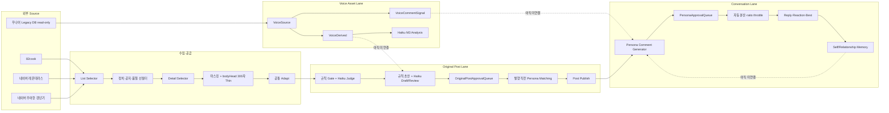

# 소란소란 Master Operating System

> 상태: 운영 정본 후보
> 기준 시각: 2026-09-08 16:31 KST
> 코드 기준: `origin/main` `7c6530e46dcb9f52545bc24644bb5a4b02da011f`
> 원칙: 이 문서의 상태값과 코드·DB·workflow 실측이 다르면 실측을 먼저 믿고 이 문서를 같은 PR에서 갱신한다.

## 0. 이 문서가 답해야 하는 질문

이 문서는 창업자와 운영 에이전트가 다음 질문에 한 번에 답하기 위한 시작점이다.

1. 우리는 왜 이 서비스를 만드는가.
2. 성공을 무엇으로 측정하는가.
3. 전체 시스템은 어떤 Lane으로 움직이는가.
4. 각 Lane은 설계, main 구현, 운영 설정, 실제 가동 중 어디까지 왔는가.
5. 어떤 AI 모델이 어디서 호출되고 비용이 발생하는가.
6. 지금 병목과 다음 큰 작업 묶음은 무엇인가.
7. 전략이나 전술이 바뀌면 어떤 정본을 함께 바꿔야 하는가.

이 문서는 상세 계약을 전부 복제하지 않는다. 목적, 구조, 현재 상태, 우선순위와 상세 정본의 위치를 연결한다.

## 1. 목적, 본질, 철학

### 1.1 서비스 본질

소란소란은 40대 중반부터 60대 중반 여성, 특히 50대 여성이 몸의 변화, 가족과 관계,
돈과 일, 노후와 일상의 고민을 같은 시기를 지나는 사람들과 나누며 다음 선택지를 찾는 커뮤니티다.

핵심 감정은 다음 한 문장이다.

> 나만 이런 게 아니구나.

일자리와 매거진, SEO, 크롤러, AI, Persona는 이 감정을 만들기 위한 수단이다. 서비스의 목적이 아니다.

### 1.2 Mission과 기대 경험

Mission은 사용자의 문제를 대신 해결하겠다는 것이 아니라 사용자를 혼자 두지 않는 것이다.

사용자가 순서대로 느껴야 하는 경험은 다음과 같다.

1. 여기 사람들이 활동한다.
2. 나도 말해도 된다.
3. 내가 한 말에 반응이 온다.
4. 전에 한 이야기를 기억해준다.
5. 다시 들어올 이유가 생긴다.

### 1.3 가치와 불변 조건

| 가치 | 운영 질문 |
|---|---|
| 공감 | 판단과 조언보다 공감이 먼저인가 |
| 연결 | 사용자를 고립시키지 않는가 |
| 안전 | 정치, 혐오, 사칭, 위험한 의료·재무 단정을 막는가 |
| 실용 | 사용자의 오늘에 도움이 되는가 |
| 존중 | 삶의 속도와 선택을 비교하거나 낮추지 않는가 |

다음은 속도보다 위에 있는 불변 조건이다.

- 외부 원문 유출 0.
- 위험 콘텐츠 공개 발행 0.
- 실회원과 Persona를 내부적으로 확실히 구분한다.
- Persona와 봇의 활동을 North Star에 포함하지 않는다.
- 공개 자동화는 cap, kill switch, audit, ratio limit, rollback을 가진다.
- 내부 Shadow 생산은 공격적으로 확장하되 공개량과 혼동하지 않는다.

## 2. North Star와 지표 위계

### 2.1 North Star

> 최근 7일 안에 재방문했고 글 또는 댓글을 한 번 이상 남긴 고유 실사용자 수

Persona, 봇, 운영 계정은 제외한다. 단순 게시량, 페이지뷰, 색인 수는 North Star가 아니다.

### 2.2 지표 위계

| 층 | 지표 | 용도 | 현재 측정 상태 |
|---|---|---|---|
| North Star | 주간 재방문 참여 실사용자 | 유일한 대표 지표 | 재방문 이벤트가 없어 정확히 측정 불가 |
| 선행 | D7 retention, 첫 댓글 전환, UGC 비율 | North Star를 움직이는 레버 | 일부만 계산 가능 |
| 경험 | 댓글 0개 공개 글 비율, 답글 도달 시간 | 말해도 되는 분위기 | 댓글 0개 25/30 |
| 안전 | source leak, safety failure, 실회원 오배정 | 공개 자동화 정지 조건 | 주요 Gate 구현 |
| 공급 | 신선 재고, source health, Queue yield | 자동화 가용성 | d1 health 구현 |
| 참고 | DAU, MAU, PV, SEO 클릭, 색인, 발행량 | 유입·생존 상태 | North Star로 사용 금지 |

2026-09-08 현재 최근 7일 대용 지표는 실사용자 글 9건, 댓글 15건, 고유 기여자 3명이다.
직전 7일도 고유 기여자는 같은 3명이지만 방문 이벤트가 없으므로 이들을 North Star의
`재방문 사용자`라고 확정해서는 안 된다.

## 3. 전체 시스템 구조



현재 핵심 결손은 `Voice 자산 -> 글/댓글 생성`, `Persona -> 생성 입력`,
`공개 글 -> 댓글 자동 분산 -> Memory -> 재응답` 연결이다.

## 4. Lane별 계약과 실제 상태

상태는 다섯 층을 분리한다.

- 설계: 정책과 계약이 문서 또는 순수 함수로 확정됐는가.
- main: 코드가 `origin/main`에 반영됐는가.
- 설정: env, workflow, launchd가 실제로 켜졌는가.
- 가동: 실제 운영 데이터가 생성됐는가.
- 관찰: 최소 한 운영 주기 동안 기대한 품질과 안전성이 확인됐는가.

| Lane | 입력 | 저장/출력 | AI | 설계 | main | 설정·가동 | 최종 판정 |
|---|---|---|---|---|---|---|---|
| Source Crawl | 82cook, Naver 2개 | list JSONL | 없음 | 완료 | 완료 | Naver 2개만 독립 가동 | 부분완료 |
| Thin Detail | selector 결과 | `*.thin-detail.jsonl`, 300자 이하 | 없음 | 완료 | 완료 | 세 source 실파일 존재 | 완료 |
| Raw Micro Seed | 승인한 외부 원문 | `MicroSeedRawContent`, Sheet, permanent noindex | 없음 | 완료 | 완료 | 과거 5건 발행 | 완료 |
| Automated Original Supply | thin row | adapt, judge, draft, Queue | Haiku | 완료 | 완료 | 재고 14/14 | d1 가동 |
| Voice Asset | 우나어 legacy read-only | VoiceSource/Derived/CommentSignal | 규칙 + Haiku 분석 | 완료 | 완료 | 전량 분석 완료 | 자산화 완료 |
| Persona-first Generation | Persona identity/voice + topic | Persona 고유 초안 | 생성 모델 미확정 | 완료 | 미구현 | 미가동 | 미착수 |
| Persona Matching | Queue + active Persona | matchedPersonaId, matchMeta | 없음 | 완료 | 완료 | 8명 대상 가동 | 완료 |
| Original Publish | matched Queue | Post + ActivityLog | 없음 | 완료 | 완료 | GHA 1회/day | d1 가동 |
| Persona Comment | Post + reaction role | 댓글 후보 Queue | 기본 Haiku | 대부분 완료 | 생성기·Gate만 | 자동 스케줄 0 | 초기 단계 |
| Comment Distribution | 새 글, 댓글 비율 | 공개 Persona 댓글 | 없음 | 완료 | 미구현 | 미가동 | 미착수 |
| Memory | 사용자·Persona 대화 | Self/Relationship/Community/Mood | 미정 | 완료 | 스키마만 | 사실상 0행 | 미착수 |
| Reply/Reaction/Best | 댓글·기억·시간 | 답글, 좋아요, Best | 미정 | 방향만 | 미구현 | 미가동 | 미착수 |
| Health/Forecast | DB, 파일, 로그, scale | 화면 + JSON | 없음 | 완료 | 완료 | 수동 조회 | 부분완료 |
| SEO Bulk | 별도 indexable 콘텐츠 | 별도 URL/작성자/색인 정책 | 미정 | 미완료 | 없음 | 없음 | 미착수 |

### 4.1 Raw Vault 용어 정리

현재 `MicroSeedRawContent`에는 성격이 다른 데이터가 함께 있다.

| 종류 | 현재 행 수 | 의미 |
|---|---:|---|
| 82cook 외부 원문 | 39 | Micro Seed 원문 Vault |
| Naver 외부 원문 | 2 | 과거 직접 적재분 |
| `publish-candidate:*` envelope | 17 | 생성·큐레이션 후보를 Queue에 연결하기 위한 envelope |

따라서 `MicroSeedRawContent = 외부 원문 전용 Raw Vault`라고 설명하면 현재 DB와 맞지 않는다.
스키마 분리 또는 명시적인 origin/type 계약 보강이 필요하다.

Automated thin Lane은 외부 전문을 DB에 저장하지 않는다. 수집 메모리에서 마스킹한 뒤
300자 이하의 `bodyHead`만 파일로 남기고, 하류에서 생성된 후보 envelope가 DB에 들어간다.

### 4.2 현재 생성 순서

현재 구현은 Persona-first가 아니다.

```text
source title + masked bodyHead + axis/community angle
  -> 일반 오리지널 초안 생성
  -> Queue 적재
  -> 발행 직전 Persona 매칭
  -> Persona 작성자로 발행
```

목표 구조는 다음과 같다.

```text
source signal + target community context
  -> Persona identity/life constraints/topic role 선택
  -> VoiceDerived/VoiceCommentSignal 기반 Persona 고유 생성
  -> originality/safety/persona consistency Gate
  -> Queue
  -> 같은 Persona로 발행·댓글·기억 연결
```

## 5. AI API와 모델 정본

### 5.1 모델별 현재 역할

| 모델 | 현재 코드 역할 | 운영 상태 | 비용 상태 |
|---|---|---|---|
| `claude-haiku-4.5` | Voice M3 분석, 자동 judge, 자동 draft/review, 기본 Persona 글·댓글 생성 | 현재 신규 공급의 기본 모델 | 호출 시 과금 |
| `gpt-5-nano` | Voice M3 비교 실험, 선택 가능한 수동 생성 후보 | 기본 운영 아님 | 과거 실험 비용 존재 |
| `gpt-5-mini` | Voice M3 비교 실험, 선택 가능한 수동 생성 후보 | 기본 운영 아님 | 과거 실험 비용 존재 |
| `gemini-3.7-flash` | 과거 Original Queue 생성 | 현재 5건이 legacy 재고로 제외 | 과거 호출만 과금 |

API key가 설정돼 있다는 사실만으로 비용은 발생하지 않는다. `callProvider()`가 실제 호출될 때만 발생한다.
공개 발행 단계 자체는 LLM을 호출하지 않는다. 공급 부족 회차의 judge/draft와 수동 생성기가 호출 지점이다.

### 5.2 현재까지 기록된 Voice M3 비용

| 모델군 | 기록된 호출 | 기록 비용 |
|---|---:|---:|
| Haiku | 9,460 | $42.0139 |
| GPT-5 nano | 35 | $0.0351 |
| GPT-5 mini | 30 | $0.0975 |
| 합계 | 9,525 | $42.1465 |

현재 자동 supply의 파일 기반 judge/draft는 토큰과 비용을 DB 원장에 기록하지 않는다.
따라서 현재 글 한 건당 정확한 생성 비용은 아직 알 수 없다.

### 5.3 모델 결정에서 혼동하면 안 되는 것

- Haiku는 Voice M3의 `분석 모델`로 선정됐다.
- 분석 모델 선정은 `생성 모델` 선정을 의미하지 않는다.
- 현재 자동 생성은 별도 동일 샘플 실험 없이 Haiku를 하드코딩했다.
- Gemini Queue는 과거 산출물이며 현재 신규 생성 모델이 아니다.
- 생성 모델은 Persona/Voice 연결 후 동일 입력·동일 Gate로 Haiku와 Gemini를 재비교해야 확정할 수 있다.

## 6. 현재 main, 설정, DB

### 6.1 main 반영분

기준 SHA는 `7c6530e`다. 다음이 main에 있다.

- 3개 source 수집기와 thin 공통 레일.
- 규칙 + Haiku judge/draft와 Queue 자동 보충.
- Account 기준 실회원 차단.
- 최대 매칭, 기존 배정 복구, Queue/Post/ActivityLog 정합성 검사.
- Persona 8명 생성·seed·활성화.
- 공급 health와 capacity forecast.
- d1/d3/d5/d10 scale profile, capacity/release 분리, readiness 기반 강제 감속.
- 수동 발행기 1건 제한.

Claude의 `feat/d10-activation-prep` 미커밋 변경은 main이 아니다. 해당 변경의 Persona 24명,
freshness TTL, Naver 다중 슬롯, 82cook 수집 계획은 검토 전 가정으로 취급한다.

### 6.2 실제 설정

| 항목 | 현재 |
|---|---|
| `SORAN_CAPACITY_STAGE` | 미설정 -> d1 |
| `SORAN_RELEASE_STAGE` | 미설정 -> d1 |
| 공개 발행 workflow | `5 15 * * *`, 1슬롯/day, `--limit=1` |
| Naver remonterrace | launchd 09:20 KST |
| Naver wgang | launchd 13:20 KST |
| supply runner | launchd 21:10 KST |
| 82cook 독립 job | 미등록 |

GitHub Actions cron은 정확한 시각을 보장하지 않는다. 실제 00:05 예정 실행이 약 04:05 KST에 시작된
사례가 있다. 10개 공개 슬롯의 실시간성을 GHA schedule에만 의존해서는 안 된다.

### 6.3 DB 스냅샷

| 항목 | 2026-09-08 실측 |
|---|---:|
| User / Account | 12 / 3 |
| Persona | 8, 모두 active |
| Post | 40: PUBLISHED 30, HIDDEN 1, DELETED 9 |
| Comment / Reply | 26 / 4 |
| 공개 글 중 댓글 0개 | 25/30, 83.3% |
| Like / CommentLike / Scrap | 5 / 4 / 1 |
| MicroSeedRawContent | 58 |
| OriginalPostApprovalQueue | 24: APPROVED 19, PUBLISHED 5 |
| 현재 사용 가능 재고 | 14: human 4, Haiku machine 10 |
| legacy Gemini 재고 | 5, 현재 재고에서 제외 |
| PersonaApprovalQueue | PENDING 1, APPROVED 2, PUBLISHED 1 |
| PersonaActivityLog | post 5, comment 1 |
| Memory | Self 0, Relationship 0, Community 0, Mood 0, Negative 1 |
| VoiceSource / VoiceDerived | 9,674 / 9,674 |
| VoiceCommentSignal | 59,252 |

이 표는 역사 스냅샷이다. 현재 운영 판정은 `npm run supply:health -- --json`과 DB 실측을 사용한다.

## 7. 마일스톤과 진행률

### 7.1 운영 마일스톤 M1-M10

| M | 이름 | 설계 | main 구현 | 실제 운영 | 판정 |
|---|---|---|---|---|---|
| M1 | Micro Seed Operating Rail | 완료 | 완료 | 5건 발행 | 완료 |
| M2 | Source Quality Engine | 완료 | 완료 | 세 source 적용 | 완료 |
| M3 | Founder Gate | 완료 | 완료 | 과거 운영 | 완료 |
| M4 | Voice Engine Contract | 완료 | 부분 | 생성 경로 미연결 | 부분완료 |
| M5 | Legacy Data Vault | 완료 | 완료 | 9,674건 | 완료 |
| M6 | Derived Voice Dataset | 완료 | 완료 | 9,674건 + 댓글 신호 | 완료 |
| M7 | Offline Voice Analyzer | 완료 | 완료 | 전량 분석 | 완료 |
| M8 | LLM Voice Engine | 분석 완료 | 분석 완료 | 생성 모델 미확정 | 부분완료 |
| M9 | Original Content Lane | 완료 | 완료 | d1 가동 | 부분완료 |
| M10 | Comment/Conversation Engine | 대부분 완료 | 초기 scaffold | 자동 댓글 0/day | 미완료 |

이 번호는 운영 마일스톤이다. 제품 생애주기의 Phase/M 번호와 섞어 쓰지 않는다.

### 7.2 범위별 진행률

퍼센트는 코드 줄 수가 아니라 `설계 -> main -> 설정 -> 실제 가동 -> 관찰`의 완료도를 기준으로 한다.

| 범위 | 설계 | main 구현 | 운영 검증 |
|---|---:|---:|---:|
| 안전한 d1 글 자동화 | 95% | 85% | 75~80% |
| 공개 d10 확장 | 75% | 50~55% | 10~15% |
| 댓글·대댓글·Memory 생태계 | 75% | 25% | 5~10% |
| North Star | 정의 100% | 계측 20% | 결과 검증 0% |
| 최종 자율 커뮤니티 전체 | 약 75% | 약 45% | 약 25% |

## 8. Scale: 현재 능력과 목표

| 단계 | 공개 글/day | 재고 목표 | 현재 준비 |
|---|---:|---:|---|
| d1 | 1 | 14 | READY, 운영 중 |
| d3 | 3 | 42 | 코드 기반만 있음 |
| d5 | 5 | 70 | 코드 기반만 있음 |
| d10 | 10 | 140 | NOT READY |
| Shadow100 | Queue 후보 100/day | 별도 | 수집·수율 미증명 |
| SEO100-200 | indexable 콘텐츠 100~200/day | 별도 Lane | 설계 없음 |

현재 d10 병목은 다음 네 가지다.

1. 재고가 14/140이다.
2. Persona가 active 8명이며 실제 큐 시뮬레이션 기준 20명 이상이 필요하다.
3. 공개 workflow가 1/10 슬롯이다.
4. 수집 능력과 yield가 증명되지 않았고 82cook 접근도 불안정하다.

### 8.1 내부 100/day 역산

현재 문서의 관측·가정으로 Queue 100건에는 judge 약 286건, draft 약 143건,
상세 요청 약 382건, 목록 약 43,816건, LLM 약 429회/day가 필요하다.

`judgePass 50%`, `draftPass 70%`는 아직 가정이다. 이 값으로 READY를 선언하지 않는다.

## 9. 댓글 규모와 ratio 계약

Persona 댓글은 전체 댓글의 30% 이하를 기본 안전 상한으로 한다.

최근 실사용자 댓글은 15건/7일, 약 2.14건/day다. 비율식 `p / (p + real) <= 0.30`을 적용하면
현재 안전한 Persona 댓글은 평균 약 0.92건/day, 즉 0~1건/day다.

| Persona 댓글 목표 | 필요한 실사용자 댓글 |
|---|---:|
| 1/day | 약 3/day |
| 3/day | 약 7/day |
| 5/day | 약 12/day |
| 10/day | 약 24/day |

따라서 d10에서 새 글 10개에 Persona 댓글을 무조건 하나씩 달면 안 된다.
댓글 0개 글을 우선하고, 실제 사용자 댓글량에 따라 자동으로 대상 글 수를 늘리거나 줄여야 한다.

## 10. 82cook 사건과 수집 원칙

### 10.1 현재 사실

- 2026-09-08 도서관 Wi-Fi에서 82cook HTTP와 HTTPS 모두 TCP 연결 단계에서 실패했다.
- HTTP status, 응답 body, captcha를 받지 못했으므로 selector 실패나 HTTP 403으로 확정할 수 없다.
- 같은 날 오전 수집은 상세 10건 중 성공 8, HTTP 404 1, fetch 실패 1이었다.
- 외부 네트워크에서는 82cook 게시판이 정상 응답했다.

현재 결론은 `도서관 공인 IP 또는 네트워크 경로 문제 가능성이 높다`이다.
우리 crawler가 차단을 유발했다는 인과관계와 영구 차단 여부는 미확정이다.

### 10.2 안전한 확인과 금지

같은 노트북에서 휴대폰 핫스팟으로 게시판 한 번만 열어 본다.

- 핫스팟 성공: 도서관 IP/망 문제.
- 핫스팟 실패: 기기 또는 로컬 경로 추가 조사.

VPN, 프록시, UA 위장, IP 회전으로 우회하지 않는다. 원인 확인 전에는 82cook 10슬롯 job을 활성화하지 않는다.

### 10.3 활성화 선행 조건

- source별 일일 요청 budget.
- 정상 요청 간격과 jitter의 단일 정본.
- 429, 403, TCP 실패별 지수 backoff.
- 연속 실패 circuit breaker.
- 성공률과 실패 종류를 health JSON에 노출.
- 한 source가 중단돼도 Naver와 발행이 계속되는 격리.

Claude의 현재 WIP에 적힌 `82cook detail 성공률 100%`와 10회/day 즉시 준비 판정은 실제와 다르므로 수정 전 merge하면 안 된다.

## 11. 문서 감사 결과

| 문서 | 판정 | 조치 |
|---|---|---|
| `NORTH_STAR.md` in unao-main | 목적·지표 유효, 옛 브랜드·도메인 | 헌법 원본으로 참조, 소란소란 맥락은 이 문서에 명시 |
| `2026-08-26-soransoran-milestones.md` | 수집·공급·DB·M5-M10 상태가 낡음 | 역사 문서로 내리고 이 문서를 현재 지도 정본으로 사용 |
| `2026-08-30-persona-architecture-design.md` | 구현 미착수 헤더가 낡음 | 상세 설계로만 유지 |
| `2026-09-02-original-post-lane-strategy.md` | 구조는 유효, health·scheduler 상태 일부 낡음 | Lane 상세 정본, 상태표는 이 문서 우선 |
| `2026-09-03-controlled-activity-automation-strategy.md` | 방향 유효, 숫자·관제 상태 일부 낡음 | 전략 상세 정본, 현재 수치는 이 문서 우선 |
| `2026-09-03-raw-supply-chain-design.md` | append-only 역사가 길어 현재 상태 식별 곤란 | 역사·사고 기록으로 유지, 현재 계약은 이 문서에서 진입 |
| `2026-09-08-scale-foundation.md` | scale 코드와 가장 가까움 | scale 상세 정본, 실측 수율은 관찰값으로 표시 |
| schema 주석 | RawContent 원문 전용 설명과 실제 envelope 사용 충돌 | 별도 스키마 계약 PR에서 정리 |

## 12. 다음 실행 계획

작은 PR을 반복하지 않고 세 개의 큰 작업 묶음으로 진행한다.

| 묶음 | 완료 조건 | 개발 예상 |
|---|---|---:|
| A. Truth + Source Reliability | 문서 정본화, 잘못된 WIP 수치 제거, 82cook 진단, source budget/backoff/circuit breaker, Naver 다중 슬롯, freshness 관제 | 0.5~1일 |
| B. Persona-first + Conversation | 동일 샘플 모델 비교, 생성 모델 확정, Voice/Persona 연결, 비용 원장, 댓글 분산, 30% 감속, North Star 이벤트 | 1.5~2일 |
| C. Scale Execution | Persona 20~24명, 신선 재고 42->70->140, 신뢰 가능한 scheduler, d3->d5->d10 자동 승격 | 2~4일 |

목표는 5~7일 안에 d10 기술 활성화다. 이후 7일 운영 관찰은 개발을 멈추고 기다리는 기간이 아니라
Memory, 대댓글, Reaction/Best와 SEO Lane을 병렬 구현하는 기간이다.

| 후속 | 예상 |
|---|---:|
| Self/Relationship Memory와 기억 기반 대댓글 | 2~3일 |
| Reaction/Best controlled automation | 1~2일 |
| 별도 SEO 100/day MVP | 범위 확정 후 3~5일 |

## 13. 전략 변경 프로토콜

목표, 모델, Lane, cap, source 또는 안전 규칙이 바뀌면 한 PR에서 다음을 함께 바꾼다.

1. 이 문서의 목적·현재 상태·결정 기록.
2. 상세 정본 문서 또는 manifest/순수 함수.
3. 실제 runtime 설정: env, workflow, launchd.
4. fixture와 health JSON.
5. DB 변경이 있으면 before/after와 rollback 절차.

`설계 완료`, `main 구현 완료`, `설정 완료`, `실제 가동`, `운영 관찰 완료`를 같은 말로 쓰지 않는다.
Claude 또는 Codex의 보고는 항상 이 다섯 칸을 분리한다.

## 14. 의사결정 기록

| 날짜 | 결정 | 근거 |
|---|---|---|
| 2026-09-08 | 현재 공개 단계는 d1 | env 미설정, workflow 1슬롯, stock 14 |
| 2026-09-08 | 100/day는 Shadow 또는 별도 SEO Lane이며 Persona 공개 100/day가 아님 | 자연스러움과 North Star 보호 |
| 2026-09-08 | 현재 생성 모델은 운영 사실상 Haiku지만 최종 생성 모델로 확정하지 않음 | 분석 모델 선택과 생성 모델 선택은 별개 |
| 2026-09-08 | 82cook 10슬롯 활성화 보류 | 현재 네트워크 실패와 성공률 8/10, 보호장치 미완료 |
| 2026-09-08 | d10 준비 작업은 큰 묶음 A/B/C로 병렬 진행 | 창업자 개입과 반복 amend 감소 |

## 15. 조사 근거

- 목적: `/Users/yanadoo/Documents/unao-main/docs/constitution/NORTH_STAR.md`
- 자동화 전략: `docs/operations/2026-09-03-controlled-activity-automation-strategy.md`
- Original Lane: `docs/operations/2026-09-02-original-post-lane-strategy.md`
- Scale: `docs/operations/2026-09-08-scale-foundation.md`
- DB 모델: `prisma/schema.prisma`
- AI adapter: `scripts/lib/voice-m3-provider.mts`
- 자동 judge/draft: `scripts/micro-seed-auto-judge.mts`, `scripts/micro-seed-auto-draft.mts`
- publish: `scripts/original-post-auto-publish.mts`, `.github/workflows/auto-publish.yml`
- health: `scripts/supply-health.mts`
- 기준 DB 스냅샷: 2026-09-08 read-only 직접 조회
- 82cook: 로컬 DNS/TCP/HTTP 진단과 외부 게시판 응답 대조

