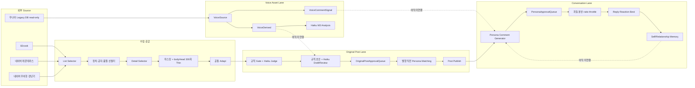

# 소란소란 Master Operating System

> 상태: 운영 정본
> 원칙: 이 문서의 상태값과 코드·DB·workflow 실측이 다르면 실측을 먼저 믿고 이 문서를 같은 PR에서 갱신한다.
>
> 🔴 **여기에 SHA·PR 번호·"미커밋 변경" 같은 순간값을 적지 않는다.**
> 그런 문구는 merge 되는 순간 낡고, 다음 사람은 낡은 전제에서 시작한다.
> 코드 기준이 궁금하면 `git log`, PR 상태는 `gh pr list` 를 본다 — 그것이 정본이다.
>
> 🔴 **세 가지를 섞지 않는다.**
>
> | | 뜻 |
> |---|---|
> | 구현됨 | 코드가 있고 fixture 가 지킨다 |
> | runtime 미활성 | 구현은 됐지만 job·설정이 올라가 있지 않다 |
> | 운영 미검증 | 실제로 돌려 본 적이 없거나 실측이 없다 |

## 0. 이 문서가 답해야 하는 질문

이 문서는 창업자와 운영 에이전트가 다음 질문에 한 번에 답하기 위한 시작점이다.

1. 우리는 왜 이 서비스를 만드는가.
2. 성공을 무엇으로 측정하는가.
3. 전체 시스템은 어떤 Lane으로 움직이는가.
4. 각 Lane은 설계, main 구현, 운영 설정, 실제 가동 중 어디까지 왔는가.
5. 어떤 AI 모델이 어디서 호출되고 비용이 발생하는가.
6. 지금 병목과 다음 큰 작업 묶음은 무엇인가.
7. 전략이나 전술이 바뀌면 어떤 정본을 함께 바꿔야 하는가.

이 문서는 상세 계약을 전부 복제하지 않는다. 목적, 구조, 현재 상태, 우선순위와 상세 정본의 위치를 연결한다.

## 1. 목적, 본질, 철학

### 1.1 서비스 본질

소란소란은 40대 중반부터 60대 중반 여성, 특히 50대 여성이 몸의 변화, 가족과 관계,
돈과 일, 노후와 일상의 고민을 같은 시기를 지나는 사람들과 나누며 다음 선택지를 찾는 커뮤니티다.

핵심 감정은 다음 한 문장이다.

> 나만 이런 게 아니구나.

일자리와 매거진, SEO, 크롤러, AI, Persona는 이 감정을 만들기 위한 수단이다. 서비스의 목적이 아니다.

### 1.2 Mission과 기대 경험

Mission은 사용자의 문제를 대신 해결하겠다는 것이 아니라 사용자를 혼자 두지 않는 것이다.

사용자가 순서대로 느껴야 하는 경험은 다음과 같다.

1. 여기 사람들이 활동한다.
2. 나도 말해도 된다.
3. 내가 한 말에 반응이 온다.
4. 전에 한 이야기를 기억해준다.
5. 다시 들어올 이유가 생긴다.

### 1.3 가치와 불변 조건

| 가치 | 운영 질문 |
|---|---|
| 공감 | 판단과 조언보다 공감이 먼저인가 |
| 연결 | 사용자를 고립시키지 않는가 |
| 안전 | 정치, 혐오, 사칭, 위험한 의료·재무 단정을 막는가 |
| 실용 | 사용자의 오늘에 도움이 되는가 |
| 존중 | 삶의 속도와 선택을 비교하거나 낮추지 않는가 |

다음은 속도보다 위에 있는 불변 조건이다.

- 외부 원문 유출 0.
- 위험 콘텐츠 공개 발행 0.
- 실회원과 Persona를 내부적으로 확실히 구분한다.
- Persona와 봇의 활동을 North Star에 포함하지 않는다.
- 공개 자동화는 cap, kill switch, audit, ratio limit, rollback을 가진다.
- 내부 Shadow 생산은 공격적으로 확장하되 공개량과 혼동하지 않는다.

## 2. North Star와 지표 위계

### 2.1 North Star

> 최근 7일 안에 재방문했고 글 또는 댓글을 한 번 이상 남긴 고유 실사용자 수

Persona, 봇, 운영 계정은 제외한다. 단순 게시량, 페이지뷰, 색인 수는 North Star가 아니다.

### 2.2 지표 위계

| 층 | 지표 | 용도 | 현재 측정 상태 |
|---|---|---|---|
| North Star | 주간 재방문 참여 실사용자 | 유일한 대표 지표 | 재방문 이벤트가 없어 정확히 측정 불가 |
| 선행 | D7 retention, 첫 댓글 전환, UGC 비율 | North Star를 움직이는 레버 | 일부만 계산 가능 |
| 경험 | 댓글 0개 공개 글 비율, 답글 도달 시간 | 말해도 되는 분위기 | 댓글 0개 25/30 |
| 안전 | source leak, safety failure, 실회원 오배정 | 공개 자동화 정지 조건 | 주요 Gate 구현 |
| 공급 | 신선 재고, source health, Queue yield | 자동화 가용성 | d1 health 구현 |
| 참고 | DAU, MAU, PV, SEO 클릭, 색인, 발행량 | 유입·생존 상태 | North Star로 사용 금지 |

2026-09-08 현재 최근 7일 대용 지표는 실사용자 글 9건, 댓글 15건, 고유 기여자 3명이다.
직전 7일도 고유 기여자는 같은 3명이지만 방문 이벤트가 없으므로 이들을 North Star의
`재방문 사용자`라고 확정해서는 안 된다.

## 3. 전체 시스템 구조



현재 핵심 결손은 `Voice 자산 -> 글/댓글 생성`, `Persona -> 생성 입력`,
`공개 글 -> 댓글 자동 분산 -> Memory -> 재응답` 연결이다.

## 4. Lane별 계약과 실제 상태

상태는 다섯 층을 분리한다.

- 설계: 정책과 계약이 문서 또는 순수 함수로 확정됐는가.
- main: 코드가 `origin/main`에 반영됐는가.
- 설정: env, workflow, launchd가 실제로 켜졌는가.
- 가동: 실제 운영 데이터가 생성됐는가.
- 관찰: 최소 한 운영 주기 동안 기대한 품질과 안전성이 확인됐는가.

| Lane | 입력 | 저장/출력 | AI | 설계 | main | 설정·가동 | 최종 판정 |
|---|---|---|---|---|---|---|---|
| Source Crawl | 82cook, Naver 2개 | list JSONL | 없음 | 완료 | 완료 | Naver 2개만 독립 가동 | 부분완료 |
| Thin Detail | selector 결과 | `*.thin-detail.jsonl`, 300자 이하 | 없음 | 완료 | 완료 | 세 source 실파일 존재 | 완료 |
| Raw Micro Seed | 승인한 외부 원문 | `MicroSeedRawContent`, Sheet, permanent noindex | 없음 | 완료 | 완료 | 과거 5건 발행 | 완료 |
| Automated Original Supply | thin row | adapt, judge, draft, Queue | Haiku | 완료 | 완료 | 재고는 §6.3 | d1 가동 |
| Voice Asset | 우나어 legacy read-only | VoiceSource/Derived/CommentSignal | 규칙 + Haiku 분석 | 완료 | 완료 | 전량 분석 완료 | 자산화 완료 |
| Persona-first Generation | Persona identity/voice + topic | Persona 고유 초안 | 생성 모델 미확정 | 완료 | 미구현 | 미가동 | 미착수 |
| Persona Matching | Queue + active Persona | matchedPersonaId, matchMeta | 없음 | 완료 | 완료 | active Persona 수는 §6.3 | 완료 |
| Original Publish | matched Queue | Post + ActivityLog | 없음 | 완료 | 완료 | GHA 1회/day | d1 가동 |
| Persona Comment | Post + reaction role | 댓글 후보 Queue | 기본 Haiku | 대부분 완료 | 생성기·Gate만 | 자동 스케줄 0 | 초기 단계 |
| Comment Distribution | 새 글, 댓글 비율 | 공개 Persona 댓글 | 없음 | 완료 | 미구현 | 미가동 | 미착수 |
| Memory | 사용자·Persona 대화 | Self/Relationship/Community/Mood | 미정 | 완료 | 스키마만 | 사실상 0행 | 미착수 |
| Reply/Reaction/Best | 댓글·기억·시간 | 답글, 좋아요, Best | 미정 | 방향만 | 미구현 | 미가동 | 미착수 |
| Health/Forecast | DB, 파일, 로그, scale | 화면 + JSON | 없음 | 완료 | 완료 | 수동 조회 | 부분완료 |
| SEO Bulk | 별도 indexable 콘텐츠 | 별도 URL/작성자/색인 정책 | 미정 | 미완료 | 없음 | 없음 | 미착수 |

🔴 **이 표에 변동하는 운영 숫자를 적지 않는다.** 재고·Persona 수·발행량 같은 값은
움직이는 순간값이라, 여기와 §6.3 두 곳에 적으면 반드시 한쪽이 낡는다(2026-09-09 실제 발생).
이 표는 **Lane 의 구조와 판정**만 적고, 숫자는 **§6.3 한 곳**에서만 관리한다.

### 4.0 `sourceCapturedAt` 은 게시 시각이 아니다

🔴 **`sourceCapturedAt` 은 "우리가 그 글을 본 시각" 이다 — 원문이 올라온 시각이 아니다.**
수집기가 목록·상세를 연 순간을 적는다. 원문 게시 시각은 지금 어느 source에서도 수집하지 않는다.

freshness TTL(§8.2)은 이 값을 **관측 시각 proxy**로 쓴다. 그래서

- 오래된 글을 오늘 처음 수집하면 우리 기준으로는 "갓 들어온 글"이다.
- 즉 **완전한 실시간성 보장이 아니다.** "수집 후 며칠 지났는가"를 보장할 뿐이다.
- 게시 시각을 수집하기 전까지 이 한계를 그대로 안고 간다. 문서에서 "최신 글만 나간다"고
  적지 않는다.

`sourceCapturedAt`이 없는 행은 나이를 알 수 없으므로 `AGE_UNKNOWN`으로 hold 한다(fail-closed).

### 4.1 Raw Vault 용어 정리

현재 `MicroSeedRawContent`에는 성격이 다른 데이터가 함께 있다.

| 종류 | 현재 행 수 | 의미 |
|---|---:|---|
| 82cook 외부 원문 | 39 | Micro Seed 원문 Vault |
| Naver 외부 원문 | 2 | 과거 직접 적재분 |
| `publish-candidate:*` envelope | 17 | 생성·큐레이션 후보를 Queue에 연결하기 위한 envelope |

따라서 `MicroSeedRawContent = 외부 원문 전용 Raw Vault`라고 설명하면 현재 DB와 맞지 않는다.
스키마 분리 또는 명시적인 origin/type 계약 보강이 필요하다.

Automated thin Lane은 외부 전문을 DB에 저장하지 않는다. 수집 메모리에서 마스킹한 뒤
300자 이하의 `bodyHead`만 파일로 남기고, 하류에서 생성된 후보 envelope가 DB에 들어간다.

### 4.2 현재 생성 순서

현재 구현은 Persona-first가 아니다.

```text
source title + masked bodyHead + axis/community angle
  -> 일반 오리지널 초안 생성
  -> Queue 적재
  -> 발행 직전 Persona 매칭
  -> Persona 작성자로 발행
```

목표 구조는 다음과 같다.

```text
source signal + target community context
  -> Persona identity/life constraints/topic role 선택
  -> VoiceDerived/VoiceCommentSignal 기반 Persona 고유 생성
  -> originality/safety/persona consistency Gate
  -> Queue
  -> 같은 Persona로 발행·댓글·기억 연결
```

## 5. AI API와 모델 정본

### 5.1 모델별 현재 역할

| 모델 | 현재 코드 역할 | 운영 상태 | 비용 상태 |
|---|---|---|---|
| `claude-haiku-4.5` | Voice M3 분석, 자동 judge, 자동 draft/review, 기본 Persona 글·댓글 생성 | 현재 신규 공급의 기본 모델 | 호출 시 과금 |
| `gpt-5-nano` | Voice M3 비교 실험, 선택 가능한 수동 생성 후보 | 기본 운영 아님 | 과거 실험 비용 존재 |
| `gpt-5-mini` | Voice M3 비교 실험, 선택 가능한 수동 생성 후보 | 기본 운영 아님 | 과거 실험 비용 존재 |
| `gemini-3.7-flash` | 과거 Original Queue 생성 | 현재 5건이 legacy 재고로 제외 | 과거 호출만 과금 |

API key가 설정돼 있다는 사실만으로 비용은 발생하지 않는다. `callProvider()`가 실제 호출될 때만 발생한다.
공개 발행 단계 자체는 LLM을 호출하지 않는다. 공급 부족 회차의 judge/draft와 수동 생성기가 호출 지점이다.

### 5.2 현재까지 기록된 Voice M3 비용

| 모델군 | 기록된 호출 | 기록 비용 |
|---|---:|---:|
| Haiku | 9,460 | $42.0139 |
| GPT-5 nano | 35 | $0.0351 |
| GPT-5 mini | 30 | $0.0975 |
| 합계 | 9,525 | $42.1465 |

현재 자동 supply의 파일 기반 judge/draft는 토큰과 비용을 DB 원장에 기록하지 않는다.
따라서 현재 글 한 건당 정확한 생성 비용은 아직 알 수 없다.

### 5.3 모델 결정에서 혼동하면 안 되는 것

- Haiku는 Voice M3의 `분석 모델`로 선정됐다.
- 분석 모델 선정은 `생성 모델` 선정을 의미하지 않는다.
- 현재 자동 생성은 별도 동일 샘플 실험 없이 Haiku를 하드코딩했다.
- Gemini Queue는 과거 산출물이며 현재 신규 생성 모델이 아니다.
- 생성 모델은 Persona/Voice 연결 후 동일 입력·동일 Gate로 Haiku와 Gemini를 재비교해야 확정할 수 있다.

## 6. 현재 main, 설정, DB

### 6.1 main 반영분

🔴 **SHA 를 적지 않는다** — 아래 목록은 "무엇이 있는가" 이고, "언제부터" 는 `git log` 가 답한다.

| 기능 | 구현 | runtime | 운영 검증 |
|---|---|---|---|
| 3개 source 수집기 · thin 공통 레일 | ✅ | 카페 2개만 job 등록 · 82cook 미등록 | 카페 ✅ · 82cook 🔴 |
| 규칙 + Haiku judge/draft · Queue 자동 보충 | ✅ | ✅ autopilot 1회/day | 통과율 실측 없음 🔴 |
| Account 기준 실회원 차단 | ✅ | ✅ | ✅ |
| 최대 매칭 · 기존 배정 복구 · 정합성 검사 | ✅ | ✅ | ✅ |
| Persona 생성·seed·활성화 도구 | ✅ | Wave A 실행 완료 · 현재 인원은 §6.3 | ✅ |
| 공급 health · capacity forecast | ✅ | ✅ | ✅ |
| d1/d3/d5/d10 profile · capacity/release 분리 · 강제 감속 | ✅ | d1 운영 중 | d1 ✅ · 그 위 🔴 |
| 수동 발행기 1건 제한 | ✅ | ✅ | ✅ |
| freshness hold 단일 계약 (§8.2) | ✅ | ✅ (d1 경로에서 동작) | hold 발생 사례 없음 |
| 수집 보호장치 — 예산·backoff·breaker (§8.3) | ✅ 3 source 전부 | 🔴 아직 한 번도 돌지 않음(상태 파일 없음) | 🔴 미검증 |
| Persona Pool 25장 · cohort 24명 | ✅ 카드·도구 | ✅ cohort 전원 활성화 완료 · 현재 인원은 §6.3 (P09 정본 제외 유지) | ✅ persona별 AuditLog 검증 |
| Naver 다회 슬롯 템플릿 | ✅ 템플릿 | 🔴 미등록 | 🔴 |

🔴 **이 표에도 변동하는 운영 숫자를 적지 않는다.** 인원·재고·발행량은 §6.3 한 곳에서만 관리한다 —
여기와 §6.3 두 곳에 적으면 반드시 한쪽이 낡는다(2026-09-09 실제 발생).

🔴 **"구현됨" 은 "돌고 있다" 가 아니다.** 세 칸을 한 칸으로 합치는 순간 이 표는 거짓이 된다.

### 6.2 실제 설정

| 항목 | 현재 |
|---|---|
| `SORAN_CAPACITY_STAGE` | **d3** (내부 3/day 기준 · Wave B, 2026-09-09) |
| `SORAN_RELEASE_STAGE` | **d1** (공개 1/day) — 🔴 Wave B 에서도 올리지 않았다 |
| 공개 발행 workflow | `5 15 * * *`, 1슬롯/day, `--limit=1` — 🔴 변경 없음 |
| Naver remonterrace | launchd **4회/day** 04:20 · 10:20 · 16:20 · 22:20 KST |
| Naver wgang | launchd **4회/day** 02:50 · 08:50 · 14:50 · 20:50 KST |
| supply runner | launchd 21:10 KST |
| 82cook 독립 job | 미등록 |

🔴 **내부 capacity 와 공개 release 는 다른 손잡이다.** Wave B 는 내부만 d3 로 올렸다 —
공개 발행량·cron·GitHub Variables 는 하나도 건드리지 않았다. 현재 운영 숫자는 §6.3.

### 6.2-b 예약 실행은 개발 작업트리가 아니라 **runtime worktree** 가 한다

🔴 **2026-09-09 이전에는 launchd 가 개발 작업트리를 직접 실행했다.** plist 의
`ProgramArguments` 가 `~/Documents/soransoran-m0/scripts/*.mts` 를 가리켰고,
그 경로는 `origin/main` 이 아니라 **그 순간 checkout 된 파일**이다 —
개발자가 feature branch 로 바꿔 두면 밤 예약 회차가 그 브랜치 코드로 돈다.

| | 위치 |
|---|---|
| 예약 실행 코드 | `~/Documents/soransoran-runtime` — 🔴 **detached · main 계보의 고정 SHA** |
| 고정 SHA 기록 | `~/Library/Application Support/soransoran/runtime-pinned-sha` |
| 비밀(`.env.local`) | `~/Library/Application Support/soransoran/env.local` — 양쪽에서 **심볼릭 링크** |
| 상태(`.microseed-data`) | `~/Library/Application Support/soransoran/microseed-data` — 양쪽에서 **심볼릭 링크** |
| 로그 | `~/Library/Logs/soransoran/` (Documents 밖 · TCC 회피) |

🔴 **코드는 나누고 상태는 하나로 둔다.** 보호장치 예산·차단기는 source 하나당 **원장 하나**여야 한다 —
worktree 마다 따로 두면 같은 사이트를 두 배로 두드린다. 그래서 데이터는 두 worktree **밖**에 두고
양쪽이 같은 실체를 가리킨다. 비밀도 같은 이유로 복제하지 않고 링크한다.

🔴 **runtime 은 자립한다** — 자체 `node_modules` 와 Prisma client 를 가진다.
개발 트리가 브랜치를 바꾸거나 재설치해도 예약 실행은 영향받지 않는다(재부팅 뒤에도 같다).

검사: `npm run runtime:isolation-check` (CI 는 판정 규칙만 · 운영 기계는 `--require-runtime`).

🔴 **배포는 job 을 올린 뒤에 끝난다.** `npm run runtime:deploy` 는 잠금 → fetch(실패 시 정지) →
unload 확인 → checkout·설치 → offline 게이트 → manifest/pin → load 확인 →
**실제 loaded 설정 대조 → `runtime:isolation-check --require-runtime`** 까지 통과해야 완료다.
job 이 내려가 있는 동안에는 loaded 를 요구하는 검사를 돌리지 않는다.
🔴 launchctl 상태는 loaded/unloaded/**unknown** 세 가지이고 unknown 은 어디서든 fail-closed 다.
🔴 runtime 아래여야 하는 것은 program 과 WorkingDirectory 뿐이다 — plist·로그 경로는 아니다.
실패하면 되돌리기를 **끝까지 시도**하고, 완전하지 않으면 남은 것을 적고 실패로 끝낸다.
🔴 Wave C 승격 신선도는 로컬 `origin/main` 이 아니라 **원격 main**(`git ls-remote`)으로 본다 —
읽지 못하면 NOT_READY 다. 자세한 것은 d10 운영 문서 §17~§18.

GitHub Actions cron은 정확한 시각을 보장하지 않는다. 실제 00:05 예정 실행이 약 04:05 KST에 시작된
사례가 있다. 10개 공개 슬롯의 실시간성을 GHA schedule에만 의존해서는 안 된다.

### 6.3 DB 스냅샷

> 🔴 **변동하는 운영 숫자는 여기 한 곳에서만 관리한다.** §4 Lane 표·§7 마일스톤은
> 숫자를 복제하지 않고 이 절을 가리킨다 — 두 곳에 적으면 반드시 한쪽이 낡는다.

| 항목 | 2026-09-09 실측 (read-only 전수) |
|---|---:|
| User / Account | 28 / 3 (Account 가 붙은 실회원 3명) |
| Persona | 24, 모두 active (draft 0 · 신규 16명 Account 0) |
| PersonaAuditLog | 101 |
| Post | 42: PUBLISHED 32, HIDDEN 1, DELETED 9 |
| Comment / Reply | 26 / 4 |
| 공개 글 중 댓글 0개 | 27/32, 84.4% |
| Like / CommentLike / Scrap | 5 / 4 / 1 |
| MicroSeedRawContent | 70 |
| OriginalPostApprovalQueue | 36: APPROVED 30, PUBLISHED 6 |
| 현재 사용 가능 재고 | 25/42: human 3, Haiku machine 22 |
| legacy Gemini 재고 | 5, 현재 재고에서 제외 |
| PersonaApprovalQueue | 4: PENDING 1, APPROVED 2, PUBLISHED 1 |
| PersonaActivityLog | 7: post 6, comment 1 |
| Memory | Self 0, Relationship 0, Community 0, Mood 0, Negative 1 |
| VoiceSource / VoiceDerived | 9,674 / 9,674 |
| VoiceCommentSignal | 59,252 |
| 수집 능력 (현재) | 80건/day — remonterrace 4회 40 · wgang 4회 40 · 82cook 0 (미등록) |

`capacity=d3 · release=d1` (§6.2). 🔴 **공개 발행은 여전히 1/day 다.**

이 표는 순간값이다. 현재 운영 판정은 `npm run supply:health -- --json`과 DB 실측을 사용한다.

## 7. 마일스톤과 진행률

### 7.1 운영 마일스톤 M1-M10

| M | 이름 | 설계 | main 구현 | 실제 운영 | 판정 |
|---|---|---|---|---|---|
| M1 | Micro Seed Operating Rail | 완료 | 완료 | 5건 발행 | 완료 |
| M2 | Source Quality Engine | 완료 | 완료 | 세 source 적용 | 완료 |
| M3 | Founder Gate | 완료 | 완료 | 과거 운영 | 완료 |
| M4 | Voice Engine Contract | 완료 | 부분 | 생성 경로 미연결 | 부분완료 |
| M5 | Legacy Data Vault | 완료 | 완료 | 9,674건 | 완료 |
| M6 | Derived Voice Dataset | 완료 | 완료 | 9,674건 + 댓글 신호 | 완료 |
| M7 | Offline Voice Analyzer | 완료 | 완료 | 전량 분석 | 완료 |
| M8 | LLM Voice Engine | 분석 완료 | 분석 완료 | 생성 모델 미확정 | 부분완료 |
| M9 | Original Content Lane | 완료 | 완료 | d1 가동 | 부분완료 |
| M10 | Comment/Conversation Engine | 대부분 완료 | 초기 scaffold | 자동 댓글 0/day | 미완료 |

이 번호는 운영 마일스톤이다. 제품 생애주기의 Phase/M 번호와 섞어 쓰지 않는다.

### 7.2 범위별 진행률

퍼센트는 코드 줄 수가 아니라 `설계 -> main -> 설정 -> 실제 가동 -> 관찰`의 완료도를 기준으로 한다.

| 범위 | 설계 | main 구현 | 운영 검증 |
|---|---:|---:|---:|
| 안전한 d1 글 자동화 | 95% | 85% | 75~80% |
| 공개 d10 확장 | 75% | 50~55% | 10~15% |
| 댓글·대댓글·Memory 생태계 | 75% | 25% | 5~10% |
| North Star | 정의 100% | 계측 20% | 결과 검증 0% |
| 최종 자율 커뮤니티 전체 | 약 75% | 약 45% | 약 25% |

## 8. Scale: 현재 능력과 목표

| 단계 | 공개 글/day | 재고 목표 | 현재 준비 |
|---|---:|---:|---|
| d1 | 1 | 14 | READY, 운영 중 |
| d3 | 3 | 42 | 코드 기반만 있음 |
| d5 | 5 | 70 | 코드 기반만 있음 |
| d10 | 10 | 140 | NOT READY |
| Shadow100 | Queue 후보 100/day | 별도 | 수집·수율 미증명 |
| SEO100-200 | indexable 콘텐츠 100~200/day | 별도 Lane | 설계 없음 |

현재 d10 병목은 다음 네 가지다.

1. 재고가 모자란다 — 현재 재고는 §6.3, d10 목표는 140이다.
2. ~~Persona 인원~~ → **2026-09-09 Wave A 로 해소.** 현재 active 인원은 §6.3.
   이제 병목은 인원이 아니라 재고다.
3. 공개 workflow가 1/10 슬롯이다.
4. 수집 능력과 yield가 증명되지 않았고 82cook 접근도 불안정하다.

### 7.x Scale Activation Wave A — Persona 24명 (2026-09-09 실행 완료)

> 🔴 아래 숫자는 **2026-09-09 실행 시점의 운영 데이터 순간값**이다. 고정 계약이 아니다.
> 계약은 §8.0~§8.5와 `src/lib/persona-cohort.ts` manifest가 정본이다.

`persona:cohort-run` 고정 cohort 도구로 두 회차를 실행했다. `--code` 같은 임의 지정은 쓰지 않았다.

| 회차 | 대상 | 결과 |
|---|---|---|
| wave3-scale | P03·P04·P06·P08·P12·P13·P14·P16·P18·P19·P20 (11명) | ✅ create → seed → activate |
| wave4-depth | P21·P22·P23·P24·P25 (5명) | ✅ create → seed → activate |

P09는 정본에 따라 **제외 상태를 유지**한다.

**배정된 표시명** (Gate ⑥-B 전원 pass · 회원 표시명 25 · authorHash 17,992 · norm 17,945 대조)

| | | | |
|---|---|---|---|
| P03 골목 | P04 창가 | P06 그늘 | P08 갈대 |
| P12 봉숭아 | P13 민들레 | P14 마루 | P16 자락 |
| P18 조약돌 | P19 들국화 | P20 산딸기 | P21 제비꽃 |
| P22 달맞이 | P23 물봉선 | P24 노루귀 | P25 패랭이 |

이름은 코드에 배정표를 두지 않고 **적용 시점 Gate ⑥-B가 정한다**(Pool §3-2).

**이 회차가 바꾼 것** (2026-09-09 실행)

| | before | after |
|---|---|---|
| User | 12 | 28 |
| Persona | 8 (active 8) | 24 (active 24 · draft 0) |
| PersonaAuditLog | 37 | 101 |
| Account | 3 | 3 (신규 16명 전원 0) |
| Post · Comment · Queue · ActivityLog · RawContent | 42 · 26 · 24 · 7 · 58 | **건드리지 않았다** |

🔴 위 `after` 는 **이 회차의 변화량을 보여주는 실행 기록**이다.
**지금 값의 정본은 §6.3 하나뿐이다** — 이후 값이 움직이면 §6.3만 갱신한다.

persona별 분포도 확인했다 — 신규 16명 각각 `created` 1 · `display_name_assigned` 1 ·
`updated`(seed) 1 · `status_changed` 1(draft→active, actorUserId·reason 있음).
총합만 맞고 분포가 틀리면 FAIL로 본다.

**기존 8명**(P01·P02·P05·P07·P10·P11·P15·P17)은 status·값·AuditLog 건수 모두 불변이다.

🔴 **공개 발행은 여전히 d1이다.** 활성화는 "말이 나간다"는 뜻이 아니다 —
발행은 auto-publish 러너가 스케줄에 따라 한다. capacity·release 단계는 올리지 않았다.

**실행 중 한 번 막혔던 것**: wave3 activate가 Prisma 기본 트랜잭션 마감 5초에 걸려
2회 연속 전원 롤백(write 0)했다. 원인과 수정은 PR #485(runbook §14)이고,
merge 뒤 `--step=activate`부터 이어서 완료했다. 부분 활성화는 발생하지 않았다.

**다음 단계**: `Scale Activation Wave B — 다회 수집 활성화와 재고 확장`.
지금 병목은 인원이 아니라 **재고와 수집 능력**이다(§8.0).

### 8.0 수집 능력: current, prepared, required를 합치지 않는다

세 숫자는 뜻이 다르므로 절대 한 값으로 합치지 않는다.

| 구분 | 뜻 | 정본 | 2026-09-08 값 |
|---|---|---|---:|
| current | `launchctl`에 **실제로 올라와 있는** job의 실제 슬롯 수 × 회차당 상세 × 성공률 | 관측(`launchctl list` + 설치된 plist) | **20/day** |
| prepared | 저장소에 템플릿·계획이 있고 계획이 성립하는 것 | `collect-schedule` 계획 | **320/day** |
| on-demand potential | `supply-autopilot`이 **재고가 모자랄 때만** 여는 몫 | 관측 + 성공률 | **+40/day** (조건부) |
| required | 그 capacity 단계가 요구하는 상세 요청 수 | `planSupply` 역산 | **382/day** (내부 100/day) |

🔴 **on-demand potential을 current에 합치지 않는다.** 재고가 차 있으면 autopilot은 0건을 연다.
합치면 "재고가 찼을 때는 0인 능력"을 상시 능력으로 세게 된다 — 그렇게 해서 60/day라는 수가 나왔었다.

- current의 정본은 **관측**이다. 코드의 정적 `loaded: true` 플래그를 능력의 근거로 쓰지 않는다.
- 지금 등록된 것은 Naver 카페 **1회 job 2개**와 `supply-autopilot`뿐이다.
  `*-multi` job과 82cook job은 **미등록**이므로 current 기여가 0이거나 1회분이다.
- 템플릿이 저장소에 있다는 사실은 prepared이지 current가 아니다.
- 여유 기준은 `required / 0.7`이다. 382 기준으로 **546/day**가 있어야 여유 30%를 만족한다.

따라서 **d10 collect readiness는 BLOCKED**다. current 20, prepared 320 모두 required 382에 못 미친다.

d1 운영 건강성과 d10 승격 준비도는 다른 질문이다. d1은 현재 job과 재고로 정상 운영될 수 있고,
그 사실이 d10 준비 완료를 뜻하지 않는다. 승격 준비도는 **계획한 다회 job이 정확한 label과
슬롯 수로 등록되어 있을 때만** READY가 될 수 있다.

### 8.1 내부 100/day 역산

현재 문서의 관측·가정으로 Queue 100건에는 judge 약 286건, draft 약 143건,
상세 요청 약 382건, 목록 약 43,816건, LLM 약 429회/day가 필요하다.

`judgePass 50%`, `draftPass 70%`는 아직 가정이다. 이 값으로 READY를 선언하지 않는다.

### 8.2 발행 후보 준비는 하나의 계약이다

러너, 관제(`supply:health`), 예측(`forecast`), 단계 준비도가 **같은 순수 함수**
`prepareCandidates`를 부른다. 같은 입력이면 자동 대상 id, hold 사유, 정렬 순서가 모두 같다.

hold 대상은 자동 발행에서만 빠지며 **큐에서 삭제하거나 status·배정을 바꾸지 않는다**.

| hold 사유 | 뜻 | 처리 |
|---|---|---|
| `TTL_EXPIRED` | 주제 성격 기준 TTL을 넘겼다 | 사람 검수 |
| `AGE_UNKNOWN` | 원문 시각을 모른다 | 사람 검수. **`warm`으로 낙관하지 않는다** |
| `RECOVERY_STALE` | 기존 배정이 있는데 그 글이 상했다 | 사람 검수. 재배정·우회 금지 |

깨진 배정(`RECOVERY_BROKEN`)은 hold가 아니라 **전체 중단**이다.

발행 우선순위는 다음과 같고, 최대 매칭 cardinality와 persona 주 상한을 깨지 않는다
(`maxMatch`가 증가 경로라 처리 순서가 총 배정 수를 바꾸지 않는다).

1. 유효한 recovery
2. timely hot
3. timely warm
4. evergreen — 실제 배정 persona 점수 → freshness → 안정적 tie-break

### 8.3 수집 차단기 상태 전이와 사람 해제

실패는 `403 FORBIDDEN`, `429 RATE_LIMIT`, `TCP NETWORK`, `5xx SERVER`, `OTHER`로 나눈다.
**대응이 다르므로 임계와 쿨다운도 분리한다.** 셋을 한 임계로 묶으면 403을 다섯 번 맞을 때까지 두드린다.

```
closed ──(연속 실패 = 임계)──> open
open   ──(쿨다운 경과)────────> half-open
half-open ──(시험 요청 1건)──> open        시험 중에는 두 번째 요청을 보내지 않는다
half-open ──(시험 성공)──────> closed
half-open ──(시험 실패)──────> open        🔴 openedAt을 그 실패 시각으로 갱신한다
                                          = 쿨다운이 그때부터 다시 시작한다
```

`FORBIDDEN`은 임계 1이며 쿨다운으로 풀리지 않는다. **사람이 확인해야 닫힌다.**

해제 절차는 전용 도구 하나뿐이다. 상태 파일 삭제나 수동 JSON 편집을 운영 절차로 두지 않는다.

```
npm run collect:guard-status
npm run collect:guard-clear -- --source=82cook --class=FORBIDDEN
npm run collect:guard-clear -- --source=82cook --class=FORBIDDEN --apply --reason "..."
```

- 기본 dry-run, source·class allowlist, `--apply`와 `--reason` 필수.
- 지정한 source/class 하나만 연다. 예산과 다른 분류는 건드리지 않는다.
- 해제 이력은 `.microseed-data/collect-guard-audit.log`에 append-only로 남긴다.

🔴 **세 source 전부가 이 보호장치를 지난다.** 82cook은 `fetch`를 감싼 `guardedGet`,
Naver 카페는 Playwright `page.goto`를 감싼 `guardedNavigate`다. 둘은 같은 상태 파일·같은 계약을 쓴다.
어느 한쪽이라도 우회하면 "source별 보호장치 구현 완료"라고 적을 수 없다 — fixture가 그것을 지킨다.

🔴 **`half-open`에서 시험 요청은 한 건이다.** 그 한 건이 실패하면 즉시 다시 열리고
쿨다운이 **그 실패 시각부터** 다시 시작한다. 처음 열린 시각을 유지하면 시험이 실패해도
계속 half-open으로 남아 무한히 두드리게 된다.

상태 파일은 82cook 독립 job과 `supply-autopilot`이 공유할 수 있으므로,
읽기·판단·기록을 **파일 잠금 안에서 한 번에** 한다. 얻지 못하면 그 회차는 요청하지 않는다(fail-closed).

### 8.4 잠금 회수 계약 — 무엇을 뺏고 무엇을 뺏지 않는가

잠금은 두 층이다.

| 파일 | 뺏는가 | 근거 |
|---|---|---|
| `collect-guard-<source>.json.lock` (primary) | 🟢 시효(60초) 뒤 **뺏는다** | 회수 잠금(reaper)을 `wx`로 **새로 얻은** 프로세스만 수행한다 |
| `collect-guard-<source>.json.reap` (reaper) | 🔴 **절대 뺏지 않는다** | 뺏는 판정 자체가 다시 경쟁이 된다 (아래) |

🔴 **reaper는 시효가 지나도 자동 회수하지 않는다.** 2026-09-09에 실제 다중 프로세스로 재현했다:
"시효가 지난 reaper를 원자적으로 교체하고 다시 읽어 내 token인지 확인한다"를 두면,
A가 교체·확인을 마친 **뒤** B가 낡은 관측으로 다시 교체한다. A의 확인은 이미 지나갔고
둘 다 primary를 바꿔 들어간다 — 강제 안무에서 `MAX_CONCURRENT=2`.
재확인·token·rename을 어떻게 조합해도 검사와 다음 조작 사이가 새 창이 될 뿐이고,
임시 잠금을 하나 더 두면 문제를 한 층 아래로 옮기기만 한다.

그래서 reaper는 **`wx`로만 생기고 주인만 지운다**. `EEXIST`면 살아 있든 시효가 지났든
그 회차는 물러난다(fail-closed). 대가는 **reaper를 쥔 채 죽으면 그 source의 수집이 멈춘다**는 것이다.
뺏는 것보다 멈추는 것이 낫다 — 뺏으면 두 프로세스가 남의 서버에 두 배로 요청한다.

🔔 **reaper crash는 사람이 복구한다.** 남은 reaper는 `npm run collect:guard-status`와
잠금 실패 오류 메시지에 운영 이상으로 표시된다. 복구 절차(수집 job 전부 정지 → 소유 프로세스
부재 확인 → 그 뒤에만 파일 삭제)는 `docs/operations/2026-09-08-d10-activation-prep.md` §12다.

🔴 **"TTL이 지나면 알아서 풀린다"고 적지 않는다.** 그 문장은 reaper가 남지 않은 경우에만 참이다.
잠금 해제 실패 안내도 세 갈래(reaper 없음 / 남이 쥔 중 / 시효 넘겨 남음)를 구분해 말한다.

### 8.5 상태 write는 fencing한다 — 승계당한 옛 주인은 쓰지 못한다

🔴 **2026-09-09 재현**: 잠금을 "쥐었었다"는 사실만 확인하고 쓰던 판은
**승계당한 옛 owner의 write를 받아들였다**(`staleOwnerWriteAccepted = true`).
그 프로세스는 이미 잠금을 뺏긴 상태였고, 결과적으로 새 주인의 예산·차단기를 덮어썼다 —
2건 보내고 1건으로 기록하거나, 열린 403 차단기를 닫힌 것으로 되돌린다.

상태를 쓰는 길은 `saveGuard` 하나뿐이고, 그 안에서 **fence**한다.

1. `wx`로 **새 reaper**를 얻는다 — 못 얻으면 쓰지 않고 던진다(fail-closed)
2. 그 reaper 안에서 실제 primary lock의 token이 **내 token**인지 확인한다
3. 같을 때만 쓴다. 다르거나·읽을 수 없거나·없으면 쓰지 않고 던진다
4. `finally`에서 **내 reaper만** 푼다

🔴 **"token을 읽고 바로 쓴다"는 다시 TOCTOU다.** 읽기와 쓰기 사이에 회수가 끼어들면
이미 옛 주인이 된 채로 쓴다. 회수는 reaper를 요구하므로(§8.4 불변식 B),
확인과 write를 **같은 reaper 구간 안**에 두어야 그 사이가 닫힌다.

`reserveRequest`·`settleRequest`·사람 해제(`collect:guard-clear`)가 모두 이 한 관문을 지난다.

🔴 **잠금 안은 동기다.** 잠금을 쥔 채 `await`하면 TTL(60초)을 넘길 수 있고,
그러면 남이 회수한 뒤에 **옛 callback이 뒤늦게 돌아와** 부작용을 만든다.
그래서 `withGuardLock` callback이 Promise를 돌려주면 실행 중에 던진다.
네트워크·대기는 잠금 **밖**에서 한다(`guardedGet`·`guardedNavigate`가 그 구조다).

## 9. 댓글 규모와 ratio 계약

Persona 댓글은 전체 댓글의 30% 이하를 기본 안전 상한으로 한다.

최근 실사용자 댓글은 15건/7일, 약 2.14건/day다. 비율식 `p / (p + real) <= 0.30`을 적용하면
현재 안전한 Persona 댓글은 평균 약 0.92건/day, 즉 0~1건/day다.

| Persona 댓글 목표 | 필요한 실사용자 댓글 |
|---|---:|
| 1/day | 약 3/day |
| 3/day | 약 7/day |
| 5/day | 약 12/day |
| 10/day | 약 24/day |

따라서 d10에서 새 글 10개에 Persona 댓글을 무조건 하나씩 달면 안 된다.
댓글 0개 글을 우선하고, 실제 사용자 댓글량에 따라 자동으로 대상 글 수를 늘리거나 줄여야 한다.

## 10. 82cook 사건과 수집 원칙

### 10.1 현재 사실

망을 바꿔 가며 **같은 Mac · 같은 코드**로 확인한 결과다.

| 네트워크 | 82cook 접속 | 비고 |
|---|---|---|
| 도서관 Wi-Fi | 🔴 실패 | HTTP·HTTPS 모두 **TCP 연결 단계**에서 실패 |
| 스타벅스 Wi-Fi | 🟢 정상 | 같은 Mac · 같은 코드 |
| 집 Wi-Fi | 🟢 정상 | 같은 Mac · 같은 코드 |

- HTTP status, 응답 body, captcha를 받지 못했으므로 selector 실패나 HTTP 403으로 확정할 수 없다.
- 같은 날 오전 수집은 상세 10건 중 성공 8, HTTP 404 1, fetch 실패 1이었다. 성공률은 **0.8**이다.

### 결론

- **전역 차단·기기 차단·계정 차단 가능성은 낮다.** 같은 기기·같은 코드가 두 망에서 정상이었다.
- **도서관 공인 IP · 방화벽 · DNS · 라우팅 등 네트워크 경로 문제 가능성이 높다.**
- 🔴 **정확한 원인은 미확정이다.** 위 둘은 가능성의 크기이지 확정이 아니다.
- 🔴 **도서관 Wi-Fi에서는 82cook live 수집을 하지 않는다.** 원인을 모르는 채 재시도하면
  관측만 오염되고 상대 서버에는 실패 요청만 쌓인다.

🔴 **403 과 TCP 를 같은 원인으로 합치지 않는다.** 403은 상대가 우리를 알아보고 막은 것이고,
TCP 실패는 연결 자체가 안 된 것이다. 전자는 재시도가 상황을 악화시키고 후자는 우리 쪽 망일 수 있다.
코드에서도 두 분류의 임계·쿨다운·해제 방법이 다르다(§8.3).

### 10.2 안전한 확인과 금지

🔴 **이미 같은 Mac에서 두 개의 정상 망(스타벅스·집)을 확인했다.** 그것으로
"기기·계정·전역 차단" 은 사실상 배제됐다. 따라서 **핫스팟 확인은 필수 다음 단계가 아니다** —
같은 종류의 관측을 한 번 더 얻을 뿐이다. 하고 싶으면 해도 되지만, 이것을 못 해서
다음 작업이 막히지는 않는다.

원인을 좁히려면 **도서관 망 자체를 보는 관측**이 필요하다(공인 IP, 방화벽, DNS 응답,
경로 추적). 그것 없이는 정확한 원인이 확정되지 않는다.

🔴 금지: VPN · 프록시 · UA 위장 · IP 회전으로 우회하지 않는다.
🔴 금지: **도서관 Wi-Fi에서는 82cook live 수집을 하지 않는다.**
🔴 원인 확인 전에는 82cook 10슬롯 job을 활성화하지 않는다.

### 10.3 활성화 선행 조건

| 선행 조건 | 2026-09-08 상태 |
|---|---|
| source별 일일 요청 budget | ✅ 구현 (`collect-guard`, KST 하루 단위) |
| 정상 요청 간격과 jitter의 단일 정본 | ✅ 구현 (`collect-schedule` 실측값) |
| 429, 403, TCP 실패별 지수 backoff | ✅ 구현 (분류별 base·cap·재시도 상한 분리) |
| 연속 실패 circuit breaker | ✅ 구현 (§8.3 상태 전이, 403은 사람 해제) |
| 성공률과 실패 종류를 health JSON에 노출 | ✅ 구현 (`supply:health --json`의 `collect.guards`) |
| 한 source가 중단돼도 Naver와 발행이 계속되는 격리 | ✅ job 분리 · 유효 처리량 기준 격리 계산 |
| **82cook 신규 유입 실측** | 🔴 **미측정** — 놓침 상한을 계산할 수 없다 |
| **접속 불안정 원인 확정** | 🔴 미확정 (§10.1) |
| **실제 job 등록** | 🔴 미등록 — current 기여 0 |

앞의 여섯 개가 구현됐어도 뒤의 세 개가 남아 있으므로 **82cook readiness는 BLOCKED**다.

`82cook detail 성공률 100%`는 잘못된 값이었다. 실측은 **8/10 = 0.8**이며,
공급 능력은 이론 최대가 아니라 이 성공률을 곱한 **유효 처리량**으로 계산한다.

## 11. 문서 감사 결과

| 문서 | 판정 | 조치 |
|---|---|---|
| `NORTH_STAR.md` in unao-main | 목적·지표 유효, 옛 브랜드·도메인 | 헌법 원본으로 참조, 소란소란 맥락은 이 문서에 명시 |
| `2026-08-26-soransoran-milestones.md` | 수집·공급·DB·M5-M10 상태가 낡음 | 역사 문서로 내리고 이 문서를 현재 지도 정본으로 사용 |
| `2026-08-30-persona-architecture-design.md` | 구현 미착수 헤더가 낡음 | 상세 설계로만 유지 |
| `2026-09-02-original-post-lane-strategy.md` | 구조는 유효, health·scheduler 상태 일부 낡음 | Lane 상세 정본, 상태표는 이 문서 우선 |
| `2026-09-03-controlled-activity-automation-strategy.md` | 방향 유효, 숫자·관제 상태 일부 낡음 | 전략 상세 정본, 현재 수치는 이 문서 우선 |
| `2026-09-03-raw-supply-chain-design.md` | append-only 역사가 길어 현재 상태 식별 곤란 | 역사·사고 기록으로 유지, 현재 계약은 이 문서에서 진입 |
| `2026-09-08-scale-foundation.md` | scale 코드와 가장 가까움 | scale 상세 정본, 실측 수율은 관찰값으로 표시 |
| schema 주석 | RawContent 원문 전용 설명과 실제 envelope 사용 충돌 | 별도 스키마 계약 PR에서 정리 |

## 12. 다음 실행 계획

작은 PR을 반복하지 않고 세 개의 큰 작업 묶음으로 진행한다.

| 묶음 | 완료 조건 | 개발 예상 |
|---|---|---:|
| A. Truth + Source Reliability | 문서 정본화, 잘못된 WIP 수치 제거, 82cook 진단, source budget/backoff/circuit breaker, Naver 다중 슬롯, freshness 관제 | 0.5~1일 |
| B. Persona-first + Conversation | 동일 샘플 모델 비교, 생성 모델 확정, Voice/Persona 연결, 비용 원장, 댓글 분산, 30% 감속, North Star 이벤트 | 1.5~2일 |
| C. Scale Execution | Persona 20~24명, 신선 재고 42->70->140, 신뢰 가능한 scheduler, d3->d5->d10 자동 승격 | 2~4일 |

목표는 5~7일 안에 d10 기술 활성화다. 이후 7일 운영 관찰은 개발을 멈추고 기다리는 기간이 아니라
Memory, 대댓글, Reaction/Best와 SEO Lane을 병렬 구현하는 기간이다.

| 후속 | 예상 |
|---|---:|
| Self/Relationship Memory와 기억 기반 대댓글 | 2~3일 |
| Reaction/Best controlled automation | 1~2일 |
| 별도 SEO 100/day MVP | 범위 확정 후 3~5일 |

## 13. 전략 변경 프로토콜

목표, 모델, Lane, cap, source 또는 안전 규칙이 바뀌면 한 PR에서 다음을 함께 바꾼다.

1. 이 문서의 목적·현재 상태·결정 기록.
2. 상세 정본 문서 또는 manifest/순수 함수.
3. 실제 runtime 설정: env, workflow, launchd.
4. fixture와 health JSON.
5. DB 변경이 있으면 before/after와 rollback 절차.

`설계 완료`, `main 구현 완료`, `설정 완료`, `실제 가동`, `운영 관찰 완료`를 같은 말로 쓰지 않는다.
Claude 또는 Codex의 보고는 항상 이 다섯 칸을 분리한다.

## 14. 의사결정 기록

| 날짜 | 결정 | 근거 |
|---|---|---|
| 2026-09-08 | 현재 공개 단계는 d1 | env 미설정, workflow 1슬롯, stock 14 |
| 2026-09-08 | 100/day는 Shadow 또는 별도 SEO Lane이며 Persona 공개 100/day가 아님 | 자연스러움과 North Star 보호 |
| 2026-09-08 | 현재 생성 모델은 운영 사실상 Haiku지만 최종 생성 모델로 확정하지 않음 | 분석 모델 선택과 생성 모델 선택은 별개 |
| 2026-09-08 | 82cook 10슬롯 활성화 보류 | 현재 네트워크 실패와 성공률 8/10, 보호장치 미완료 |
| 2026-09-08 | d10 준비 작업은 큰 묶음 A/B/C로 병렬 진행 | 창업자 개입과 반복 amend 감소 |

## 15. 조사 근거

- 목적: `/Users/yanadoo/Documents/unao-main/docs/constitution/NORTH_STAR.md`
- 자동화 전략: `docs/operations/2026-09-03-controlled-activity-automation-strategy.md`
- Original Lane: `docs/operations/2026-09-02-original-post-lane-strategy.md`
- Scale: `docs/operations/2026-09-08-scale-foundation.md`
- DB 모델: `prisma/schema.prisma`
- AI adapter: `scripts/lib/voice-m3-provider.mts`
- 자동 judge/draft: `scripts/micro-seed-auto-judge.mts`, `scripts/micro-seed-auto-draft.mts`
- publish: `scripts/original-post-auto-publish.mts`, `.github/workflows/auto-publish.yml`
- health: `scripts/supply-health.mts`
- 기준 DB 스냅샷: 2026-09-08 read-only 직접 조회
- 82cook: 로컬 DNS/TCP/HTTP 진단과 외부 게시판 응답 대조

