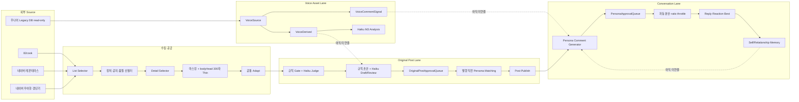

# 소란소란 Master Operating System

> 상태: **기술 지도와 역사 증거**. 현재 운영 상태도, 현재 정책도 말하지 않는다.
> 권위 지도는 [`README.md`](./README.md) 하나다. 목적은 [`NORTH-STAR.md`](./NORTH-STAR.md),
> D3~D100 정책과 정책 숫자는 [`2026-09-21-d100-goal-canon.md`](./2026-09-21-d100-goal-canon.md),
> 검증된 현재 상태와 다음 실행은 [`CURRENT-MILESTONE.md`](./CURRENT-MILESTONE.md) 가 이긴다.
>
> 🔴 **📜 표시가 붙은 절과 줄은 역사 증거다.** 과거 사건과 실측을 지우지 않으려고 남겨 두지만
> 현재 정책·상태에 투표하지 않는다. 날짜가 붙은 수치, 과거 M1~M10 표, DB 스냅샷은 당시 기록이다.
> 과거 M1~M10 이름은 현재 마일스톤과 다른 역사 namespace다.
>
> 🔴 **2026-09-30 하나의 루프 재동기화로 역사가 된 절** — 현재 정책은 canon 이다.
>
> | 이 문서의 절 | 대체한 canon 정책 |
> |---|---|
> | §4.0 `sourceCapturedAt` 을 신선도 기준으로 쓰던 계약 · §8.2 주제 성격별 TTL | §2 source-to-slot 판정 |
> | §6.2 사람이 stage env 를 올리던 절차 · §8 앞머리 단계별 재고 목표 | §6 자동 사다리 |
> | §8.0-D100 완성 글 고정 재고선 | §3 JIT 공급 · §3.2 증명일/지속 준비도 |
> | §9.0 Persona 댓글 비율 상한 · §9.4 답글 범위 제외 (옛 경로) | §5 대화 |
> | 단계별 `READY +20%` · 상세 원천 고정 환산표 | canon §3.1 실측 보충 계약 |
> | `politicalOrPublicFigure` 로 정치인과 연예·방송인을 함께 제외하던 분류 | canon §7.1 정치/공개 인물 분리 |
> | 모든 자동 글에 Persona 댓글 정확히 1건으로 끝내던 해석 | canon §5 첫 댓글 증명 + 선택적 대화 |
> | Persona 댓글을 실회원 반응과 같은 인기 신호로 합산하던 홈 랭킹 | canon §7.2 실회원 우선 랭킹 |
>
> 🔴 **여기에 SHA·PR 번호·"미커밋 변경" 같은 순간값을 적지 않는다.**
> 그런 문구는 merge 되는 순간 낡고, 다음 사람은 낡은 전제에서 시작한다.
> 코드 기준이 궁금하면 `git log`, PR 상태는 `gh pr list` 를 본다 — 그것이 정본이다.
>
> 🔴 **세 가지를 섞지 않는다.**
>
> | | 뜻 |
> |---|---|
> | 구현됨 | 코드가 있고 fixture 가 지킨다 |
> | runtime 미활성 | 구현은 됐지만 job·설정이 올라가 있지 않다 |
> | 운영 미검증 | 실제로 돌려 본 적이 없거나 실측이 없다 |

## 0. 이 문서가 답해야 하는 질문

이 문서는 창업자와 운영 에이전트가 다음 질문에 한 번에 답하기 위한 시작점이다.

1. 우리는 왜 이 서비스를 만드는가.
2. 성공을 무엇으로 측정하는가.
3. 전체 시스템은 어떤 Lane으로 움직이는가.
4. 각 Lane은 설계, main 구현, 운영 설정, 실제 가동 중 어디까지 왔는가.
5. 어떤 AI 모델이 어디서 호출되고 비용이 발생하는가.
6. 과거 병목이 무엇이었고 어떤 기술 계약이 생겼는가.
7. 전략이나 전술이 바뀌면 어떤 정본을 함께 바꿔야 하는가.

이 문서는 상세 계약과 역사를 연결한다. 지금 병목과 다음 실행은 `CURRENT-MILESTONE.md`에서만 판정한다.

## 1. 목적, 본질, 철학

### 1.1 서비스 본질

소란소란은 40대 중반부터 60대 중반 여성, 특히 50대 여성이 몸의 변화, 가족과 관계,
돈과 일, 노후와 일상의 고민을 같은 시기를 지나는 사람들과 나누며 다음 선택지를 찾는 커뮤니티다.

핵심 감정은 다음 한 문장이다.

> 나만 이런 게 아니구나.

일자리와 매거진, SEO, 크롤러, AI, Persona는 이 감정을 만들기 위한 수단이다. 서비스의 목적이 아니다.

### 1.2 Mission과 기대 경험

Mission은 사용자의 문제를 대신 해결하겠다는 것이 아니라 사용자를 혼자 두지 않는 것이다.

사용자가 순서대로 느껴야 하는 경험은 다음과 같다.

1. 여기 사람들이 활동한다.
2. 나도 말해도 된다.
3. 내가 한 말에 반응이 온다.
4. 전에 한 이야기를 기억해준다.
5. 다시 들어올 이유가 생긴다.

### 1.3 가치와 불변 조건

| 가치 | 운영 질문 |
|---|---|
| 공감 | 판단과 조언보다 공감이 먼저인가 |
| 연결 | 사용자를 고립시키지 않는가 |
| 안전 | 정치, 혐오, 사칭, 위험한 의료·재무 단정을 막는가 |
| 실용 | 사용자의 오늘에 도움이 되는가 |
| 존중 | 삶의 속도와 선택을 비교하거나 낮추지 않는가 |

다음은 속도보다 위에 있는 불변 조건이다.

- 외부 원문 유출 0.
- 위험 콘텐츠 공개 발행 0.
- 실회원과 Persona를 내부적으로 확실히 구분한다.
- Persona와 봇의 활동을 North Star에 포함하지 않는다.
- 공개 자동화는 cap, kill switch, audit, ratio limit, rollback을 가진다.
- 내부 Shadow 생산은 공격적으로 확장하되 공개량과 혼동하지 않는다.

## 2. North Star와 지표 위계

🔴 **이 절은 장기 정본이다. 단기 목표는 여기 적지 않는다.**
North Star 의 정의는 [`NORTH-STAR.md`](./NORTH-STAR.md) 가 정본이고 이 절은 그것을 인용해
지표 위계를 설명한다. 단계 목표와 정책 숫자는 D100 canon 한 곳에만 있다. 두 곳에 적으면
반드시 한쪽이 낡고, 낡은 쪽이 먼저 읽힌다.

### 2.1 North Star — 🔴 장기 정본 (분기가 바뀌어도 바뀌지 않는다 · 정의는 NORTH-STAR.md)

> 최근 7일 안에 재방문했고 글 또는 댓글을 한 번 이상 남긴 고유 실사용자 수

Persona, 봇, 운영 계정은 제외한다. 단순 게시량, 페이지뷰, 색인 수는 North Star가 아니다.

🔴 **Persona·봇 활동과 게시량은 North Star 에 넣지 않는다.**
지금 만들고 있는 것(공개 글 100/day · 댓글 500/day)은 **수단**이다.
그 수가 오르는 동안 North Star 가 그대로면, 그것은 성공이 아니라
"아무도 없는 곳에 우리끼리 말하고 있다" 는 뜻이다.

🔴 **이 서비스의 장기 정본을 한 문장으로.**
소란소란은 40대 중반~60대 중반 여성이 *"나만 이런 게 아니구나"* 를 느끼고,
글을 쓰고 반응받고 다시 돌아오는 커뮤니티다. 단기 공급 목표는 전부
그 느낌을 만들기 위한 수단이고, 수단이 목적을 이기면 즉시 멈춘다.

### 2.2 지표 위계

| 층 | 지표 | 용도 | 측정 상태 (📜 2026-09 당시) |
|---|---|---|---|
| North Star | 주간 재방문 참여 실사용자 | 유일한 대표 지표 | 재방문 이벤트가 없어 정확히 측정 불가 |
| 선행 | D7 retention, 첫 댓글 전환, UGC 비율 | North Star를 움직이는 레버 | 일부만 계산 가능 |
| 경험 | 댓글 0개 공개 글 비율, 답글 도달 시간 | 말해도 되는 분위기 | 🔴 지금 값은 §6.3 |
| 안전 | source leak, safety failure, 실회원 오배정 | 공개 자동화 정지 조건 | 주요 Gate 구현 |
| 공급 | 신선 재고, source health, Queue yield | 자동화 가용성 | d1 health 구현 |
| 참고 | DAU, MAU, PV, SEO 클릭, 색인, 발행량 | 유입·생존 상태 | North Star로 사용 금지 |

Persona 글·댓글은 빈 공간을 없애고 대화 가능성을 만드는 운영 수단이다. Persona 댓글이 많이 달렸다는
이유로 홈·베스트 인기를 높이거나 North Star에 합산하지 않는다. 실회원 반응과 합성 활동은 분리 측정한다.

🔴 **최근 7일 대용 지표의 지금 값은 §6.3 에만 둔다.** 여기 숫자를 다시 적지 않는다 —
한 번 적으면 그 숫자가 낡은 채 남아 "현재값" 으로 읽힌다. 실제로 이 문단은
`댓글 15건` 을 들고 있었는데, 그것은 **삭제된 댓글을 포함한 수**였고
살아 있는 실사용자 댓글은 그보다 훨씬 적었다(§6.3 참조).
방문 이벤트가 없으므로 고유 기여자를 North Star 의 `재방문 사용자` 라고 확정해서는 안 된다.

## 3. 전체 시스템 구조

### 3.1 목표 루프 — 기술 지도

정책은 D100 canon §2~§6 이 정한다. 이 절은 그 정책이 시스템의 어느 자리에 놓이는지만 그린다.
🔴 **이 지도는 목표 구조다. 무엇이 main 에 구현·배포·운영 검증됐는지는 이 문서가 말하지 않는다** —
[`CURRENT-MILESTONE.md`](./CURRENT-MILESTONE.md) 의 code/deployed/operating PASS 표를 본다.

```text
원천 수집 ── 원문 증거 보존 (sourcePostedAt · sourceListedAt · sourceCapturedAt ·
   │         수집 시점 반응 · 출처 지문 · 참여 동력)   ※ sourceCapturedAt 은 게시 시각이 아니다
   ▼
source-to-slot 판정 (하나의 함수, 예정 슬롯 기준, unknown 은 공개 경로 밖)
   │    ├─ 유료 생성 전: 그 슬롯에서 유효하지 않을 원문은 만들지 않는다
   │    ├─ 발행 선택: 같은 판정의 순위
   │    ├─ 준비도·health 화면: 같은 판정으로 센다
   ▼
JIT 생성 (다가오는 슬롯 수 − 그 슬롯에서 유효로 남을 READY 수 만큼)
   ▼
발행 트랜잭션: 같은 판정 재실행 → 식었으면 만료·다음 기회 → 통과하면 release 판정 도장
   ▼
첫 댓글 (60분) → 선택적 다중 턴 답글 (스레드 root + 직접 답글 대상, reply-worthiness 판정 하나)
   ▼
감사 표본 · 단계 증거 (release 판정 도장 확인, 계약 경계) → 다음 단계 결정 → 다음 슬롯
```

Persona 는 designed → qualification-pending → contract-valid reserve → stage-active 네 상태로
준비하고, 준비도는 contract-valid 수만 읽는다. 비용 천장은 장부 정산 판정 하나가 지킨다.

### 3.2 2026-09-10 당시 구조 — 📜 역사



아래는 2026-09-10 설계 당시 확인한 결손이다. 현재 병목은 이 목록에서 판단하지 않고
[`CURRENT-MILESTONE.md`](./CURRENT-MILESTONE.md)에서 읽는다.

## 4. Lane별 계약과 실제 상태 — 📜 2026-09-10 당시 스냅샷

> **역사 스냅샷:** 아래 표의 `공개 미활성`, `자동 스케줄 0`, `d1 가동`은 당시 상태다.
> 현재 lane 상태와 다음 실행은 [`CURRENT-MILESTONE.md`](./CURRENT-MILESTONE.md) 및
> `npm run ops:status -- --json`이 이긴다. 이 표로 runner를 끄거나 과거 stage로 되돌리지 않는다.

상태는 다섯 층을 분리한다.

- 설계: 정책과 계약이 문서 또는 순수 함수로 확정됐는가.
- main: 코드가 `origin/main`에 반영됐는가.
- 설정: env, workflow, launchd가 실제로 켜졌는가.
- 가동: 실제 운영 데이터가 생성됐는가.
- 관찰: 최소 한 운영 주기 동안 기대한 품질과 안전성이 확인됐는가.

| Lane | 입력 | 저장/출력 | AI | 설계 | main | 설정·가동 | 최종 판정 |
|---|---|---|---|---|---|---|---|
| Source Crawl | 82cook, Naver 2개 | list JSONL | 없음 | 완료 | 완료 | Naver 2개만 독립 가동 | 부분완료 |
| Thin Detail | selector 결과 | `*.thin-detail.jsonl`, 300자 이하 | 없음 | 완료 | 완료 | 세 source 실파일 존재 | 완료 |
| Raw Micro Seed | 승인한 외부 원문 | `MicroSeedRawContent`, Sheet, permanent noindex | 없음 | 완료 | 완료 | 과거 5건 발행 | 완료 |
| Automated Original Supply | thin row | adapt, judge, draft, Queue | Haiku | 완료 | 완료 | 재고는 §6.3 | d1 가동 |
| Voice Asset | 우나어 legacy read-only | VoiceSource/Derived/CommentSignal | 규칙 + Haiku 분석 | 완료 | 완료 | 전량 분석 완료 | 자산화 완료 |
| Persona-first Generation (Comment 경로) | Persona identity/voice + **실제 공개 댓글 reference** + 대상 글 | 댓글 후보 입력·프롬프트 | 🔴 생성 모델 **미확정 · winner null** (두 모델 공개 품질 미달, 2026-09-10 창업자 판정) | 완료 | 입력 계약·bridge·말투 근거 완료 | 실제 DB 는 preflight 까지 · provider 호출은 합성 eval 만 | 공개 미활성 |
| Persona Matching | Queue + active Persona | matchedPersonaId, matchMeta | 없음 | 완료 | 완료 | active Persona 수는 §6.3 | 완료 |
| Original Publish | matched Queue | Post + ActivityLog | 없음 | 완료 | 완료 | GHA 1회/day | d1 가동 |
| Persona Comment | Post + reaction role | 후보 텍스트 (shadow) | provisional · 미확정 | 완료 | 생성기·Gate·입력·bridge | 🔴 자동 스케줄 0 | shadow 만 |
| Comment Distribution | 댓글 0개 글, ratio 30% | 대상·Persona·역할 배정 | 없음 | 완료 | 완료(§9.2) | 🔴 shadow 만 | 공개 0/day |
| Memory | 사용자·Persona 대화 | Self/Relationship/Community/Mood | 미정 | 완료 | 스키마만 | 사실상 0행 | 미착수 |
| Reply/Reaction/Best | 댓글·기억·시간 | 답글, 좋아요, Best | 미정 | 방향만 | 미구현 | 미가동 | 미착수 |
| Health/Forecast | DB, 파일, 로그, scale | 화면 + JSON | 없음 | 완료 | 완료 | 수동 조회 | 부분완료 |
| Magazine Publish (**M-AUTO**) | topic queue 항목 | `articles.ts`, hero, 예약 PR, 자동 병합, 공개 | brief claude CLI · 원고/이미지 ChatGPT 웹 UI | 완료 | 완료 | launchd 3 job (producer·auto-register·watch) | 가동 — 정본 [`magazine-automation-runbook.md`](./magazine-automation-runbook.md) |
| Magazine Topic Graph (**M-GRAPH**) | Google 검색 조사 근거 + 기존 매거진 자산 | 검색 의도 정본 · 주제 그래프 · 장기 발행 구간 | 미정 | 헌장만 확정 (G0 이전) | 없음 | 없음 | 미착수 — 정본 [`M-GRAPH-PROJECT-CHARTER.md`](./M-GRAPH-PROJECT-CHARTER.md) |
| SEO Bulk | 별도 indexable 콘텐츠 | 별도 URL/작성자/색인 정책 | 미정 | 미완료 | 없음 | 없음 | 미착수 |

🔴 **이 표에 변동하는 운영 숫자를 적지 않는다.** 재고·Persona 수·발행량 같은 값은
움직이는 순간값이라, 여기와 §6.3 두 곳에 적으면 반드시 한쪽이 낡는다(2026-09-09 실제 발생).
이 표는 **Lane 의 구조와 판정**만 적고, 숫자는 **§6.3 한 곳**에서만 관리한다.

🔴 **M-GRAPH 는 M-AUTO 를 대체하지 않는다.** M-GRAPH 가 *무엇을 왜 어떤 관계로* 발행할지 정하고,
M-AUTO 가 *정해진 대상을 안전하게* 만들고 공개한다. 매거진의 검색 키워드·주제 선정·시리즈·
관련 글·SEO 성장 작업은 먼저 [`M-GRAPH-PROJECT-CHARTER.md`](./M-GRAPH-PROJECT-CHARTER.md)를 읽고,
설치·가동·병합·공개 감시는 [`magazine-automation-runbook.md`](./magazine-automation-runbook.md)를 읽는다.

### 4.0 `sourceCapturedAt` 은 게시 시각이 아니다

🔴 **`sourceCapturedAt` 은 "우리가 그 글을 본 시각" 이다 — 원문이 올라온 시각이 아니다.**
수집기가 목록·상세를 연 순간을 적는다. 원문 게시 시각은 지금 어느 source에서도 수집하지 않는다.

freshness TTL(§8.2)은 이 값을 **관측 시각 proxy**로 쓴다. 그래서

- 오래된 글을 오늘 처음 수집하면 우리 기준으로는 "갓 들어온 글"이다.
- 즉 **완전한 실시간성 보장이 아니다.** "수집 후 며칠 지났는가"를 보장할 뿐이다.
- 게시 시각을 수집하기 전까지 이 한계를 그대로 안고 간다. 문서에서 "최신 글만 나간다"고
  적지 않는다.

`sourceCapturedAt`이 없는 행은 나이를 알 수 없으므로 `AGE_UNKNOWN`으로 hold 한다(fail-closed).

### 4.1 Raw Vault 용어 정리

현재 `MicroSeedRawContent`에는 성격이 다른 데이터가 함께 있다.

| 종류 | 현재 행 수 | 의미 |
|---|---:|---|
| 82cook 외부 원문 | 39 | Micro Seed 원문 Vault |
| Naver 외부 원문 | 2 | 과거 직접 적재분 |
| `publish-candidate:*` envelope | 17 | 생성·큐레이션 후보를 Queue에 연결하기 위한 envelope |

따라서 `MicroSeedRawContent = 외부 원문 전용 Raw Vault`라고 설명하면 현재 DB와 맞지 않는다.
스키마 분리 또는 명시적인 origin/type 계약 보강이 필요하다.

Automated thin Lane은 외부 전문을 DB에 저장하지 않는다. 수집 메모리에서 마스킹한 뒤
300자 이하의 `bodyHead`만 파일로 남기고, 하류에서 생성된 후보 envelope가 DB에 들어간다.

### 4.2 현재 생성 순서

현재 구현은 Persona-first가 아니다.

```text
source title + masked bodyHead + axis/community angle
  -> 일반 오리지널 초안 생성
  -> Queue 적재
  -> 발행 직전 Persona 매칭
  -> Persona 작성자로 발행
```

목표 구조는 다음과 같다.

```text
source signal + target community context
  -> Persona identity/life constraints/topic role 선택
  -> VoiceDerived/VoiceCommentSignal 기반 Persona 고유 생성
  -> originality/safety/persona consistency Gate
  -> Queue
  -> 같은 Persona로 발행·댓글·기억 연결
```

## 5. AI API와 모델 정본

### 5.1 모델별 현재 역할

| 모델 | 현재 코드 역할 | 운영 상태 | 비용 상태 |
|---|---|---|---|
| `claude-haiku-4.5` | Voice M3 분석, 자동 judge, 자동 draft/review, 기본 Persona 글·댓글 생성 | 현재 신규 공급의 기본 모델 | 호출 시 과금 |
| `gpt-5-nano` | Voice M3 비교 실험, 선택 가능한 수동 생성 후보 | 기본 운영 아님 | 과거 실험 비용 존재 |
| `gpt-5-mini` | Voice M3 비교 실험, 선택 가능한 수동 생성 후보 | 기본 운영 아님 | 과거 실험 비용 존재 |
| `gemini-3.7-flash` | 과거 Original Queue 생성 | 현재 5건이 legacy 재고로 제외 | 과거 호출만 과금 |

API key가 설정돼 있다는 사실만으로 비용은 발생하지 않는다. `callProvider()`가 실제 호출될 때만 발생한다.
공개 발행 단계 자체는 LLM을 호출하지 않는다. 공급 부족 회차의 judge/draft와 수동 생성기가 호출 지점이다.

### 5.2 현재까지 기록된 Voice M3 비용

| 모델군 | 기록된 호출 | 기록 비용 |
|---|---:|---:|
| Haiku | 9,460 | $42.0139 |
| GPT-5 nano | 35 | $0.0351 |
| GPT-5 mini | 30 | $0.0975 |
| 합계 | 9,525 | $42.1465 |

현재 자동 supply의 파일 기반 judge/draft는 토큰과 비용을 DB 원장에 기록하지 않는다.
따라서 현재 글 한 건당 정확한 생성 비용은 아직 알 수 없다.

### 5.3 모델 결정에서 혼동하면 안 되는 것

- Haiku는 Voice M3의 `분석 모델`로 선정됐다.
- 분석 모델 선정은 `생성 모델` 선정을 의미하지 않는다.
- 현재 자동 생성은 별도 동일 샘플 실험 없이 Haiku를 하드코딩했다.
- Gemini Queue는 과거 산출물이며 현재 신규 생성 모델이 아니다.
- 생성 모델은 Persona/Voice 연결 후 동일 입력·동일 Gate로 Haiku와 Gemini를 재비교해야 확정할 수 있다.

## 6. 현재 main, 설정, DB — 📜 2026-09 당시 기록 (현재값 아님)

### 6.1 main 반영분

🔴 **SHA 를 적지 않는다** — 아래 목록은 "무엇이 있는가" 이고, "언제부터" 는 `git log` 가 답한다.

| 기능 | 구현 | runtime | 운영 검증 |
|---|---|---|---|
| 3개 source 수집기 · thin 공통 레일 | ✅ | 🟢 **4 job 전부 등록** (카페 2 · 82cook 목록 · 82cook 본문) | 카페 ✅ · 82cook 🟢 1회 canary |
| 수집 job 과 처리 job 의 분리 (source 독립 실패) | ✅ | 🟢 **`supply-process` 등록·loaded** | fixture ✅ · 운영 🟢 1회 실행 |
| 규칙 + Haiku judge/draft · Queue 자동 보충 | ✅ | 🟢 **6회/day 등록** 08:15·12:15·14:15·17:15·21:15·22:15 KST | 통과율 24h 관측 중 🟡 |
| Account 기준 실회원 차단 | ✅ | ✅ | ✅ |
| 최대 매칭 · 기존 배정 복구 · 정합성 검사 | ✅ | ✅ | ✅ |
| Persona 생성·seed·활성화 도구 | ✅ | Wave A 실행 완료 · 현재 인원은 §6.3 | ✅ |
| 공급 health · capacity forecast | ✅ | ✅ | ✅ |
| d1/d3/d5/d10 profile · capacity/release 분리 · 강제 감속 | ✅ | d1 운영 중 (Variables 부재 → fallback) | d1 ✅ · 그 위 🟡 코드는 준비, 운영 미전환 |
| 수동 발행기 1건 제한 | ✅ | ✅ | ✅ |
| freshness hold 단일 계약 (§8.2) | ✅ | ✅ (d1 경로에서 동작) | hold 발생 사례 없음 |
| 수집 보호장치 — 예산·backoff·breaker (§8.3) | ✅ 3 source 전부 | 🔴 아직 한 번도 돌지 않음(상태 파일 없음) | 🔴 미검증 |
| Persona Pool 25장 · cohort 24명 | ✅ 카드·도구 | ✅ cohort 전원 활성화 완료 · 현재 인원은 §6.3 (P09 정본 제외 유지) | ✅ persona별 AuditLog 검증 |
| Naver 다회 슬롯 템플릿 | ✅ 템플릿 | 🟢 등록됨 (remonterrace 5회 · wgang 4회) | 🟢 |

🔴 **이 표에도 변동하는 운영 숫자를 적지 않는다.** 인원·재고·발행량은 §6.3 한 곳에서만 관리한다 —
여기와 §6.3 두 곳에 적으면 반드시 한쪽이 낡는다(2026-09-09 실제 발생).

🔴 **"구현됨" 은 "돌고 있다" 가 아니다.** 세 칸을 한 칸으로 합치는 순간 이 표는 거짓이 된다.

### 6.2 실제 설정

> **역사 스냅샷:** 이 절의 "현재"는 2026-09-08~14 당시를 뜻한다. 지금 운영값으로 인용하지
> 않는다. 최신 상태는 `CURRENT-MILESTONE.md`와 runtime/DB/workflow read-only 실측에서 읽는다.

🔴 **두 축을 나눠 읽는다** — ① 코드가 무엇을 할 수 있는가 ② 지금 운영이 무엇을 하고 있는가.
저장소의 코드와 운영 설정은 다른 것이고, 둘을 한 칸에 적으면 반드시 한쪽이 낡는다.

| 항목 | 현재 운영 상태 (실측) |
|---|---|
| `SORAN_CAPACITY_STAGE` | 🔴 **Variable 없음** → `d1` fallback (저장된 d1 이 아니다 · 2026-09-12 `gh variable list` 0건) |
| `SORAN_RELEASE_STAGE` | 🔴 **Variable 없음** → `d1` fallback (같음) |
| 실제 공개 발행 | **1건/day** — d1 의 슬롯은 `09:30 KST` 하나뿐이다 |
| Naver remonterrace | launchd **5회/day** 07:30 · 10:30 · 13:30 · 16:30 · 21:30 KST — 🟢 등록·loaded |
| Naver wgang | launchd **4회/day** 09:30 · 11:30 · 15:30 · 20:30 KST — 🟢 등록·loaded |
| 82cook 목록 | launchd **5회/day** 07:00 · 10:00 · 13:00 · 16:00 · 19:00 KST — 🟢 등록·loaded |
| 82cook 본문 | launchd **5회/day** 07:40 · 10:40 · 13:40 · 16:40 · 19:40 KST (목록 40분 뒤) — 🟢 등록·loaded |
| 공급 처리 | launchd **6회/day** 08:15 · 12:15 · 14:15 · 17:15 · 21:15 · 22:15 KST — 🟢 등록·loaded |

| 항목 | 코드 계약 (PR #504 반영 시) |
|---|---|
| 공개 발행 workflow | 네 단계 슬롯의 **합집합 10개**를 예약한다 (`allStageCronLines()` 가 정본) |
| 어느 회차를 쓰는가 | 러너가 `judgeCatchUp` 으로 **도래한 슬롯 수 − 오늘 발행 수**를 본다. 어느 회차가 오든 그날 밀린 몫을 메운다 — 예약 하나가 배달되지 않아도 하루가 비지 않는다 |
| 트리거 | 둘이다. `--trigger=schedule`(GitHub 예약 · **늦게 온다**) · `--trigger=local`(launchd · 🔴 **맥이 깨어 있을 때만 · 단기 임시 bridge**). 겹쳐도 중복 발행 0 (코드·static 검증 완료 · 운영 동시성 검증 미실시) |
| 한 호출당 | 최대 **1건** (`--limit` 은 반드시 1 · `PER_RUN_MAX`). 밀림이 3건이어도 한 번에 쏟지 않는다 |
| catch-up 창 | 🔴 **08:00~22:00 KST 안에서만** 메운다. 창을 넘긴 밀림은 버리고 다음 날 첫 슬롯부터 다시 센다 |
| 앞당김 | 🔴 **없다.** 도래하지 않은 슬롯은 세지 않는다 — 08:10 회차가 09:30 몫을 미리 내지 않는다 |
| 단계별 하루 | d1 1슬롯 · d3 3슬롯 · d5 5슬롯 · d10 10슬롯 → 각각 **1 · 3 · 5 · 10건** |
| 발행 시각 | 🔴 **전부 댓글 운영 창 08:00~22:00 KST 안**(§9.5-g) — 예약표상 첫 댓글 대기 최대 43분 (🟡 댓글 runner 미등록이라 운영 실적 아님) |
| 슬롯 계약 | ① 슬롯 수 = `dailyTarget` ② 창 08:00~22:00 ③ 다음 댓글 회차 60분 이하 ④ yml 이 `allStageCronLines()` 를 빠짐없이 담는다. 🟢 [현재값] 합집합 10개 — **포함 관계는 계약이 아니다** |
| 중복·재실행 | **두 겹이다.** ① `judgeCatchUp` 의 backlog(오늘 발행 수를 이미 뺀 값) ② 발행 트랜잭션이 **Serializable 안에서 오늘 발행 수를 다시 센다**. 한 겹만으로는 동시 실행에 뚫린다 |

🔴 **내부 capacity 와 공개 release 는 다른 손잡이다.** 둘 다 Variable 이고, **둘 다 올려야**
공개량이 올라간다 — release 만 올리면 capacity 가 그것을 눌러 d1 로 되돌린다(`resolveScale`).
현재 운영 숫자는 §6.3.

#### d3 로 올리는 절차 — 🔴 **고칠 곳은 두 군데 × 값 두 개다**

🔴 **"GitHub Variables 만 바꾸면 된다" 가 아니다.** local 트리거(launchd)를 등록했거나
등록할 예정이면 runtime `env.local` 도 같이 올려야 한다 — 두 트리거가 같은 단계를 봐야 한다(§6.2-d).

1. **PR #504 merge** — 안 하면 예약 슬롯이 하나뿐이라 변수를 바꿔도 1건/day 다
2. 재고와 준비도 확인 — d3 는 재고 목표 **42건** (현재 재고는 §6.3)
3. **GitHub Variables** ← Settings → Secrets and variables → Actions → Variables
   - `SORAN_CAPACITY_STAGE=d3`
   - `SORAN_RELEASE_STAGE=d3` — **같이 올린다.** 하나만 올리면 낮은 쪽이 이긴다
4. 🔴 **runtime `env.local`** ← `~/Library/Application Support/soransoran/env.local`
   - `SORAN_CAPACITY_STAGE=d3` · `SORAN_RELEASE_STAGE=d3` — **같은 값으로 맞춘다**
   - 🟡 **현재 실측은 `capacity=d3 · release=d1` 로 GitHub 과 어긋나 있다**(§6.2-d)
5. `npm run publish:trigger-preflight` — **exit 0 이어야 한다.** 1이면 두 트리거가
   서로 다른 하루 상한을 보는 상태이고, 그대로 두면 local runner 를 등록하지 않는다
   - 🔴 등록 순서: **runtime 배포·SHA 확인 → preflight → exit 0 일 때만 plist 설치**
6. 첫 세 슬롯(`09:30` · `13:30` · `19:00` KST) 실행 결과 확인
   - 🔴 GitHub 예약만 있으면 d3 는 실측 지연에서도 **3/3 을 채운다**(§6.2-c). d5·d10 은 다르다

   🔴 실측(`resolveScale`): `{RELEASE=d3}` 만 → release **d1** · `{CAPACITY=d3, RELEASE=d3}` → release **d3**

### 6.2-b 예약 실행은 개발 작업트리가 아니라 **runtime worktree** 가 한다

🔴 **2026-09-09 이전에는 launchd 가 개발 작업트리를 직접 실행했다.** plist 의
`ProgramArguments` 가 `~/Documents/soransoran-m0/scripts/*.mts` 를 가리켰고,
그 경로는 `origin/main` 이 아니라 **그 순간 checkout 된 파일**이다 —
개발자가 feature branch 로 바꿔 두면 밤 예약 회차가 그 브랜치 코드로 돈다.

| | 위치 |
|---|---|
| 예약 실행 코드 | `~/Documents/soransoran-runtime` — 🔴 **detached · main 계보의 고정 SHA** |
| 고정 SHA 기록 | `~/Library/Application Support/soransoran/runtime-pinned-sha` |
| 비밀(`.env.local`) | `~/Library/Application Support/soransoran/env.local` — 양쪽에서 **심볼릭 링크** |
| 상태(`.microseed-data`) | `~/Library/Application Support/soransoran/microseed-data` — 양쪽에서 **심볼릭 링크** |
| 로그 | `~/Library/Logs/soransoran/` (Documents 밖 · TCC 회피) |

🔴 **코드는 나누고 상태는 하나로 둔다.** 보호장치 예산·차단기는 source 하나당 **원장 하나**여야 한다 —
worktree 마다 따로 두면 같은 사이트를 두 배로 두드린다. 그래서 데이터는 두 worktree **밖**에 두고
양쪽이 같은 실체를 가리킨다. 비밀도 같은 이유로 복제하지 않고 링크한다.

🔴 **runtime 은 자립한다** — 자체 `node_modules` 와 Prisma client 를 가진다.
개발 트리가 브랜치를 바꾸거나 재설치해도 예약 실행은 영향받지 않는다(재부팅 뒤에도 같다).

검사: `npm run runtime:isolation-check` (CI 는 판정 규칙만 · 운영 기계는 `--require-runtime`).

🔴 **배포는 job 을 올린 뒤에 끝난다.** `npm run runtime:deploy` 는 잠금 → fetch(실패 시 정지) →
unload 확인 → checkout·설치 → offline 게이트 → manifest/pin → load 확인 →
**실제 loaded 설정 대조 → `runtime:isolation-check --require-runtime`** 까지 통과해야 완료다.
job 이 내려가 있는 동안에는 loaded 를 요구하는 검사를 돌리지 않는다.
🔴 launchctl 상태는 loaded/unloaded/**unknown** 세 가지이고 unknown 은 어디서든 fail-closed 다.
🔴 runtime 아래여야 하는 것은 program 과 WorkingDirectory 뿐이다 — plist·로그 경로는 아니다.
실패하면 되돌리기를 **끝까지 시도**하고, 완전하지 않으면 남은 것을 적고 실패로 끝낸다.
🔴 Wave C 승격 신선도는 로컬 `origin/main` 이 아니라 **원격 main**(`git ls-remote`)으로 본다 —
읽지 못하면 NOT_READY 다. 자세한 것은 d10 운영 문서 §17~§18.

### 6.2-c GitHub Actions 예약은 정시를 약속하지 않는다

🔴 **추정이 아니라 실측이다.**

| 날짜 | 관측 |
|---|---|
| 2026-09-13 | 예약 10건 **전부 도착**. 지연 **108~331분** (중앙값 294분) |
| 2026-09-14 | `30 0 * * *`(09:30 KST · **d1 의 유일한 슬롯**)이 **12:15 KST 기준 미도착.** 도착한 08:10 회차는 "내 슬롯이 아니다" 로 쉬었고, 재고·배정·cap·kill switch 가 전부 준비된 채 그 시점 **0편**. 🟡 **판정 대기** — 어제 동일 cron 의 지연이 279분이라 "미배달 확정" 으로 쓰지 않는다 |

🔴 **그래서 예약을 더 늘리지 않는다.** 늘려도 같은 큐에서 같이 늦는다. 두 가지로 나눠 답한다.

| 무엇이 깨졌나 | 무엇이 답하는가 | 어디까지 답하나 |
|---|---|---|
| **그날이 통째로 빈다** | `judgeCatchUp` — 어느 회차가 오든 **도래한 슬롯 − 오늘 발행 수**를 메운다 | 🟡 **단계마다 다르다.** 아래 표 |
| **예약 시각에 나가지 않는다** | 정시 트리거가 따로 있어야 한다 | 🔴 `judgeCatchUp` 은 "0편" 을 막을 뿐 **"정시" 를 만들지 못한다** |

#### 🔴 2026-09-13 관측 — **그날의 트리거 처리 가능량** (미래 보장 아님)

> 🔴 그 하루의 **run 생성 시각(`created_at`)** 을 각 슬롯에 적용했을 때 처리 가능했던 건수다.
> GitHub 지연은 날마다 다르므로 **다음 날의 약속이 아니다.**
> 🔴 `created_at` 은 run 이 만들어진 시각이지 **글이 발행된 시각이 아니다.**

그 관측일 기준 **22:00 KST 이전 `created_at` 은 10회 중 7회**(3회는 창 밖).
한 회차가 1건(`PER_RUN_MAX`)이므로 **창 안 트리거 수가 곧 그날의 천장**이다.

| 단계 | 그날 처리 가능량 | 판정 |
|---|---|---|
| d1 | **1 / 1** | 🟢 |
| d3 | **3 / 3** | 🟢 |
| d5 | **5 / 5** | 🟢 |
| **d10** | **7 / 10** | 🔴 **못 채운다** — 17:30·19:00·20:30 슬롯의 run 이 22시 이후 생성됐다 |

🔴 **"GitHub 만으로도 그날 목표량을 채운다" 고 쓰지 않는다.** d10 에서 거짓이다.
계약은 배치도 그날의 숫자도 아니라 **부등식**이다 — 창 안 트리거 수 < 슬롯 수면 미달.
(`publish:catchup-check` ⑫ 가 이 표를 재현한다)

🔴 **catch-up 이 가능한 조건은 "창 안에 트리거 1회" 가 아니다.**
**그 단계의 첫 도래 슬롯 이후이고 22:00 KST 이전**인 트리거가 있어야 한다 — 둘 다 필요하다.
밀림이 n건이면 트리거도 n회 필요하다(회차당 1건).

#### 🟡 정시 트리거 — launchd 는 **단기 임시 bridge** 다

launchd 는 **이 맥이 깨어 있을 때만** 동작한다. 최종 운영 스케줄러가 아니다.

| 맥 상태 | d10 달성 (실측 슬롯 배치) |
|---|---|
| 깨어 있음 | **10 / 10** 🟢 |
| 09:00~18:00 절전 | **4 / 10** 🔴 — 지나간 회차가 wake 때 **1회로 합쳐진다**(`man launchd.plist`), 그리고 한 회차는 1건만 낸다 |
| 꺼져 있음 | **0 / 10** 🔴 — 놓친 회차는 부팅 시에도 복구되지 않는다(`RunAtLoad=false`) |

🔴 **Mac OFF·sleep 상태에서 d10 10건을 보장한다고 쓰지 않는다.** 보장하지 못한다.
맥 전원과 무관한 정시성이 필요해지면 **다른 것으로 바꾼다** — launchd 가 정답이 아니다.

템플릿은 `scripts/lib/original-post-runner-template.ts` 에 있고 **등록은 별도 승인**이며,
등록 전에 `npm run publish:trigger-preflight` 가 통과해야 한다(§6.2-d).
GitHub 예약은 **끄지 않는다** — 맥이 꺼져 있으면 남는 것이 그것뿐이다.

### 6.2-d 🔴 두 트리거는 **서로 다른 설정 원천**을 읽는다

| 트리거 | 설정 원천 |
|---|---|
| GitHub Actions | Repository **Variables** (`gh variable list --repo MogoKim/soransoran`) |
| launchd(local) | 🔴 `~/Library/Application Support/soransoran/env.local` — **절대 경로 하나** |

🔴 **2026-09-14 실측으로 두 곳이 달랐다.**

```
정본 env          SORAN_CAPACITY_STAGE=d3 · SORAN_RELEASE_STAGE=d1   → 실제 공개 d1
GitHub Variables  (비어 있음)                                          → 실제 공개 d1 (fail-closed)
```

🔴 **preflight 는 cwd 도 `process.env` 도 정본으로 쓰지 않는다.** 앞선 판이 그렇게 읽어
PR 작업트리(`.env.local` 없음)에서 **`local d1/d1` 로 오인해 exit 0(거짓 통과)** 를 냈다.
정본 파일에서 **단계 키 둘만** 읽고, 파일 없음·읽기 실패·파싱 실패는 전부 exit 1 이다.

지금은 **실제 공개 단계가 우연히 양쪽 d1 로 같아서** 사고가 나지 않았다.
한쪽만 올리면 **같은 날 두 트리거가 서로 다른 하루 상한을 본다.**

🔴 **새 중앙 설정을 만들지 않는다.** 값을 한 곳으로 합치는 대신 **다르면 등록을 멈춘다** —
설정이 둘인 것은 인프라의 사실이고, 그 사실을 감추는 추상화가 더 위험하다.

```bash
npm run publish:trigger-preflight   # 다르면 exit 1 → local runner 등록하지 않는다
```

### 6.3 DB 스냅샷

> 🔴 **변동하는 운영 숫자는 여기 한 곳에서만 관리한다.** §4 Lane 표·§7 마일스톤은
> 숫자를 복제하지 않고 이 절을 가리킨다 — 두 곳에 적으면 반드시 한쪽이 낡는다.

| 항목 | 2026-09-09 실측 (read-only 전수) |
|---|---:|
| User / Account | 28 / 3 (Account 가 붙은 실회원 3명) |
| Persona | 24, 모두 active (draft 0 · 신규 16명 Account 0) |
| PersonaAuditLog | 101 |
| Post | 42: PUBLISHED 32, HIDDEN 1, DELETED 9 |
| Comment / Reply | 26 / 4 |
| 공개 글 중 댓글 0개 (댓글 행 기준) | 27/32, 84.4% |
| 🔴 공개 글 중 **살아 있는** 댓글 0개 | 29/32, 90.6% |
| 🔴 최근 7일 살아 있는 실사용자 댓글 | 1 |
| 🔴 최근 7일 Persona 댓글 | 0 |
| Comment 중 isDeleted | 18/26 |
| Like / CommentLike / Scrap | 5 / 4 / 1 |
| MicroSeedRawContent | 70 |
| OriginalPostApprovalQueue | 36: APPROVED 30, PUBLISHED 6 |
| 현재 사용 가능 재고 | 25/42: human 3, Haiku machine 22 |
| legacy Gemini 재고 | 5, 현재 재고에서 제외 |
| PersonaApprovalQueue | 4: PENDING 1, APPROVED 2, PUBLISHED 1 |
| PersonaActivityLog | 7: post 6, comment 1 |
| Memory | Self 0, Relationship 0, Community 0, Mood 0, Negative 1 |
| VoiceSource / VoiceDerived | 9,674 / 9,674 |
| VoiceCommentSignal | 59,252 |
| 설정된 상세 상한 (configured ceiling) | **204건/day** — 82cook thin 85 · remonterrace 55 · wgang 64 (🔴 raw 목록 job 은 상세를 열지 않는다) |
| 근거 보정 계획 추정치 | 187건/day — 위 상한 × 실측 성공률. 🔴 **관측된 생산량이 아니다** — 계획용 추정치다 |
| 🔴 수집 능력 (observed) | **0건/day** — 등록 이후 성공 회차 0 (2026-09-10 복구 전) · 복구 후 재측정 대기 |

`capacity=d3 · release=d1` (§6.2). 🔴 **공개 발행은 여전히 1/day 다.**

이 표는 순간값이다. 현재 운영 판정은 `npm run supply:health -- --json`과 DB 실측을 사용한다.

## 7. 마일스톤과 진행률 — 📜 옛 M1~M10 역사

### 7.1 운영 마일스톤 M1-M10

> **역사 스냅샷:** 이 표는 2026-09-10까지 사용한 옛 M1~M10 namespace다. 현재 자동 운영
> M0~M12의 완료 판정은 [`CURRENT-MILESTONE.md`](./CURRENT-MILESTONE.md)만 사용한다.

| M | 이름 | 설계 | main 구현 | 실제 운영 | 판정 |
|---|---|---|---|---|---|
| M1 | Micro Seed Operating Rail | 완료 | 완료 | 5건 발행 | 완료 |
| M2 | Source Quality Engine | 완료 | 완료 | 세 source 적용 | 완료 |
| M3 | Founder Gate | 완료 | 완료 | 과거 운영 | 완료 |
| M4 | Voice Engine Contract | 완료 | 부분 | 생성 경로 미연결 | 부분완료 |
| M5 | Legacy Data Vault | 완료 | 완료 | 9,674건 | 완료 |
| M6 | Derived Voice Dataset | 완료 | 완료 | 9,674건 + 댓글 신호 | 완료 |
| M7 | Offline Voice Analyzer | 완료 | 완료 | 전량 분석 | 완료 |
| M8 | LLM Voice Engine | 분석 완료 | 분석 완료 | 생성 모델 provisional · 호출 0회 | 부분완료 |
| M9 | Original Content Lane | 완료 | 완료 | d1 가동 | 부분완료 |
| M10 | Comment/Conversation Engine | 완료 | Queue→승인→발행 실경로 · Serializable · provenance 칼럼(0024 **적용됨**) — PR #491 | **2026-09-10 당시** 공개 댓글 OFF · shadow · runner/schedule 없음 | 부분완료 |

이 번호는 운영 마일스톤이다. 제품 생애주기의 Phase/M 번호와 섞어 쓰지 않는다.

### 7.2 범위별 진행률

퍼센트는 코드 줄 수가 아니라 `설계 -> main -> 설정 -> 실제 가동 -> 관찰`의 완료도를 기준으로 한다.

| 범위 | 설계 | main 구현 | 운영 검증 |
|---|---:|---:|---:|
| 안전한 d1 글 자동화 | 95% | 85% | 75~80% |
| 공개 d10 확장 | 75% | 50~55% | 10~15% |
| 댓글·대댓글·Memory 생태계 | 75% | 25% | 5~10% |
| North Star | 정의 100% | 계측 20% | 결과 검증 0% |
| 최종 자율 커뮤니티 전체 | 약 75% | 약 45% | 약 25% |

## 8. Scale: 현재 능력과 목표

### 8.00 단계별 준비도와 d10 병목 — 📜 2026-09 당시 기록

> **역사 스냅샷:** 아래 준비도와 병목은 작성 당시 기록이다. 현재 단계 PASS와 Persona 부족은
> `2026-09-21-d100-goal-canon.md` 및 `CURRENT-MILESTONE.md`가 정본이다.

| 단계 | 공개 글/day | 재고 목표 | 현재 준비 |
|---|---:|---:|---|
| d1 | 1 | 14 | READY, 운영 중 |
| d3 | 3 | 42 | 코드 기반만 있음 |
| d5 | 5 | 70 | 코드 기반만 있음 |
| d10 | 10 | 140 | NOT READY |
| ~~Shadow100~~ | ~~Queue 후보 100/day~~ | — | 🔴 **superseded (2026-09-21)** — Shadow 는 공개 100/day 의 **선행 지표**이지 목표가 아니다. [D100 목표 정본](2026-09-21-d100-goal-canon.md) |
| ~~SEO100-200~~ | ~~indexable 콘텐츠 100~200/day~~ | — | 🔴 **superseded (2026-09-21)** — **별도 SEO 레인을 만들지 않는다.** SEO 는 커뮤니티 글이 검색에 노출된 **결과**다. [D100 목표 정본](2026-09-21-d100-goal-canon.md) |
| d20 · d30 · d50 · d100 | 20 · 30 · 50 · 100 | 코드 정본 | `src/lib/d100-capacity.ts` · `npm run d100:readiness` |

현재 d10 병목은 다음 네 가지다.

1. 재고가 모자란다 — 현재 재고는 §6.3, d10 목표는 140이다.
2. ~~Persona 인원~~ → **2026-09-09 Wave A 로 해소.** 현재 active 인원은 §6.3.
   이제 병목은 인원이 아니라 재고다.
3. ~~공개 workflow가 1/10 슬롯이다~~ → **PR #504 에서 해소.** 워크플로우가 네 단계 슬롯의
   합집합 10개를 예약하고 러너가 지금 stage 의 슬롯만 고른다. 남은 것은 코드가 아니라
   **운영 전환**이다 — `SORAN_CAPACITY_STAGE` 와 `SORAN_RELEASE_STAGE` 를 **둘 다** 올려야 한다(§6.2).
4. 수집 능력과 yield가 증명되지 않았고 82cook 접근도 불안정하다.

### 7.x Scale Activation Wave A — Persona 24명 (2026-09-09 실행 완료) — 📜 역사

> 🔴 아래 숫자는 **2026-09-09 실행 시점의 운영 데이터 순간값**이다. 고정 계약이 아니다.
> 계약은 §8.0~§8.5와 `src/lib/persona-cohort.ts` manifest가 정본이다.

`persona:cohort-run` 고정 cohort 도구로 두 회차를 실행했다. `--code` 같은 임의 지정은 쓰지 않았다.

| 회차 | 대상 | 결과 |
|---|---|---|
| wave3-scale | P03·P04·P06·P08·P12·P13·P14·P16·P18·P19·P20 (11명) | ✅ create → seed → activate |
| wave4-depth | P21·P22·P23·P24·P25 (5명) | ✅ create → seed → activate |

P09는 정본에 따라 **제외 상태를 유지**한다.

**배정된 표시명** (Gate ⑥-B 전원 pass · 회원 표시명 25 · authorHash 17,992 · norm 17,945 대조)

| | | | |
|---|---|---|---|
| P03 골목 | P04 창가 | P06 그늘 | P08 갈대 |
| P12 봉숭아 | P13 민들레 | P14 마루 | P16 자락 |
| P18 조약돌 | P19 들국화 | P20 산딸기 | P21 제비꽃 |
| P22 달맞이 | P23 물봉선 | P24 노루귀 | P25 패랭이 |

이름은 코드에 배정표를 두지 않고 **적용 시점 Gate ⑥-B가 정한다**(Pool §3-2).

**이 회차가 바꾼 것** (2026-09-09 실행)

| | before | after |
|---|---|---|
| User | 12 | 28 |
| Persona | 8 (active 8) | 24 (active 24 · draft 0) |
| PersonaAuditLog | 37 | 101 |
| Account | 3 | 3 (신규 16명 전원 0) |
| Post · Comment · Queue · ActivityLog · RawContent | 42 · 26 · 24 · 7 · 58 | **건드리지 않았다** |

🔴 위 `after` 는 **이 회차의 변화량을 보여주는 실행 기록**이다.
**지금 값의 정본은 §6.3 하나뿐이다** — 이후 값이 움직이면 §6.3만 갱신한다.

persona별 분포도 확인했다 — 신규 16명 각각 `created` 1 · `display_name_assigned` 1 ·
`updated`(seed) 1 · `status_changed` 1(draft→active, actorUserId·reason 있음).
총합만 맞고 분포가 틀리면 FAIL로 본다.

**기존 8명**(P01·P02·P05·P07·P10·P11·P15·P17)은 status·값·AuditLog 건수 모두 불변이다.

🔴 **공개 발행은 여전히 d1이다.** 활성화는 "말이 나간다"는 뜻이 아니다 —
발행은 auto-publish 러너가 스케줄에 따라 한다. capacity·release 단계는 올리지 않았다.

**실행 중 한 번 막혔던 것**: wave3 activate가 Prisma 기본 트랜잭션 마감 5초에 걸려
2회 연속 전원 롤백(write 0)했다. 원인과 수정은 PR #485(runbook §14)이고,
merge 뒤 `--step=activate`부터 이어서 완료했다. 부분 활성화는 발생하지 않았다.

**현재 단계**: `Wave B 복구 / Wave C 운영 증명` (2026-09-10).

🔴 **Wave B 는 구현·설정은 끝났고 운영 성공은 0 이었다.** 둘을 갈라 적는다.

| Wave B | 상태 | 근거 |
|---|---|---|
| 다회 job 템플릿·등록 | ✅ 완료 | `-multi` 2개 launchd `loaded` |
| capacity d3 설정 | ✅ 완료 | `SORAN_CAPACITY_STAGE=d3` |
| **운영 성공 회차** | 🔴 **0회** | 등록 이후 8회 전부 `SESSION_FILE_MISSING` |

원인은 `SORAN_NAVERCAFE_SESSION_PATH` 가 **상대 경로**였던 것이다. launchd 의
`WorkingDirectory` 는 runtime worktree 인데 세션 파일은 개발 트리에만 있었고,
그 파일은 gitignore 대상이라 checkout 으로 따라가지 않는다. 2026-09-10 에
정본을 `~/Library/Application Support/soransoran/naver-session/` 으로 옮기고
env 를 절대 경로로 바꿔 복구했다(§8.0-a).

지금 병목은 인원이 아니라 **재고와 수집 능력**이다(§8.0).

### 8.0-a 세션 정본 — 🔴 상대 경로가 8회를 죽였다

```
정본  ~/Library/Application Support/soransoran/naver-session/soransoran-storage-state.json
권한  디렉터리 700 · 파일 600
env   SORAN_NAVERCAFE_SESSION_PATH = 위 절대 경로 (공유 env 한 항목)
```

🔴 **worktree 안에 두지 않는다.** 배포가 트리를 갈아 끼우면 사라지고,
개발 트리에만 있으면 runtime 이 못 읽는다. 두 트리의 `.env.local` 은 공유 env 를
가리키는 symlink 이므로 **한 항목만 바꾸면 둘 다 같은 실체를 읽는다.**

🔴 **운영에서 fail-closed 인 것** (`judgeSession`):

| 코드 | 뜻 |
|---|---|
| `SESSION_PATH_RELATIVE` | 상대 경로 — 실행 디렉터리에 따라 다른 파일을 본다 |
| `SESSION_PATH_IN_WORKTREE` | worktree 안 — 배포에 사라진다 |
| `SESSION_FILE_MISSING` | 파일이 없다 |
| `SESSION_NOT_REGULAR_FILE` | 디렉터리·끊긴 symlink |
| `SESSION_BAD_PERMISSIONS` | 남이 읽을 수 있다 (600 이 아니다) |
| `SESSION_MALFORMED` | storageState 모양이 아니다 — 열면 로그인 화면을 긁는다 |

판정은 provider 요청 **앞**에 있다. 인증 쿠키(NID_AUT·NID_SES)의 **존재와 만료**도
브라우저를 열기 전에 본다 — 이름과 시각만 보고 값은 담지 않는다.
세션이 만료됐으면 자동 로그인·재시도하지 않고 멈춘다
— 사람이 headed 로 재발급한다(`npm run navercafe:session-setup`).

🔴 **발급도 정본 자리에 직접 쓰지 않는다.** 옛 판은 `storageState({ path: target })` 로
곧바로 썼고, 로그인이 안 잡힌 채 Enter 를 누르면 **인증 없는 파일이 멀쩡하던 정본을
덮어썼다.** 지금은 같은 디렉터리의 staging → 모양·인증·만료 검사 → 600 →
atomic rename 이다. 검사에 걸리면 staging 을 버리고 **정본은 건드리지 않는다.**

🔴 쿠키 값·자격증명은 화면·로그·커밋 어디에도 남기지 않는다. 이전 도구는
digest 와 바이트 수만 찍는다(`scripts/naver-session-migrate.mjs`).

### 8.0-a2 🔴 지금 배포된 것은 이 코드가 아니다 (2026-09-10) — 📜 역사

| | 값 |
|---|---|
| runtime HEAD · pin · manifest | `f3d3d24` |
| 회차 기록·중복 제거·본문 카운트 | **PR 브랜치에만 있다 — 배포되지 않았다** |

🔴 **그러므로 지금 상태의 14:50 · 16:20 회차는 새 구조적 기록을 만들지 못한다.**
"다음 슬롯부터 4/4 가 시작된다" 고 쓰지 않는다.
**4/4 증명은 PR merge 후 runtime 배포 시각 이후 슬롯부터** 시작한다.

수동 preflight 로 상세 경로가 산다는 것은 확인했지만(`MANUAL_PREFLIGHT_OK`),
그것은 예약 4/4 를 채우지 않는다 — 예약이 돌았다는 증거는 예약 회차에서만 나온다.

### 8.0-b 관제 계약 — 등록 ≠ 능력

| 무엇 | 어디서 나오는가 |
|---|---|
| `configured` | `loaded` 슬롯 수 × 회차당 상세 — **설정값** (🔴 `current` 라고 부르지 않는다) |
| `scheduled liveness` | 예약 회차가 실제로 돌았는가 (`judgeSlotHealth`) |
| `body-read` | 상세를 열어 **본문을 읽었는가** (`judgeDetailHealth`) |
| **`observed`** | 매칭된 회차의 **신규 고유 산출 행 수** (`observedRows`) |

🔴 **넷을 합치지 않는다.** `observed` 를 `configured × 성공 비율` 로 만들면
그건 여전히 설정값의 그림자다 — 회차가 몇 행을 만들었는지 말하지 않는다.

🔴 **`observed` 는 `thinRows` 합이 아니라 신규 고유 행이다.** 같은 글을 네 회차가
반복해 담으면 `thinRows` 합은 4 지만 새로 들어온 공급은 **1건**이다.
collector 는 DB 를 import 하지 않고(계약 유지), 정본 경로와 기존 thin 산출물에서
`sourceArticleId` 를 모아 **상세 요청 전에** 거른다(`skippedSeen`·`repeatedRows`).

🔴 **열었다는 것과 읽었다는 것은 다르다.** 상세를 10번 열고 셀렉터가 다 터지면
`bodyRows` 는 0 이고, 그 회차는 성공이 아니다(`BODY_EMPTY`).
반대로 **신규 후보가 없어 상세 0인 회차**는 고장이 아니다(`NO_NEW`) —
예약은 돌았고 공급만 0 이다. 셋을 한 낱말로 뭉개지 않는다.
🔴 일부 슬롯만 지났으면 **누적 실측 + 관찰 중**으로 적고 하루 처리량으로 확정하지 않는다.
🔴 성공 회차 0이면 `observed 0`, 지나간 슬롯 0이면 `null / PENDING`.

| 건강도 | 뜻 | 조치 |
|---|---|---|
| `OBSERVATION_PENDING` | 전환 이후 지나간 슬롯이 0 | 기다린다 (실패가 아니다) |
| `ACCUMULATING` | 지나간 만큼 다 성공, 기대 수 미달 | 기다린다 |
| `DEGRADED` | 일부 실패 | 로그를 본다 |
| `BROKEN` | 지나간 슬롯이 있는데 성공 0 | **즉시 고친다** |
| `OK` | 기대 수 전부 성공 | — |

🔴 `0/4` 를 한 낱말로 뭉개지 않는다. 아직 안 지나간 것과 다 실패한 것은 조치가 정반대다.

#### 회차 기록 — 🔴 로그 글자로 현재를 말하지 않는다

관제는 append-only stderr 의 **낱말**로 현재 상태를 판정했다(`logHintOf`).
그 파일에 옛 `SESSION_FILE_MISSING` 이 남아 있어, 세션을 고친 뒤에도
`세션` 이 걸려 **`SOURCE_SESSION_EXPIRED`** 가 계속 나왔다 — 쿠키는 3주 뒤까지 유효했다.

지금은 회차마다 구조적 종료 기록을 남기고(`collect-runs/*.jsonl`),
**최신 종료 회차 하나**가 현재 상태를 말한다.

| 규칙 | 뜻 |
|---|---|
| 과거 실패 뒤 성공 | 과거는 과거다 (`RUN_OK` · 실패 횟수는 사실로 남긴다) |
| 성공 뒤 실패 | 최신 실패가 이긴다 |
| `RUN_SESSION_FILE_MISSING` | 경로 문제 — **env 를 고친다** (재로그인이 아니다) |
| `RUN_AUTH_MISSING` / `RUN_AUTH_EXPIRED` | 사람이 headed 로 재발급한다 |
| `RUN_SELECTOR` / `RUN_NETWORK` / `RUN_OTHER` | 서로 다른 조치 |

🔴 **로그를 지우거나 잘라서 통과시키지 않는다.** 그것도 거짓말이다.

🔴 **기록은 어떤 검사보다 먼저 연다.** live 가 확정된 직후 `started` 를 남긴다 —
세션·인증·락·의존성 실패도 전부 terminal record 를 남겨야 하기 때문이다.
앞선 판은 브라우저를 띄운 뒤에야 기록을 만들어, 그 앞의 실패는 **기록이 하나도 없었다.**
8회 연속 실패가 조용했던 이유가 이것이다.
첫 기록을 남기지 못하면 **외부 요청을 하지 않고 멈춘다**(fail-closed).
🔴 락을 쥔 뒤의 어떤 실패에서도 락을 놓고 나간다.

#### 예약 회차와 수동 회차

`XPC_SERVICE_NAME` 이 `com.soransoran.*` 이면 launchd 가 띄운 **예약 회차**,
아니면 사람이 돌린 **수동 회차**다. 예약 슬롯 증거는 예약 회차에서만 나온다 —
수동 preflight 가 성공해도 `4/4` 를 채우지 못한다.

🔴 **`--scout` 는 예약 경로의 성공 증거가 아니다.** 목록만 읽고 상세 요청이 0이다.
예약 job 은 상세를 연다. 상세를 실제로 연 회차(`detailRequests > 0`)만 성공으로 센다.

🔴 **기술적 성공과 공급 산출 성공을 나눈다.** 상세를 열었는데 전부 걸러져
thin 이 0건일 수 있다 — 실패는 아니지만 재고를 늘리지도 않는다.
🔴 **guard 가 `closed` 이고 요청이 0회면 건강의 증거가 아니다** — 침묵이다.
그 8회 동안 차단기는 내내 `closed` 였다. 요청을 한 번도 보내지 않았기 때문이다.
🔴 산출물 stale 임계는 **슬롯 간격에서 파생**한다(`staleAfterFromSlots`).
상수 30시간을 쓰던 옛 판은 6시간마다 도는 job 이 22시간 죽어 있어도 `SOURCE_OK` 였다.
🔴 관제는 **실제로 도는 job 의 로그**를 읽는다. 옛 판은 1회판 로그를 보고 있어서
`-multi` 의 실패를 한 번도 읽지 못했다.

### 8.0 수집 능력: current, prepared, required를 합치지 않는다 — 📜 2026-09-11 당시 실측 포함

세 숫자는 뜻이 다르므로 절대 한 값으로 합치지 않는다.

| 구분 | 뜻 | 정본 | 2026-09-08 값 (🔴 낡음 — 아래 정정 참조) |
|---|---|---|---:|
| ~~current~~ → **configured** | `launchctl`에 **올라와 있는** job의 슬롯 수 × 회차당 상세 × 가정 성공률 | 관측(`launchctl list` + 설치된 plist) | **20/day** |
| prepared | 저장소에 템플릿·계획이 있고 계획이 성립하는 것 | `collect-schedule` 계획 | **320/day** |
| ~~on-demand potential~~ | 🔴 **폐기(2026-09-11)**. 중앙 러너가 "재고가 모자랄 때만" 열던 몫이다. 지금 82cook 얇은 상세는 **예약 job** 이므로 조건부 몫이 없다 | — | — |
| required | 그 capacity 단계가 요구하는 상세 요청 수 | `planSupply` 역산 | **382/day** (내부 100/day) |

🔴 **2026-09-10 정정 — 이 행을 `current` 라고 부르지 않는다.**
`launchctl` 관측은 **무엇이 올라와 있는가**를 말할 뿐, 그 job 이 실제로 돌아
몇 건을 냈는지는 말하지 않는다. 실제 산출은 회차 기록의 `observed`(신규 고유 행)가
답한다(§8.0-b). 등록을 능력으로 읽은 것이 Wave B 사고의 핵심이었다.

🔴 **2026-09-11 정정 — 조건부 몫이라는 칸 자체를 없앴다.**
중앙 러너는 재고가 모자랄 때만 82cook 을 열었고, 재고가 차 있으면 0건이었다.
그 몫을 상시 능력에 합쳐 60/day 라는 수가 나왔었다. 지금 82cook 몫은
**예약 job(`com.soransoran.supply-collect-82cook-thin`)의 슬롯**에서만 나온다 —
조건이 없으니 따로 셀 칸도 없다. 등록 전까지는 0 이다.

- configured의 정본은 **관측**이다. 코드의 정적 `loaded: true` 플래그를 근거로 쓰지 않는다.
  🔴 그러나 관측된 **등록**은 `configured` 일 뿐 `observed` 가 아니다.
- 🔴 **2026-09-11 정정**: 지금 등록된 **수집** job 은 Naver 카페 **다회(`*-multi`) job 2개**뿐이다.
  82cook 은 두 job(`raw-collect-82cook` · `supply-collect-82cook-thin`) 다 템플릿까지만 있다.
  공급 **처리**(`supply-process`)는 수집하지 않으므로 이 표에 한 건도 보태지 않는다.
  > 🟢 **2026-09-12 해소** — 위는 **2026-09-11 당시 사실이다.** 그 뒤 runtime 을 `b2a8cbd` 로
  > 전환해 **수집 4 job + 처리 1 job 이 전부 등록·loaded** 됐다. 현재값은 §6.2 를 본다.
  > 아래 표의 `🔴 미등록` 도 당시 값이며, 지우지 않고 기록으로 남긴다.
- 🔴 **그런데 등록은 능력이 아니다.** 그 `-multi` 2개는 등록 이후 8회 전부 실패했고,
  그동안 관제는 "current 80/day" 라고 말했다. 지금은 `configured` 와
  `observed`(성공한 회차로 환산한 값)를 **따로** 낸다 — `judgeObservedCapacity`.
- 템플릿이 저장소에 있다는 사실은 prepared이지 current가 아니다.
- 여유 기준은 `required / 0.7`이다. 382 기준으로 **546/day**가 있어야 여유 30%를 만족한다.

따라서 **d10 collect readiness는 BLOCKED**다. configured 20, prepared 320 모두 required 382에 못 미친다.

d1 운영 건강성과 d10 승격 준비도는 다른 질문이다. d1은 현재 job과 재고로 정상 운영될 수 있고,
그 사실이 d10 준비 완료를 뜻하지 않는다. 승격 준비도는 **계획한 다회 job이 정확한 label과
슬롯 수로 등록되어 있을 때만** READY가 될 수 있다.

### 8.0-D100 공급 실측과 부족분 — 🔴 **정본은 "승인 가능 글 순증가"** (2026-09-11) — 📜 역사 (완성 글 고정 재고선은 canon §3 JIT 로 대체)

🔴 **요청 수는 공급이 아니다.** 회차를 몇 번 돌렸는지·목록을 몇 행 읽었는지는
남의 서버를 얼마나 두드렸는지일 뿐이다. 공급의 정본은
**`OriginalPostApprovalQueue` 의 APPROVED 순증가/day** 하나다.

#### 실측 (2026-09-11)

| 축 | 24h | 7d |
|---|---:|---:|
| navercafe 회차(2 source) | 10회 (ok 8 · fail 2) | — |
| 목록 행 | 220 | — |
| 상세 요청 | 26 | — |
| 신규 thin | **19** | — |
| Raw 적재 | **0** | 30 |
| Queue 신규 | **0** | 30 |
| 승인 가능 순증가 | **0/day** | **4.3/day** |

🔴 **09-09 12:14 이후 신규 Raw 0.** 수집 job 은 계속 돌았고 thin 도 계속 나왔지만,
DB 로 넘어가는 전환이 멈춰 있었다.

#### source 별 능력 — 🔴 **상한은 "새 글" 이지 "요청 수" 가 아니다**

| source | 등록 | 하루 신규(24h 관측) | 회차×상세 | 정상 상태/day | 잔여 목록(1회성) |
|---|---|---:|---:|---:|---:|
| navercafe:remonterrace | ✅ | 8 | 4×10 | **8** | — |
| navercafe:wgang | ✅ | 11 | 4×10 | **11** | — |
| 82cook | 🔴 미등록 | 🔴 **미관측** | 1×50 | 🔴 **미확인** | 5 |
| **관측 합** | | | | **19** | 5 |

🔴 **82cook 의 5 는 하루 신규가 아니다.** 목록 1,367행 중 **지금 열 수 있는 잔여 대상** 수이고,
유량이 아니라 재고다. 하루 회차가 1번뿐인데 그 회차가 `ECONNREFUSED` 로 실패해
**유량을 잴 표본이 없다.** 그래서 능력 합계에 넣지 않는다 — 앞선 판은 이 5 를
`freshPerDay` 로 적어 합계를 24 로 만들었다. 잘못된 수였다.

🔴 **위 관측은 전부 "목록 1페이지만 읽던 회차" 의 값이다.**
`BOARD_TARGETS` 에는 `jjong 2~16p` · `humor 1p` · `wgang:all 1~5p` 가 있는데
launchd 가 `--pages=1` 로 돌아 **한 번도 열리지 않았다**(2026-09-11 배선).
그래서 **"페이지·회차로는 더 늘릴 수 없다" 는 결론은 철회한다** — 계획대로 연 뒤에야
유량을 말할 수 있다.

🔴 **그리고 이 수는 신규 thin 이지 APPROVED 순증가가 아니다.**
상태별 시점 스냅숏이 없어 순증가는 **미측정**이다. Queue 전체 생성 건수를
순증가라고 부르지 않는다.

#### 🔴 배선 후 계획 (2026-09-11) — `npm run micro-seed:navercafe-run -- --cafe=<id>`

| source | 게시판 | 목록/회차 | 회차 | 상세/회차 | 하루 요청 | 상한 |
|---|---|---:|---:|---:|---:|---:|
| remonterrace | jjong 2~16p · humor 1p | 16 | 4 | 12 | **112** | 150 |
| wgang | all 1~5p | 5 | 4 | 10 | **60** | 150 |
| 82cook | 3p | 3 | 10 | 30 | **330** | 400 |

게시판·페이지·회차·상한은 `BOARD_TARGETS`·`RUNS_PER_DAY`·`MAX_REQUESTS_PER_DAY` 가 정본이고,
`navercafe-run-plan` 이 그 안에서 나눈다. **launchd 에 숫자를 손으로 적지 않는다.**

#### 근본 병목 넷

1. 🔴 **정지선이 42 였다.** `judgeRun` 이 `usable >= dailyTarget × 14`(capacity d3 → 42)에서
   수집을 통째로 멈췄다. D100 재고 목표 **700** 은 그 산식 아래에서 도달 불가다.
   → 정지선을 재고 밴드(`STOCK_BANDS.target` = 700)로 옮기고, 그 아래는 밴드가 속도를 정한다.
2. 🔴 **한 source 의 전송 실패가 회차 전체를 죽였다.** 82cook `ECONNREFUSED` 하나로
   09-10 21:10 회차가 멈췄고, 이미 모아 둔 네이버 thin 19건이 Raw 로 가지 못했다.
   보호장치는 HTTP 응답이 있어야 기록을 남기는데 연결 거부는 응답이 없어
   "우리 쪽 오류" 로 분류됐다. → 전송 계층 실패를 source 차단 증거로 인정한다(403·429 계약은 그대로).
3. 🔴 **82cook 목록 재고 고갈.** 1,367행 중 열 대상 **5건** — 979행은 네이버(브라우저·세션이 들어
   이 경로로는 못 연다), 241행은 댓글 5개 미만, 110행은 이미 읽음.
   전용 목록 job 은 템플릿만 있고 **등록돼 있지 않다**.
5. 🔴 **계획된 게시판이 runner 에 배선되지 않았다** (2026-09-11 해소).
   `BOARD_TARGETS` 는 코드에 있는데 launchd 는 `--cafe=... --pages=1 --max=10` 으로 돌았다.
   게다가 `DETAIL_MAX_PAGES=5` 가 `jjong 2~16p`(15장)를 `fail()` 로 죽였고,
   `AUTO_MIN_SCORE=20` 이 **본문을 열기도 전에** 후보를 버려 상세가 2~4건에서 끝났다.
4. 🔴 **전부 로컬 launchd.** 노트북이 꺼지면 그날 공급은 0 이다.

#### 재고선 — 🔴 **runtime 은 한 선만 본다: 700 미만 수집, 이상 no-op**

| 이름 | 재고 | 쓰임 |
|---|---:|---|
| `bootstrap` | 100 | 보고·승격 눈금 |
| `min` | 300 | 보고·승격 눈금 |
| `target` | **700** | 🔴 **runtime 정지선** |

🔴 **밴드별 속도 배수는 지웠다** (2026-09-11). `critical ×1.5` 는 재고 687 이하 전 구간에서
`collectCapFor` 가 상한 50 에 포화돼 ×1 과 결과가 **완전히 같았고**, `full ×0.25` 는
`judgeRun` 이 700 에서 먼저 NOOP 을 내 **도달 자체가 불가능한 dead branch** 였다.
돌지 않는 가속·감속을 코드에 두면 다음 사람이 그것을 능력으로 읽는다.

#### 재고 도달 예상 (현재 29건 기준)

🔴 **재고 도달 예상은 뺐다.** 그 표는 "신규 thin 1건 = APPROVED 1건" 을 가정한 값이었고,
그 비율은 측정되지 않았다. 가정을 표로 만들면 다음 사람이 그것을 실측으로 읽는다.
지금 값이 필요하면 `npm run supply:d100-plan` 이 **가정임을 밝히고** 계산해 준다.

#### 컴퓨터 OFF 자동화

`.github/workflows/supply-collect.yml` 을 두되 **cron 은 켜지 않았다**(수동 실행만).
82cook 은 로그인 없는 fetch 라 러너에서 그대로 돈다. **네이버는 옮기지 않는다** —
브라우저와 로그인 세션이 들고, 세션을 CI secret 으로 옮기는 것은 계정 자격을 러너에 두는 일이다.
🔴 **수집의 동시 실행은 잠금으로 막지 못한다.** 잠금 파일은 `.microseed-data/` 안에 있고
**각 기계에 따로** 있다 — 러너와 노트북은 서로의 잠금을 보지 못한다. 겹치지 않게 하는 방법은
**82cook owner 를 한쪽만 두는 것** 하나뿐이다.
🔴 반대로 **처리는 겹쳐도 중복 적재가 생기지 않는다** — 적재 단계가 `provenanceKey` 로
DB 를 대조하고 트랜잭션 안에서 만든다. 잠금은 같은 기계 안의 겹침만 막는다.

🔴 **지금 82cook owner 는 노트북이다** (2026-09-11). GHA `supply-collect` 의 `schedule` 은
주석 그대로 두고 **수동 실행만** 남긴다 — owner 를 옮기는 것은 별도 결정이다.

🔴 **GHA 로 owner 를 옮길 때의 순서** — ① 노트북에서
`com.soransoran.supply-collect-82cook-thin` 을 내린다. 나머지 네 job 은 그대로 둔다 —
**82cook owner 를 옮기는 것과 공급을 멈추는 것은 다른 일이다** →
② Secrets(`DATABASE_URL`·`DIRECT_URL`·`ANTHROPIC_API_KEY`)와
Variables(`SORAN_82COOK_THIN_DETAIL_ENABLED`·`SORAN_SUPPLY_PROCESS_ENABLED`) 등록 →
③ `apply=false` 로 한 번 돌려 계획을 눈으로 확인 → ④ cron 주석 해제.
**①을 건너뛰고 ④를 하면 두 기계가 같은 목록을 동시에 연다.**

### 8.0-c 🔴 예약 job 은 다섯이고, 전환은 `runtime:deploy` 가 한다 — 📜 2026-09-11 당시

```
① navercafe-collect-remonterrace-multi   수집
② navercafe-collect-wgang-multi          수집
③ raw-collect-82cook                     수집 — 목록을 만든다
④ supply-collect-82cook-thin             수집 — ③의 목록을 소비한다
⑤ supply-process                         처리
```

### 🔴 확정 운영 일정 (2026-09-11 · 전부 KST) — 📜 당시 일정

```
82cook 목록      07:00 10:00 13:00 16:00 19:00        5회
82cook 본문      07:40 10:40 13:40 16:40 19:40        5회   ← 목록 40분 뒤
remonterrace     07:30 10:30 13:30 16:30 21:30        5회
wgang            09:30 11:30 15:30 20:30              4회
supply-process   08:15 12:15 14:15 17:15 21:15 22:15  6회   ← 수집 뒤에 비운다
```

🔴 **노트북을 켜 두는 07:00~22:30 안에만 둔다.** 앞선 판은 `24 / 회차` 로 하루에 고르게 폈고,
그래서 02:50 · 04:20 · 01:10 처럼 **기계가 꺼져 있는 시각**에 슬롯이 있었다 —
예약은 있는데 회차는 돌지 않는다. **돌지 않는 슬롯은 능력이 아니다.**
균등함은 목표가 아니었다. 도는 것이 목표다.

🔴 **게시판·페이지는 바꾸지 않았다** (jjong 2~16p · humor 1p · wgang:all 1~5p).
바뀐 것은 **언제 도는가** 하나다. 회차가 늘면서 하루 상한(150) 안에서 remonterrace 의
회차당 상세만 12 → 11 로 재분배됐다 — 기존 산식(`planCafeRun`)의 자동 결과다.

🔴 **82cook 요청량**: 목록 job 4×5 = 20 + 본문 job 18×5 = 90 → **110/day** (상한 400, 여유 290).
   robots.txt 요청도 회차마다 1건씩 센다.
한 회차 상한 17 은 **고정값**이다. 일정이 바뀔 때마다 상한이 따라 커지면 안전장치가 아니다 —
82cook 유입 관측이 쌓이기 전까지 보수적으로 둔다.

🔴 시각의 정본은 `src/lib/collect-schedule.ts` 의
`SLOTS` · `THIN_82COOK_SLOTS` · `SUPPLY_PROCESS_SLOTS` 다.
fixture 가 **render 한 실제 plist** 와 대조한다.

정본은 `src/lib/runtime-isolation.ts` 의 `RUNTIME_JOBS` 하나다.
🔴 **82cook 은 두 job 이 함께 있어야 한다.** ④는 목록을 스스로 만들지 않는다 —
③이 없으면 열 대상이 0 이고 82cook 공급은 조용히 0 이 된다.
82cook 을 "선택 사항" 으로 두면 네이버 둘로만 공급이 돌고, 100/day 는 그 구성에서 나오지 않는다.

🔴 **plist 전환을 사람이 손으로 하지 않는다.** `npm run runtime:deploy -- --apply --target=<sha>` 가
저장소 템플릿을 render 해 설치본으로 쓰고, `plutil` 로 검증하고, 퇴역 job 의 설치본을 보관소로
옮기고, load 뒤에 **실제 `ProgramArguments` 와 `WorkingDirectory` 를 템플릿과 값으로 대조**한다.
실패하면 SHA · plist 원문 · loaded 상태까지 되돌린다.

🔴 **왜 이것이 필요했나.** 배포기가 기존 설치 plist 를 `unload` 하고 그대로 다시 `load` 했다.
저장소의 새 템플릿이 설치본에 닿지 못해, 배포를 몇 번 해도 네이버 job 은 옛
`micro-seed-collect-navercafe.mts --pages=1 --max=10` 을 계속 돌았다 —
경로 검사는 전부 초록이었다(runtime 밑이 맞으니까). **무엇을 실행하는가는 인자가 말한다.**

🔴 **지금 상태로는 "컴퓨터 OFF 에서도 공급된다" 고 말할 수 없다.**
옮겨지는 것은 82cook(유량 미관측) 하나이고, **관측된 19/day 는 전부 네이버 몫이라
노트북에 남는다.**

### 8.1 내부 100/day 역산 — 📜 당시 가정

현재 문서의 관측·가정으로 Queue 100건에는 judge 약 286건, draft 약 143건,
상세 요청 약 382건, 목록 약 43,816건, LLM 약 429회/day가 필요하다.

`judgePass 50%`, `draftPass 70%`는 아직 가정이다. 이 값으로 READY를 선언하지 않는다.

### 8.2 발행 후보 준비는 하나의 계약이다 — 📜 옛 신선도 경로 (canon §2 source-to-slot 판정으로 대체)

러너, 관제(`supply:health`), 예측(`forecast`), 단계 준비도가 **같은 순수 함수**
`prepareCandidates`를 부른다. 같은 입력이면 자동 대상 id, hold 사유, 정렬 순서가 모두 같다.

hold 대상은 자동 발행에서만 빠지며 **큐에서 삭제하거나 status·배정을 바꾸지 않는다**.

| hold 사유 | 뜻 | 처리 |
|---|---|---|
| `TTL_EXPIRED` | 주제 성격 기준 TTL을 넘겼다 | 사람 검수 |
| `AGE_UNKNOWN` | 원문 시각을 모른다 | 사람 검수. **`warm`으로 낙관하지 않는다** |
| `RECOVERY_STALE` | 기존 배정이 있는데 그 글이 상했다 | 사람 검수. 재배정·우회 금지 |

깨진 배정(`RECOVERY_BROKEN`)은 hold가 아니라 **전체 중단**이다.

발행 우선순위는 다음과 같고, 최대 매칭 cardinality와 persona 주 상한을 깨지 않는다
(`maxMatch`가 증가 경로라 처리 순서가 총 배정 수를 바꾸지 않는다).

1. 유효한 recovery
2. timely hot
3. timely warm
4. evergreen — 실제 배정 persona 점수 → freshness → 안정적 tie-break

### 8.3 수집 차단기 상태 전이와 사람 해제

실패는 `403 FORBIDDEN`, `429 RATE_LIMIT`, `TCP NETWORK`, `5xx SERVER`, `OTHER`로 나눈다.
**대응이 다르므로 임계와 쿨다운도 분리한다.** 셋을 한 임계로 묶으면 403을 다섯 번 맞을 때까지 두드린다.

```
closed ──(연속 실패 = 임계)──> open
open   ──(쿨다운 경과)────────> half-open
half-open ──(시험 요청 1건)──> open        시험 중에는 두 번째 요청을 보내지 않는다
half-open ──(시험 성공)──────> closed
half-open ──(시험 실패)──────> open        🔴 openedAt을 그 실패 시각으로 갱신한다
                                          = 쿨다운이 그때부터 다시 시작한다
```

`FORBIDDEN`은 임계 1이며 쿨다운으로 풀리지 않는다. **사람이 확인해야 닫힌다.**

해제 절차는 전용 도구 하나뿐이다. 상태 파일 삭제나 수동 JSON 편집을 운영 절차로 두지 않는다.

```
npm run collect:guard-status
npm run collect:guard-clear -- --source=82cook --class=FORBIDDEN
npm run collect:guard-clear -- --source=82cook --class=FORBIDDEN --apply --reason "..."
```

- 기본 dry-run, source·class allowlist, `--apply`와 `--reason` 필수.
- 지정한 source/class 하나만 연다. 예산과 다른 분류는 건드리지 않는다.
- 해제 이력은 `.microseed-data/collect-guard-audit.log`에 append-only로 남긴다.

🔴 **세 source 전부가 이 보호장치를 지난다.** 82cook은 `fetch`를 감싼 `guardedGet`,
Naver 카페는 Playwright `page.goto`를 감싼 `guardedNavigate`다. 둘은 같은 상태 파일·같은 계약을 쓴다.
어느 한쪽이라도 우회하면 "source별 보호장치 구현 완료"라고 적을 수 없다 — fixture가 그것을 지킨다.

🔴 **`half-open`에서 시험 요청은 한 건이다.** 그 한 건이 실패하면 즉시 다시 열리고
쿨다운이 **그 실패 시각부터** 다시 시작한다. 처음 열린 시각을 유지하면 시험이 실패해도
계속 half-open으로 남아 무한히 두드리게 된다.

상태 파일은 82cook 의 두 수집 job(raw · 얇은 상세)이 공유할 수 있으므로,
읽기·판단·기록을 **파일 잠금 안에서 한 번에** 한다. 얻지 못하면 그 회차는 요청하지 않는다(fail-closed).

### 8.4 잠금 회수 계약 — 무엇을 뺏고 무엇을 뺏지 않는가

잠금은 두 층이다.

| 파일 | 뺏는가 | 근거 |
|---|---|---|
| `collect-guard-<source>.json.lock` (primary) | 🟢 시효(60초) 뒤 **뺏는다** | 회수 잠금(reaper)을 `wx`로 **새로 얻은** 프로세스만 수행한다 |
| `collect-guard-<source>.json.reap` (reaper) | 🔴 **절대 뺏지 않는다** | 뺏는 판정 자체가 다시 경쟁이 된다 (아래) |

🔴 **reaper는 시효가 지나도 자동 회수하지 않는다.** 2026-09-09에 실제 다중 프로세스로 재현했다:
"시효가 지난 reaper를 원자적으로 교체하고 다시 읽어 내 token인지 확인한다"를 두면,
A가 교체·확인을 마친 **뒤** B가 낡은 관측으로 다시 교체한다. A의 확인은 이미 지나갔고
둘 다 primary를 바꿔 들어간다 — 강제 안무에서 `MAX_CONCURRENT=2`.
재확인·token·rename을 어떻게 조합해도 검사와 다음 조작 사이가 새 창이 될 뿐이고,
임시 잠금을 하나 더 두면 문제를 한 층 아래로 옮기기만 한다.

그래서 reaper는 **`wx`로만 생기고 주인만 지운다**. `EEXIST`면 살아 있든 시효가 지났든
그 회차는 물러난다(fail-closed). 대가는 **reaper를 쥔 채 죽으면 그 source의 수집이 멈춘다**는 것이다.
뺏는 것보다 멈추는 것이 낫다 — 뺏으면 두 프로세스가 남의 서버에 두 배로 요청한다.

🔔 **reaper crash는 사람이 복구한다.** 남은 reaper는 `npm run collect:guard-status`와
잠금 실패 오류 메시지에 운영 이상으로 표시된다. 복구 절차(수집 job 전부 정지 → 소유 프로세스
부재 확인 → 그 뒤에만 파일 삭제)는 `docs/operations/2026-09-08-d10-activation-prep.md` §12다.

🔴 **"TTL이 지나면 알아서 풀린다"고 적지 않는다.** 그 문장은 reaper가 남지 않은 경우에만 참이다.
잠금 해제 실패 안내도 세 갈래(reaper 없음 / 남이 쥔 중 / 시효 넘겨 남음)를 구분해 말한다.

### 8.5 상태 write는 fencing한다 — 승계당한 옛 주인은 쓰지 못한다

🔴 **2026-09-09 재현**: 잠금을 "쥐었었다"는 사실만 확인하고 쓰던 판은
**승계당한 옛 owner의 write를 받아들였다**(`staleOwnerWriteAccepted = true`).
그 프로세스는 이미 잠금을 뺏긴 상태였고, 결과적으로 새 주인의 예산·차단기를 덮어썼다 —
2건 보내고 1건으로 기록하거나, 열린 403 차단기를 닫힌 것으로 되돌린다.

상태를 쓰는 길은 `saveGuard` 하나뿐이고, 그 안에서 **fence**한다.

1. `wx`로 **새 reaper**를 얻는다 — 못 얻으면 쓰지 않고 던진다(fail-closed)
2. 그 reaper 안에서 실제 primary lock의 token이 **내 token**인지 확인한다
3. 같을 때만 쓴다. 다르거나·읽을 수 없거나·없으면 쓰지 않고 던진다
4. `finally`에서 **내 reaper만** 푼다

🔴 **"token을 읽고 바로 쓴다"는 다시 TOCTOU다.** 읽기와 쓰기 사이에 회수가 끼어들면
이미 옛 주인이 된 채로 쓴다. 회수는 reaper를 요구하므로(§8.4 불변식 B),
확인과 write를 **같은 reaper 구간 안**에 두어야 그 사이가 닫힌다.

`reserveRequest`·`settleRequest`·사람 해제(`collect:guard-clear`)가 모두 이 한 관문을 지난다.

🔴 **잠금 안은 동기다.** 잠금을 쥔 채 `await`하면 TTL(60초)을 넘길 수 있고,
그러면 남이 회수한 뒤에 **옛 callback이 뒤늦게 돌아와** 부작용을 만든다.
그래서 `withGuardLock` callback이 Promise를 돌려주면 실행 중에 던진다.
네트워크·대기는 잠금 **밖**에서 한다(`guardedGet`·`guardedNavigate`가 그 구조다).

## 9. 댓글 규모와 ratio 계약

### 9.0 Persona 댓글 30% ratio 기본 상한 — 📜 역사 계약 (2026-09-30 canon §5 대화 계약으로 대체)

Persona 댓글은 전체 댓글의 30% 이하를 기본 안전 상한으로 한다.
🔴 **계약은 이제 문서가 아니라 코드다** — `src/lib/persona-comment-governor.ts` 가 정본이고,
`npm run persona:comment-engine-check` 가 경계값을 행동으로 지킨다.

비율식은 `p / (p + real) <= 0.30` 이고, 이를 만족하는 최대 persona 수는 `⌊(0.3/0.7)·real⌋` 다.
🔴 **내림한다.** 0.43건은 0건이다 — 반올림하면 실사용자 1명에 봇 1개가 붙는다.

| 최근 7일 실사용자 댓글 | 7일 Persona 상한 |
|---:|---:|
| 0 | 0 |
| 1~2 | 0 |
| 3~4 | 1 |
| 7 | 3 |
| 15 | 6 |

🔴 **`real` 은 살아 있는 댓글만 센다.** 지워진 대화가 봇 예산을 만들어 주면 안 된다.
🔴 **집계에 실패하거나 값이 손상되면 상한은 0이다.** 0으로 보정해 열어 두면
감속 장치가 아니라 통과 장치가 된다.
🔴 최종 상한은 **min(일 cap, ratio 여유)** 이고 기본 일 cap 은 1이다.
비율이 여유로워도 하루에 몰아 달면 그날 타임라인이 봇으로 덮인다.

따라서 d10에서 새 글 10개에 Persona 댓글을 무조건 하나씩 달면 안 된다.
🔴 **글 발행량(d1/d3/d5/d10)과 댓글 상한을 묶지 않는다.**
댓글 0개 글을 우선하고, 실제 사용자 댓글량에 따라 자동으로 늘리거나 줄인다.

### 9.1 실행 모드 — 셋을 섞지 않는다

| 모드 | 하는 것 | 공개 Comment write |
|---|---|---|
| `inspect` | 계획과 준비도만 본다 | 0 |
| `shadow` | 후보 생성 입력·Gate 검증까지 | 🔴 0 |
| `release` | 공개 발행이 가능한 유일한 모드 | 가능 |

🔴 **기본은 `shadow` 다.** `SORAN_PERSONA_COMMENT_STAGE` 가 없거나 모르는 값이면
공개 write 로 가지 않는다 — "설정을 안 했더니 발행이 시작됐다" 가 일어나지 않게 한다.
🔴 준비도 미달은 스위치를 끄는 것이 아니라 **0/day 감속**이다.
조건이 회복되면 사람이 다시 켜지 않아도 상한이 돌아온다.

### 9.2 대상 선정 계약

정본은 `src/lib/persona-comment-planner.ts` 다. 우선순위는
① 댓글 0개 글 → ② 댓글이 적은 글 → ③ 그 안에서 최신 글이다.

제외한다: HIDDEN·DELETED · 보류/가입인사 · 공개 시각 불명 · 30일 초과 ·
이미 Persona 댓글이 있는 글 · 회원 댓글 3건 이상 · 중복 Queue ·
active 아닌 Persona · 🔴 **Account 가 붙은 Persona(사칭)** · Account 조회 불명 ·
seed/voice 불완전 · 자기 글 · 생활사 충돌 · 맡지 않는 반응 역할.
🔴 한 회차에 같은 Persona 는 한 번만 나오고, 반응 역할도 고르게 쓴다.

### 9.3 생성 입력 계약 — Persona-first

정본은 `src/lib/persona-comment-input.ts` 다.

🔴 **정정 (2026-09-09).** 앞선 판에 "옛 생성기는 과거 댓글만 근거로 썼다" 고 적었는데
그것은 사실이 아니다. 기존 생성기도 `voiceCore` · `voiceVariations` 를 `buildPrompt` 로
넘기고 있었다. 실제 문제는 **새 planner/input 계약이 기존 생성·Gate 흐름과 연결되지
않았던 것**이다 — `persona-comment-input` 을 import 하는 곳이 doc-check 의 문자열뿐이었다.

🔴 **말투 근거 없이 생성하지 않는다.** `Persona.voiceCore`(ending·register·emoji·length)와
`voiceVariations` 를 개인 근거로 쓰고, 근거가 비면 입력을 만들지 않는다.
자기 발화(과거 댓글)는 있으면 더 단단해지는 것이지 전제가 아니다 —
실측상 24명 중 자기 댓글이 있는 Persona 는 1명뿐이다.

🔴 corpus(VoiceDerived 9,674 · VoiceCommentSignal 59,252)는 **공통 배경**이지 개인 근거가 아니다.
커뮤니티 전체의 말투를 개인 근거로 쓰면 24명이 다시 한 목소리가 된다.

🔴 **정정 (2026-09-10, Wave E — Natural Voice Reset).**
위 두 문단은 *"설정을 개인 근거로 쓴다"* 로 읽혔고, 그대로 구현돼 있었다.
유료 회차 `20260909-181515` 가 그 결과를 실물로 보여 줬다 — **두 모델 모두 공개 품질 미달**이다.
창업자 채점 메모: *"빨래 개다 말고 문득 생각나서 ← 이딴 거 왜 있는 거야"* · *"억지 상황으로 조짐"*.

원인은 모델이 아니라 **프롬프트**였다. 옛 `buildPrompt` 는 셋을 동시에 요구했다.

| 옛 지시 | 실측 (실제 공개 댓글 1,566건) |
|---|---|
| 원글 상황으로 여는 것을 **금지** | — |
| 대신 "지금 내 자리의 생활 장면" 으로 열라 + 예시 4종 | 그렇게 여는 실제 댓글 **0건 (0.00%)** |
| `저 맞 그 어 아 와` 로 시작 금지 (첫 **글자**) | 그 글자로 시작하는 실제 댓글 **19.2%** |
| `한두 문장` · `120자` 상한 | 120자 초과 **15.6%** · 문장 2개 이상 **42.1%** |

맥락을 막고 장면을 요구하고 길이를 조이면 남는 답은 하나다 —
**원글과 무관한 생활 장면 한 줄.** 20건이 서로 비슷했던 것은 모델이 게을러서가 아니다.

🔴 **고치는 방향은 규칙 추가가 아니다.** 옛 주석이 스스로 그 실패를 기록하고 있다 —
어절을 막으니 첫 글자가 같아졌고, 첫 글자를 막으니 장면이 같아졌다.
금지를 하나 더 얹으면 모델은 남은 흔한 자리로 옮겨 갈 뿐이다.
**실제 사람이 쓴 댓글을 근거로 준다.**

| 계약 | 정본 |
|---|---|
| 말투 근거 판정 (순수) | `src/lib/persona-voice-reference.ts` |
| 자산 로더 · Persona 별 분할 | `scripts/lib/persona-reference-store.mts` |
| 프롬프트 주입 | `buildPrompt({ reference })` — 없으면 `REFERENCE_MISSING` 으로 **막는다** |

🔴 **Persona 마다 근거가 실제로 달라야 한다.** `voiceCore` 의 어미·존댓말 차이는
설정이 다른 것이지 말투 자산이 다른 것이 아니다. 입력 지문이 다르다는 사실도
말투 다양성의 증거가 아니다. `bundlesAreDistinct` 가 **겹침 0** 을 강제한다.

🔴 **길이 목표를 두지 않는다.** `PROMPT_TARGET_MAX_CHARS` 를 지웠다.
참고 댓글의 **관찰된 분포**(p25 · 중앙 · p90)를 전하고 "맞출 필요 없다" 고 말한다.
`MAX_COMMENT_LENGTH` 500자는 운영 절대 상한이지 목표가 아니다.

🔴 **댓글만 내보낸다.** 창업자의 법률 판단은 공개 **댓글**에 관한 것이다.
원글 본문 외부 전송 권한으로 확대 해석하지 않는다 —
로더가 `comments[].content` 만 읽고, 반환 타입에 본문·닉네임을 담을 자리가 없다.

🔴 **정정 (2026-09-10, P0 판정 — 회차 `20260910-153254` 영구 무효).**

그 회차의 말투 근거에 **작성자 식별자(닉네임) 약 454건이 섞여 있었다.**
자산 파일 하나의 `comments` 가 닉네임과 댓글이 번갈아 든 평문 배열인데
로더가 모든 문자열을 댓글로 받았다.

| 항목 | 사실 |
|---|---|
| 사유 | `REFERENCE_IDENTITY_DISCLOSURE` |
| 전송 | **Anthropic · Google 로 전송됨. 외부 보존 여부 미확인.** |
| 용도 | 🔴 winner 선정 · 채점 · Queue 근거로 **쓸 수 없다** |
| artifact | 원본은 고치지 않는다 — 지우는 대신 **쓰지 못하게** 한다 |

정본은 `src/lib/persona-eval-invalidation.ts` 의 `INVALIDATED_RUNS` 다.
`promoteRun` 이 이 목록과 manifest 를 함께 보고 **승격 자체를 거부한다.**

🔴 **앞으로 모든 유료 회차는 reference manifest 를 남긴다.**
`sanitizerVersion` · `sourceDigest` · `sanitizedCorpusDigest` · `commentCount` ·
`personaBundleDigest` · `identityLeakCheck`. 하나라도 없거나 digest 가 어긋나면
canon 승격이 막힌다. **"유출 검사를 안 돌렸다" 를 "깨끗하다" 로 세지 않는다.**

🔴 **길이순 라운드로빈 배분을 폐기했다 (P0-4).**
앞선 판은 코퍼스를 길이순으로 세워 Persona 에게 번갈아 나눠 담고,
"묶음이 겹치지 않는다" 를 **말투가 다르다는 증거**로 보고했다. 그것은 틀렸다 —
서로 다른 댓글 열두 개를 모아도 전부 `~해요` 로 끝나면 같은 말투다.
이제 **한 작성자(anchor)를 중심으로** 묶고, 모자라면 **문체 좌표가 가까운 댓글**로 채운다.
말투 차이의 근거는 겹침이 아니라 `judgeVoiceSeparation` 의 **문체 거리**다.

🔴 **실측 (자산 880건 · 작성자 730명 · 최대 보유 8건)**

| Persona 요청 | 실제 묶음 | 문체 최소거리 | blocker |
|---|---|---|---|
| 5 | 5 | 0.100 | 0 |
| 10 | **9** | 0.100 | 1 (S10 anchor 비중 13%) |
| 24 | **21** | 0.051 | 3 |
| 40 | **27** | 0.025 | 8 (anchor 34명이 상한) |

🔴 **모델 확정 (2026-09-10, 창업자 승인 — 회차 `20260910-215242`).**

| 항목 | 값 |
|---|---|
| winner | **gemini-3.7-flash** |
| 탈락 | claude-haiku-4.5 — 근거 없는 자기 경험 **1/9** · statusPass 2/9 |
| 근거 | winner 근거 없는 자기 경험 **0/9** · statusPass **6/9** |
| artifact SHA | summary `5d3b933f15932501` · samples `f3c5ce4b78470c4e` · key `9f8ea80e872d7c72` |
| corpus digest | `56caff2e05d45ce4` |
| **bundle digest** | **`bb3ee27d45f7c76c`** |

🔴 **묶음 digest 를 결정에 명시한다.** 앞선 회차(`20260910-180719`)는 코퍼스 digest 는
같았는데 **묶음 digest 가 달라** 승격에서 막혔다 — 회차를 만든 뒤 1인칭 판정 오탐을
고쳤고, 그 수정이 경험형 참고 댓글 제외를 255→202 로 바꿔 묶음 구성이 달라졌다.
**코퍼스가 같아도 묶음이 다르면 그 회차는 재현되지 않는다.**

🔴 **확정한 것과 확정하지 않은 것**

- **확정** — 앞으로 댓글 후보를 만들 때 쓸 **모델**은 `gemini-3.7-flash` 다.
- 🔴 **확정하지 않음** — 그 회차의 **9개 표본 전체를 승인한 것이 아니다.**
  `statusPass` 에 걸린 후보는 **Queue 적재 자격이 없다**(6/9 만 통과).
- 🔴 **`fullGatePass` 는 0/9 다.** Gate ⑧(Voice Fingerprint)은 9/9 `notRun` 이고,
  **`notRun` 을 `pass` 로 바꾸지 않는다.**
- 🔴 `bootstrap` 은 기존대로 **사람 승인 전용**이다.
- 🔴 **Persona 준비 상태는 §9.5-f 한 곳만 정본이다.** 여기 숫자를 적지 않는다 —
  두 곳에 적으면 한쪽만 고쳐지는 날이 온다.
- 🔴 `더라고요` · 주어 생략 · 짧은 구어체를 **새 금지 규칙으로 만들지 않는다.**
  프롬프트 · Gate · reference bundle 알고리즘은 이번에 수정하지 않았다.

🔴 **모델 확정 경로 (2026-09-10 · 실행 완료 — winner `gemini-3.7-flash`).**

확정 정본(`persona-comment-model.json`)을 쓰는 일은 되돌리기 어렵다 —
한 번 쓰이면 health · Queue · runner · 발행 트랜잭션이 전부 그것을 읽는다.
그래서 **묻는 것을 한 곳에 모아 순수 함수**로 두고, 명령은 기본이 read-only 다.

| 계약 | 정본 |
|---|---|
| 확정 판정 (순수) | `src/lib/persona-canon-decision.ts` |
| 명령 | `npm run persona:comment-decide -- --run=<runId> [--apply]` |

🔴 **`winner` 를 명령줄로 받지 않는다.** 승인된 결정은 `APPROVED_DECISION` 상수 하나다 —
받으면 오타 하나가 다른 모델을 확정한다. 바꾸려면 커밋이 있어야 하고 그 커밋이 기록이 된다.

확정 전에 묻는 것 — 하나라도 어긋나면 **파일 write 0**

- 회차가 승인된 것인가 (`20260910-180719`)
- 그 회차가 무효 목록에 없는가
- `winner` 가 **key.json 에 실제로 있는가** · 승인된 모델인가
- `decidedBy` 가 `founder` 인가
- artifact 3파일 SHA 가 16자 hex 이고 runId 가 일치하는가
- 회차 manifest 의 코퍼스 digest 가 **지금 정본 자산**과 같은가
- winner 표본이 9건이고 **근거 없는 자기 경험 0건**인가

🔴 **탈락 모델은 근거로만 기록한다.** `claude-haiku-4.5` 는 화면과 판정 근거에 남지만
`winner` 로 고를 수 없다.

🔴 **쓰기는 덮어쓰지 않는다.** 없으면 쓰고, 같으면 멱등 성공, **다르면 중단**이다.
temp write → atomic rename → 권한 600. 쓴 뒤에는 `readConfirmedSelection` 으로
다시 읽어 `confirmed · winner` 를 확인한다 — 소비 경로가 받아들이지 않으면 쓴 의미가 없다.

🔴 **이 명령은 Queue 를 만들지 않고 runner 를 등록하지 않고 release 를 켜지 않는다.**

🔴 **확정은 `persona:comment-decide -- --run=20260910-215242 --apply` 로만 이루어진다.**
수동 편집하지 않는다.

🔴 **정정 (2026-09-10, A — 역할 체계를 실제 댓글 분포에 맞춘다).**

실제 공개 댓글 879건을 기존 분류기(`classifyReaction`)로 재면

| 역할 | 비율 | 옛 planner |
|---|---|---|
| **other** | **81.3%** | 🔴 쓰지 않음 |
| question | 11.5% | 사용 |
| empathy | 5.3% | 사용 |
| rebuttal | 0.8% | 미사용 |
| experience | 0.7% | 사용 |
| information | 0.3% | 미사용 |

옛 목록 셋을 합쳐도 **17.5%** 다. 사람 댓글 다섯 중 넷은 그냥 한마디인데
planner 가 매 댓글을 셋 중 하나로 **억지로** 만들고 있었다 —
물을 것이 없어도 질문을, 겪은 일이 없어도 공감할 경험을 만들었다.

`COMMENT_REACTION_ROLES` 에 **`other` 를 넣었고 그것이 기본 후보다.**
eval 은 고정 교대가 아니라 **자산에서 매번 다시 잰 분포**로 배정한다
(`allocateRolesByCorpus` · 최대잉여법 · 재현 가능).
`empathy` 지침에서 **"나도 비슷했다"** 를 지웠고,
`voiceVariations` 에서 **"자기 경험 짧게"** 를 지웠다 — 유도를 입력에서 없앤다.

🔴 **정정 (2026-09-10, B — 참고 댓글을 사실 위험에 따라 공급한다).**

참고 댓글의 표현·호흡을 가깝게 쓰는 것은 허용된다. 그러나 그 안에 **남의 경험**이
들어 있으면 근거 없는 Persona 가 그것을 자기 것으로 옮긴다.
`carriesExperience` 가 **기존 분류기 둘**(`classifyReaction` + `findExperienceClaims`)로
가려내고, 경험 근거가 없는 Persona 에게는 **안전한 것만** 준다.
새 금지 문구나 어미 정규식을 만들지 않는다.
실측: 정본 자산 879건 중 경험형 255건(29.0%) 제외 · 안전 624건.

🔴 **정정 (2026-09-10, C — 검출이 아니라 생성이 기준이다).**
Gate 가 가짜 경험을 잡았다는 것은 완료가 아니다.
**생성 결과에서 근거 없는 자기 경험 0건**이 되어야 품질 통과다.

| 회차 | 근거 없는 자기 경험 | 판정 |
|---|---|---|
| `20260910-165632` | 10/18 | 실패 |
| `20260910-172838` | 6/18 | 실패 |
| `20260910-180719` | **2/18** | 🔴 **실패** (기준 0/18) |

🔴 세 회차 모두 **창업자 채점 대상이 아니고 winner·canon 으로 승격하지 않는다.**

🔴 **정정 (2026-09-10, P0-1 — 가짜 경험은 역할과 무관하다).**

앞선 판은 `reactionRole === 'experience'` 일 때만 경험 근거를 물었다.
회차 `20260910-165632` 는 18건 중 **10건에 근거 없는 자기 경험**이 있었고
그중 **7건이 `gateStatus=pass`** 였다 — 역할이 `empathy` · `question` 이었기 때문이다.

**역할은 무엇을 쓸지를 정할 뿐 무엇을 주장해도 되는지를 정하지 않는다.**

정본은 `src/lib/persona-experience-grounding.ts` 하나이고,
**생성 계획(`buildPrompt`)과 후보 검증(Gate ⑦)이 같은 함수를 쓴다.**

| 갈래 | 예 | 처리 |
|---|---|---|
| 단순 맞장구 | `저도요` · `그러게요` | 통과 — 새 사실을 보태지 않는다 |
| 입장 표명 | `저도 궁금하네요` | 통과 |
| **자기 사실 주장** | 가족 상황 · 과거 행동 · 질병/통증 · 방문 경험 · 감정 지속 | **근거 있을 때만** |

🔴 **금지 문구 목록을 늘리지 않는다.** 문구를 막으면 같은 주장이 다른 문구로 나온다 —
이 저장소가 이미 두 번 겪은 실패다(어절 → 첫 글자 → 생활 장면).
**구조**를 본다: *1인칭 화자가 입장 표명이 아닌 내용을 자기에게 붙이는가.*

🔴 **참고 댓글은 말투 근거이지 인생 사실의 근거가 아니다.**
`judgeExperienceGrounding` 은 참고 댓글을 인자로 받지도 않는다.

🔴 **정정 (2026-09-10, P0-2 — 표현 재사용을 막지 않는다).**
창업자 결정에 따라 **25자 연속 일치 일괄 차단**과 "통째로 옮기지 마라" 지시를 **지웠다.**
맥락과 사실이 맞으면 문장 구조와 표현을 가깝게 써도 된다 —
저작권 회피를 이유로 억지 재작성을 시키지 않는다.
막는 것은 넷뿐이다: **① 참고 댓글의 개인 경험 전환 · ② 원문 유출(Gate ①) ·
③ 작성자 식별자 유출 · ④ 맥락 밖 사실 복사(`findContextMismatch`)**.
길이는 그중 무엇도 재지 못하므로 길이로 막지 않는다.

🔴 **정정 (2026-09-10, P0-3 — 한 줄 요약으로 맥락을 평가하지 않는다).**
`bodyDigest` 한 줄에는 반응할 거리가 없어 모델이 남는 자리를 자기 이야기로 채웠다.
비교 입력은 주제·상황·감정·물음이 담긴 **여러 문장** 합성 원글이다
(`src/lib/persona-eval-posts.ts` · 9종 · 101~195자). 실사용자 자료 0.

🔴 **정정 (2026-09-10, P0-4 — 자산 대조는 선택 사항이 아니다).**
앞선 판은 `expectedReferenceDigests` 를 **주면** 대조하고 안 주면 넘어갔는데,
health · Queue · runner · 발행 트랜잭션 중 **아무도 주지 않았다.**
이제 `readConfirmedSelection` 이 정본 자산을 **직접 읽어** 대조한다.
자산 부재 · digest 불일치 · 읽기 실패는 전부 `provisional · winner null` 이다.

🔴 회차 manifest 의 `identityLeakCheck` 는 **자산 생성 시점 검사를 이어받는다.**
회차 시점에는 불투명 `speakerId` 뿐이라 그것을 작성자라고 부르며 대조하면 늘 0건이 나온다 —
검사한 적 없는 것을 검사했다고 보고하지 않는다. 이어받을 것이 없으면 `ran: false` 다.

### 9.5-f Persona reference 준비 상태 — 🔴 **이 표 하나만 정본이다**

🔴 **한 묶음은 정확히 한 화자의 댓글만 쓴다** (2026-09-10 정정).
앞선 판은 8건을 맞추려고 문체가 가까운 **다른 화자의 댓글**로 채웠다 —
18개 중 13개가 anchor 3 + 보완 5 였고, **말투 근거의 과반이 남의 말**이었다.
이제 모자라면 모자란 채로 둔다(3~8 가변). 3건 미만은 `REFERENCE_MISSING` 이다.

🔴 **배정은 정본 universe 전체로 한 번 계산한다**(`stableAssignment`).
부르는 쪽이 넘긴 목록으로 나누면 같은 Persona 가 배치마다 다른 묶음을 받는다 —
실측으로 `P10` 이 단독·둘·24명에서 각각 다른 묶음을 받았다.

| 축 | 수 | 뜻 |
|---|---|---|
| production 정본 universe | **24명** | `PRODUCTION_PERSONA_CODES` (P09 정본 제외) |
| **reference bundle 성립** | **18명** | P01~P08 P10~P19 · 한 화자 3~8건 |
| bundle 미성립 | **6명** | P20 P21 P22 P23 P24 P25 — 화자 부족 |
| **production 입력 성립** | **14명** | Queue 와 같은 경로로 입력이 서는 수 |
| production 입력 실패 | **4명** | P07 P10 P15 P17 — DB 에 `lifeStage` 없음 |
| **Gemini shadow 실행** | **14명** | 회차 `20260910143505` · 호출 14회 · 실측 $0.019713 |
| **9관문 완주** | **0명** | 🔴 `fullGatePass` — 관문 ⑧ 은 shadow 에서 돌지 않는다 |

🔴 **"bundle 성립" · "production 입력 성립" · "shadow 실행" · "9관문 완주" 는 서로 다른 상태다.**
넷을 같은 수로 말하지 않는다.

🔴 **shadow 회차 `20260910143505` 실측** (저장 judgement 를 되읽은 값이다).
`statusPass` **10/14** · `fullGatePass` **0/14** · 근거 없는 자기 경험 **1/14**(P14).
관문 ② 재생성 2 · 검토 1, 관문 ⑦ 재생성 1, 관문 ⑧ **notRun 14**.
🔴 `statusPass` 를 "9관문 통과" 로 읽지 않는다 — ⑧ 이 아예 돌지 않았다.
🔴 P07 P10 P15 P17 은 `PERSONA_LIFESTAGE_MISSING` 으로 **막힌 채 두었다**.
`lifeStage` 를 채우는 것은 DB write 라 이번 승인 범위 밖이다.

🔴 문체 최소거리 **0.044** (P10 ↔ P18) — 얇다.
🔴 anchor 최소 3건 기준을 **낮추지 않았다.**

### 9.5-g 초기 부트스트랩 — 역사 댓글 계약 — 📜

> **역사 스냅샷:** 2026-09-11 댓글 부트스트랩 설계와 당시 상태를 보존한 절이다. 현재 단기 실행
> 정본은 `CURRENT-MILESTONE.md`이며, 아래 `M0~M5 미실행`과 runner 미등록 문구를 현재값으로
> 사용하지 않는다.

이 절은 2026-09-11 당시 단기 정본이었다. 현재 목표와 상태는 이 절에서 읽지 않는다.
장기 정본(North Star)은 §2.1 이고, 아래 수는 당시 부트스트랩 계약을 설명하는 **역사 증거**다.

🔴 **목적.** 초기 유저가 거의 없어도 시스템이 먼저 글과 댓글을 공급해
"사람들이 글과 댓글을 남기는 커뮤니티" 의 분위기를 만든다.
안전성은 목적을 멈추는 규제 묶음이 아니다 — 하드 차단은 다섯 가지뿐이다:
**개인정보 외부 전송 · 중복 발행 · 승인되지 않은 stage · DB 경쟁 · kill switch.**

#### 2026-09-11 당시 단기 계약

| 항목 | 값 | 코드 정본 |
|---|---|---|
| 공개 글 | **100/day** (D100 목표 정본) | 단계 정본 `src/lib/d100-capacity.ts` · 슬롯 `scale-profile.ts` `PROFILES` — **2026-09-11 당시** `d1`(1/day) |
| 새 관리형 글의 첫 댓글 | **60분 안에** | `FIRST_COMMENT_MAX_MINUTES` |
| 한 글의 Persona 댓글 | **1~5건** | `PERSONA_COMMENTS_PER_POST_MAX` |
| Persona 댓글 하루 상한 | **500건** | `BOOTSTRAP_DAILY_MAX` |
| 선택 순서 | **댓글 0개 글을 항상 먼저** | `priorityOf` · 라운드로빈 |
| 같은 Persona 가 같은 글에 | **금지** | `PERSONA_ALREADY_ON_POST` |
| 30% ratio | **`organic` 단계에서만** | `judgeRatio` |
| 짧은 댓글 | 허용한다. 억지로 짧게 만들지 않는다 | `MIN_COMMENT_LENGTH` |
| 참고 댓글 | 표현·호흡은 적극 활용, **경험 사실은 가져오지 않는다** | `EXPERIENCE_WITHOUT_GROUND` |

🔴 **폐기한 계약 — 역사로만 남긴다** (되살리지 않는다).

| 옛 계약 | 왜 폐기했나 |
|---|---|
| coverage **50%** | "절반은 댓글 0 으로 남긴다" 가 지키려던 것은 자동 응답기처럼 보이지 않기였는데, 실제로 남긴 것은 **댓글이 하나도 없는 글이 절반**이었다. 사람은 아무도 없는 글에 쓰지 않는다 |
| 하루 **100건** 절대 상한 | 글 100/day × 글당 5 = 500 을 상한 100 이 잘라, 글당 1~5 계약이 조용히 깨졌다 |
| 한 글에 Persona **1명** | 댓글 1건은 대화가 아니라 통보다. 막아야 할 것은 "여럿이 말하는 것" 이 아니라 **"한 사람이 여럿인 척하는 것"** 이었다 |
| Queue 적재 **회차당 1건** | 예산이 아니라 병목이었다. 상한의 정본은 단계 예산 하나다 |
| 한 Persona 는 **한 회차에 한 번** | Persona 24명 × 1회 = 하루 24건이 천장이 되어 500 에 닿지 못한다. 제약을 **글 단위**로 옮겼다 |
| 댓글 runner **하루 1회**(19:40) | 한 회차 발행 상한이 25 건이라 schedule 만으로 이미 25/day 가 천장이었다 |
| Persona **하루 1건** bootstrap | 취지는 편중 방지였는데 실제로는 **전체 운영의 천장**이었다 — 말투 묶음이 서는 Persona 18명 × 1 = 하루 18건(실측). 편중은 planner 의 soft balancing 이 다룬다 |
| 예산에서 `publishedToday` **이중 차감** | `openSlots` 는 이미 기존 댓글을 뺀 남은 자리인데 거기서 또 뺐다 — 한 건 나갈 때마다 예산이 2씩 줄어 글 1편이 **3건**, 100편이 **250건**에서 멈췄다(실측) |
| ② 코퍼스 **자체 댓글 500건 대기** | 기다릴 이유가 없었다. 이미 정제를 마친 익명 정본이 그 자리에 있었다 |

#### 단계 (`SORAN_PERSONA_COMMENT_STAGE`)

| 단계 | 후보 생성 | 공개 | 예산 정본 |
|---|---|---|---|
| `shadow` (기본) | 🔴 0 | 🔴 0 | 없음 |
| `bootstrap-review` | ✅ | ✅ **사람이 승인한 것만** | 오늘 열린 댓글 자리 수 |
| `bootstrap-auto` | ✅ | ✅ 자동 (🔴 창업자가 명시로 올린 뒤에만) | 오늘 열린 댓글 자리 수 |
| `organic` | ✅ | ✅ 자동 | 실사용자 대비 **30%** |

🔴 **모르는 값은 `shadow` 다.** 오타 하나로 자동 공개가 켜지지 않는다.
🔴 옛 문자열은 옮겨 둔다 — `release` → `organic`(30% 를 조용히 벗기지 않는다),
`inspect` → `shadow`. **옛 값이 `bootstrap-auto` 로 올라가는 경로는 없다.**

🔴 **단계는 발행 트랜잭션 안에서 다시 읽는다** (2026-09-11 정정).
옛 판은 `publishCandidateTx` 가 `readRunMode` 를 썼고, 그 파서는 `bootstrap-*` 를
**모르는 값**으로 보고 `shadow` 로 내렸다. 게다가 `judgeReadiness` 를 단계 없이 불러
예산이 언제나 30% ratio 였다 — 실회원 댓글이 0 인 지금 그 값은 항상 0 이다.
즉 **bootstrap 공개 경로는 코드상 닫혀 있었다.** 축이 둘이면 한쪽이 다른 쪽을 모른다.

#### 예산

관리형 글 = Persona·SYSTEM·관리자가 쓴 글이며 **외부 커뮤니티 원문이 아닌** 글.
실회원 글과 외부 원문은 provider 전송 대상에서 계속 제외한다.
**모든 관리형 글에 자리를 열고, 댓글 0 인 글부터 채운다.**

| 오늘 관리형 공개 글 | 열린 자리 | 댓글 상한 |
|---|---:|---:|
| 1편 | 5 | **5건** |
| 10편 | 50 | **50건** |
| 100편 | 500 | **500건** |
| 200편 | 1000 | **500건** (절대 상한) |

| 그 글의 기존 Persona 댓글 | 0 | 1 | 4 | 5 |
|---|---:|---:|---:|---:|
| 남은 자리 | **5** | **4** | **1** | **0** |

🔴 **오늘 발행 수를 두 번 빼지 않는다** (2026-09-11 정정).
`openSlots` 는 이미 기존 Persona 댓글을 뺀 **남은** 자리다. 오늘 발행한 댓글은 그 글의
댓글 수에 이미 반영돼 자리에서 빠져 있다. 그런데 옛 산식은 거기서 `publishedToday` 를
**다시** 뺐다 — 한 건 나갈 때마다 예산이 **2씩** 줄었고, 실측으로 글 1편이 5건이 아니라
**3건**, 글 100편이 500건이 아니라 **250건**에서 멈췄다. 절반이 조용히 사라지고 있었다.
남은 수량은 `min(남은 자리, 500 − 오늘 발행 수)` 이고, `cap` 은 여전히 **총 상한**(남은+쓴)이다 —
발행 트랜잭션이 `cap − publishedTodayInTx` 로 다시 빼서 자리를 확인하기 때문이다.
**그 재검증은 유지한다.**

🔴 이것은 **상한**이지 목표가 아니다. 붙일 수 있는 Persona 가 하나면 그 글은 1건이고,
그것으로 끝이다 — **억지로 5건을 채우지 않는다.**
🔴 계산 실패·작성자 유형 불명·출처 불명은 **그 글만** 빼고 회차는 계속한다 —
한 편 때문에 회차가 죽으면 운영자는 원인을 찾는 대신 검사를 끈다.

#### Gate ⑧ cold-start 를 자동화의 영구 blocker 로 쓰지 않는다 (2026-09-11)

⑧ 은 "같은 Persona 의 이전 발화와 얼마나 닮았나" 를 본다 — **이전 발화가 없으면 돌지 않는다.**
옛 판은 bootstrap 후보를 `manual-admin` 이 아닌 한 무조건 막았다. 그 규칙은
"자동화는 첫 발화가 생긴 뒤에만 가능하다" 였고, 첫 발화를 자동으로 만들 길이 없으니
**영원히 열리지 않는 문**이었다.

- 문은 **`bootstrap-auto` 단계 하나**에만 열린다. 창업자가 명시로 올린 자리다.
- 여는 모양은 **"⑧ 만 `notRun` 이고 나머지 여덟이 전부 `pass`"** 하나뿐이다
  (`isGateEightColdStart`). ① 유출이 `reject` 면 Gate 재검사에서 그대로 막힌다.
- 판정은 **적재와 발행이 같은 함수**를 쓴다. 옛 판은 두 곳이 각자 셌고 **답이 달랐다** —
  발행 쪽은 `missingRequired` 만 봐서 ① 이 `reject` 여도 cold-start 로 보였다.
- 주체와 무관하게 **bootstrap governor 조건은 그대로 본다**(Persona 당 총량·일일).

#### 마일스톤

| | 목표 | 상태 |
|---|---|---|
| **M0** | 승인된 댓글 **1건** 실제 canary 공개 | 🔴 미실행 |
| **M1** | `bootstrap-review` · 하루 5~10개 후보 생성 · 사람 승인 | 🔴 미실행 |
| **M2** | 창업자 승인 후 `bootstrap-auto` — 새 글마다 첫 댓글 | 🔴 미실행 |
| **M3** | 공개 글 100/day · 글당 1~5 · 댓글 **최대 500/day** | 🔴 미실행 |
| **M4** | 모든 새 관리형 글에 **60분 안에** 첫 댓글 | 🔴 미실행 |
| **M5** | 실사용자 활동이 충분해지면 `organic` ratio 로 감속 | 🔴 미실행 |

🔴 **글 파이프라인은 아직 100/day 가 아니다.** 지금 `SORAN_RELEASE_STAGE=d1` 이고
`dailyTarget` 은 **1** 이다. 이번 변경은 **댓글이 글 증가를 따라가는 계약**을 만든 것이지
글 자체를 100 으로 올린 것이 아니다. M3 는 글 쪽이 먼저 서야 시작된다.

🔴 **runner 는 등록하지 않았다.** 슬롯은 하루 절대 상한에서 역산한다
(`planCommentLoopSchedule` → `COMMENT_RUNNER_SLOTS`) — 500/day 의 용량만으로는 20회면 되지만,
**한 글이 60분 안에 시도 3번**을 받도록 재시도 바닥을 얹어 회차당 25건 × **43회**,
08:07~22:00 에 균등 분산이고 **회차 간격 최대 20분**이다(60분 계약 충족 · 시도 3회).
🔴 (2026-09-28) 옛 판은 20회 · 간격 44분이라 한 글이 60분 안에 받는 시도가 **한 번**이었다 —
20:00 글이 20:32 회차에서 9관문에 한 번 막히자 다음 회차(21:16)는 시한 밖이었다.
할 일 없는 회차는 provider 0 · DB 읽기뿐이다. 하루 상한은 여전히 예산·일일 상한이 막는다.

#### 🔴 운영 창 계약 — 08~22시 (2026-09-11 확정)

**댓글 runner 를 24시간으로 만들지 않는다.** 새벽 3시에 달리는 댓글은 사람처럼 보이지
않고, 그것은 "말해도 되는 분위기" 가 아니라 "기계가 돌고 있다" 는 신호다.
야간 공백 607분(10시간 7분)은 그대로 둔다 — 이 수를 0 으로 만들지 않는다.

🔴 **그래서 관리형 글 발행도 같은 창 안에 배치해야 한다.** 22시 이후에 공개된 글은
다음 날 08:07 까지 첫 댓글을 받지 못한다 — 60분 계약이 깨지는 것이 아니라
**창 밖에 글을 내보낸 것**이 계약 위반이다. 글 쪽 슬롯(`scale-profile.ts` `PROFILES`)을
100/day 로 올릴 때 `{hour: 0, minute: 5}` 같은 창 밖 슬롯을 그대로 늘리면 안 된다.

> 🔴 **위는 2026-09-11 당시 기록이다.** 그때 `d1` 의 슬롯은 `00:05` 로 창 밖이었고,
> "그것을 고치는 것은 글 레인의 일" 이라고 미뤄 두었다.
>
> 🟢 **2026-09-12 해소** — PR #504 가 네 단계의 슬롯을 전부 창 안으로 옮겼다.
> `d1` 09:30 · `d3` 09:30 13:30 19:00 · `d5` 08:10 10:50 13:30 16:10 19:00 ·
> `d10` 은 08:10~20:30 을 80~90분 간격으로 채운다. 정본은 `scale-profile.ts` `PROFILES` 하나다.
> 예약표 대조: 모든 슬롯의 첫 댓글 대기 **최대 43분** · 60분 초과 **0건** · 22시 넘어가는 글 **0건**.
> 🔴 **전제를 분명히 한다** — 댓글 runner 가 **등록·loaded** 되고 그 stage 가 가동될 때의 값이다.
> 현재 댓글 runner 는 **미등록**이므로 이것은 운영 SLA **달성 실적이 아니다.**
> `scale:foundation-check` 가 `planRunnerSchedule(500)` 과 대조해 이것을 지킨다.

🔴 **글 파이프라인을 100/day 로 확장하는 것은 여전히 별도 승인 대상이다.**
이 절은 **계약만** 적는다 — 확장은 재고와 준비도가 답한다(§6.2).

🔴 **② 댓글 코퍼스 공급원 — 소란소란 익명 정본 자산** (2026-09-11 확정).

정본은 `~/Library/Application Support/soransoran/persona-reference/corpus.json` 의
**879건**이다(작성자 729명 대조 · 잔존 0건 · digest·권한 검증 통과).
읽기는 `loadCanonCorpusTexts` 하나이고, 말투 묶음 로더와 **같은 게이트**를 쓴다.

🔴 **`speakerId` 는 빈도 판정에 쓰지 않는다.** ② 는 "이 표현이 이 공동체에서 흔한가" 를
묻고, 그 물음에 누가 썼는지는 들어가지 않는다. 반환 타입에서 아예 빼 두었다 —
호출부가 실수로도 화자를 섞지 못한다.
🔴 **원문을 Git·DB 로 복사하지 않는다.** 메모리에만 올려 빈도 조회에만 쓴다.
🔴 **밴드로 거르지 않는다.** 말투 묶음은 "인용할 만한 길이" 를 고르지만 빈도 코퍼스는
이 공동체가 실제로 쓰는 말 **전부**여야 한다 — 짧은 맞장구를 빼면 `그쵸` 가 희귀어가 된다.

지나온 두 막다른 길을 기록으로 남긴다.

| 버린 안 | 왜 |
|---|---|
| 우나어 `CafePost.topComments` | 남의 서비스 DB 하나가 우리 댓글 레인의 생사를 쥐었다. 2026-09-10 폐기 이후 근거도 되지 못한다 |
| 자체 `Comment` 표 + 500건 대기 | 지금 우리 댓글은 한 자릿수라 흔한 말도 빈도 0 → `rare` → 전부 regenerate. 그렇다고 "쌓일 때까지" 규제를 두면 초기에는 영영 돌지 않는다 — **기다릴 이유가 없었다** |

🔴 **자산 부재·digest 불일치는 사유와 함께 표면화한다.** 새 규제를 만들지 않는다 —
기존 fail-closed(② `notRun` · 유료 호출 차단) 그대로이고, 달라진 것은
`frequencyLookup (② 댓글 코퍼스) — ASSET_MISSING …` 처럼 **왜 못 읽었는지**가
로그에 남는다는 점뿐이다. bootstrap 전체를 영구 정지시키지 않는다.

🔴 **억지로 24개를 만들지 않는다.** anchor 비중 37.5% 미만이면 그 묶음은
"한 사람의 말투" 가 아니므로 만들지 않고 blocker 로 낸다.

🔴 **참고 댓글의 사실을 Persona 경험으로 가져오지 못하게 한다 (P0-5).**
reference 는 **어휘·호흡·길이·질문 방식**의 근거이지 겪은 일의 근거가 아니다.
memory 도 생활 근거도 없으면 `experience` 역할을 **배정하지 않는다**
(`EXPERIENCE_WITHOUT_GROUND`). 프롬프트로 "지어내지 마라" 를 더 말해서 될 일이 아니다 —
역할 자체가 없는 것을 요구한다.

🔴 **파생 댓글 원문은 Git 에 커밋하지 않는다 (P1).**
정본은 `~/Library/Application Support/soransoran/persona-reference/` 아래 600 권한이고,
코드·CI 에는 **스키마 fixture 와 digest/manifest 검증만** 둔다.
runtime 에서 자산 부재·해시 불일치는 **fail-closed** 다.

🔴 **새 회차의 Gate 실패 기준선 (숨기지 않는다, P0-6).**

| 지표 | 값 |
|---|---|
| statusPass | **12 / 20** |
| fullGatePass | **0 / 20** |
| ⑧ Voice Fingerprint notRun | **20 / 20** |

🔴 **이 표본을 "개선 완료" 라고 부르지 않는다.** 프롬프트 수정 효과
(억지 생활 장면 0/20)는 관찰됐지만 **9관문을 통과한 후보는 0건**이다.
⑧ 은 대조 발화가 없어 한 번도 돌지 않았다 — 돌지 않은 것을 통과로 세지 않는다.

🔴 **Gate 통과는 사람 품질 통과가 아니다.** `20260909-181515` 는 gateStatus 가 전부 `pass`
였고 사람 판정은 전부 미달이었다. 채점기에 **공개 불가(REJECT)** 축을 따로 뒀다
(`REJECT_REASONS` · `judgeAbsoluteQuality`). 두 모델이 모두 탈락할 수 있고,
그때 `judgeModelSelection` 은 `status: none · winner: null` 을 낸다 —
평균이 더 높은 쪽도 승자가 아니다.

🔴 입력에 **지문**을 붙이고, 지문에 `code` 를 넣지 않는다.
code 를 넣으면 나머지가 전부 같아도 지문이 달라져 "다 다르다" 는 거짓 통과가 나온다.

🔴 Memory 가 없으면 **없다고 적는다**. 빈자리를 그럴듯한 문장으로 채우면
그 문장이 곧 그 Persona 의 거짓 과거가 된다.

🔴 `advice` · `caution` 전면 금지와 의료·법률·투자 단정 금지는 기존 Gate 계약 그대로다.
이번 범위에서 풀지 않았다.

🔴 **새 생성기를 만들지 않았다.** 프롬프트 정본은 `buildPrompt`, 안전 판정 정본은
`checkCommentCandidate`(9관문)이고, `scripts/lib/persona-comment-bridge.ts` 가 그 사이를 잇는다.
끊겨 있던 것은 생성기가 아니라 **연결**이었다 — 새 입력 계약을 실제 생성기가
import 하지 않아 어디에도 닿지 않고 있었다.

#### 🔴 정정 — 경로는 **둘**이고 하나로 이어져 있지 않다 (2026-09-09)

앞선 판이 "planner → callProvider → Gate end-to-end 완료" 라고 적었는데 사실이 아니다.
실제 DB 글로는 provider 를 부르지 않는다(개인정보 계약 §9.7). 지금 있는 것은 두 경로다.

| 경로 | 흐름 | 외부 호출 | 후보 Gate 실행 |
|---|---|---|---|
| **실제 DB shadow** | planner → Persona-first input → `buildPrompt` → **Gate 입력 사전검사** | 🔴 0 | 🔴 0 (후보 텍스트를 만들지 않는다) |
| **합성 eval** | 합성 input → buildPrompt → provider → 실제 Gate | 있음 | 있음 |

🔴 **실제 DB 글을 provider 로 보내는 단일 end-to-end 경로는 지금 없고, 의도적으로 막혀 있다.**
그 둘을 이으려면 §9.7 의 PII 제거·대상 글 유형·보관 금지·provider 전송 계약을 먼저 확정해야 한다.
그전까지 "end-to-end 완료" 라고 쓰지 않는다 — 읽는 사람이 없는 경로를 있다고 믿는다.

🔴 **반응 역할 어휘의 정본은 `src/lib/persona-reaction-roles.ts` 하나다.**
planner 가 `share` 를 배정하고 생성기가 그것을 거부하던 일이 있었다 —
계획과 생성이 다른 낱말을 쓰면 계획은 아무 데도 도달하지 못한다.

### 9.4 2026-09-10 당시 상태 — 설계 / 코드 / shadow / public 설정 / 실제 가동 — 📜 역사

> **역사 스냅샷:** 아래 표는 2026-09-09~10 상태다. 현재 댓글 runner와 공개 가동 상태는
> `CURRENT-MILESTONE.md` 및 실제 launchd/DB에서 확인한다.

| 축 | 상태 |
|---|---|
| 설계 | 완료 |
| 코드 구현 | 완료 — governor · planner · input · cost · eval-runner · bridge |
| **실제 DB shadow** | planner → input → `buildPrompt` → **Gate 입력 사전검사** 까지 완료 · 🔴 외부 호출 0 · 🔴 후보 Gate 실행 0 |
| **합성 eval** | 합성 입력 → provider → 실제 9관문 Gate — 실행 완료 (§9.5) |
| public 설정 | 🔴 **없음** — `SORAN_PERSONA_COMMENT_STAGE` 미설정 = shadow |
| 자동 공개 runner/schedule | 🔴 **없음** — cron·launchd 어디에도 등록돼 있지 않다 |
| 실제 공개 가동 | 🔴 **0/day** |
| 최종 생성 모델 | ✅ **confirmed · winner `gemini-3.7-flash`** (회차 `20260910-215242` · 창업자 확정) |
| Memory · 대댓글 | 🔴 이번 범위 **아님**. 후속 |
| 옛 1회판 수집 job | ✅ unload + plist 를 정본 밖 보관소로 이동(재부팅 재등록 차단) |
| 평가 artifact 불변성 | ✅ 유료 회차 디렉터리 분리 · dry-run 격리 (§9.5-b) |
| Gate ⑧ cold-start | ✅ 판정 계약까지 (§9.5-c) |
| 공개 release 계약 | ✅ 모델 게이트·개인정보·Queue·트랜잭션 재검사 (§9.5-d) |
| Queue 적재 실행 | ✅ 파이프라인 연결 · 🔴 **shadow·허용량 0·runner 미등록으로 fail-closed** — DB write 0 |
| 발행 트랜잭션 | ✅ Serializable · 댓글 레인 재검사 배선 완료 |
| runner | ✅ `publishCandidateTx` 배선 완료 · 🔴 조건 미충족으로 발행 0 |
| runner/schedule 등록 | 🔴 **등록 0** |
| 후보 provenance | ✅ 적재·재검증 · 🔴 스키마 전용 컬럼은 **blocker**(§9.5-e) |

🔴 **"shadow 검증 완료" 를 한 줄로 적지 않는다.** 경로가 둘이고 도달 지점이 다르다 —
실제 DB 글은 Gate 입력 사전검사에서 멈추고(개인정보 계약 §9.7),
provider 와 실제 9관문까지 간 것은 **합성 입력뿐**이다.
한 줄로 합쳐 적으면 실제 회원 글이 모델까지 갔다고 읽힌다.

🔴 **"실사용자 댓글 3건 + env" 만으로 자동 댓글이 시작되지 않는다.**
그 둘은 *상한이 0을 넘게 하는* 조건일 뿐이다. 실제 공개 발행에는 아래가 더 필요하다.

| 공개 release 에 남은 것 | 왜 |
|---|---|
| 승인 Queue 적재 경로 | Gate 통과는 "대기열에 갈 자격" 이지 발행이 아니다 |
| 발행 transaction 안의 재검사 | 계획 시점과 발행 시점 사이에 글·댓글 상태가 바뀐다 |
| 자동 runner + schedule | 지금은 사람이 명령을 쳐야만 돈다 |
| 사람 채점 기반 모델 확정 | parse율·Gate율은 안전 지표이지 "그 사람 목소리인가" 를 재지 못한다 |

### 9.5 모델 비교 실측 (2026-09-09 · 합성 입력 10건 × 2모델)

🔴 실제 회원 글이 아니라 **합성 fixture** 로 비교했다. 원문·닉네임·개인정보는 나가지 않았다.
🔴 실행 회차 `20260909-181515` · **20회 · $0.038924**.

| 모델 | parse | statusPass | 🔴 fullGatePass | missingRequired | bootstrap review |
|---|---:|---:|---:|---|---:|
| `claude-haiku-4.5` | 10/10 | 10/10 | **0/10** | ⑧ ×10 | 10 |
| `gemini-3.7-flash` | 9/10 | 9/10 | **0/10** | ⑧ ×10 | 9 |

| 모델 | 평균 latency | 실제 비용 | reasoning |
|---|---:|---:|---:|
| `claude-haiku-4.5` | 1,478ms | $0.027767 | 0 |
| `gemini-3.7-flash` | 3,183ms | $0.011157 | 4,868 |

🔴 **`statusPass` 와 `fullGatePass` 는 다르다.**
`statusPass` 는 **돌아간 관문만** 봤을 때 최악 상태가 pass 라는 뜻이고,
`fullGatePass` 는 필수 관문이 하나도 빠짐없이 돌았고 그 전부가 pass 라는 뜻이다.
지금 표본은 전부 ⑧ 이 `notRun` 이라 **fullGatePass 는 0/20** 이다 —
"9관문 통과" 라고 부를 수 있는 표본은 하나도 없다.
(앞선 판이 `status === 'pass'` 만 보고 20건을 전부 Gate pass 로 셌다. 그것이 오류였다.)

🔴 `gpt-5-mini` 는 1차(3모델 30회 $0.058605)에서 reasoning 토큰 8,000 이 출력 예산을
전부 먹어 10건 전부 `EMPTY` 였다. 이 프롬프트·출력 상한 조합에서 결과물이 나오지 않으므로
자동 재호출하지 않는다 — 돈만 쓰고 같은 빈 응답을 받는다.

🔴 **사람 채점 미완료 · winner null.** 채점된 축이 하나도 없다.
`tmp/persona-comment-eval/<runId>/samples.json`(모델명 없음 · 7축 빈칸)을 읽고 채점한 뒤
같은 디렉터리의 `key.json` 을 연다.

### 9.5-b 평가 artifact 불변성

🔴 **유료 실행 결과를 dry-run 이 덮어썼다** (2026-09-09 실측).
실제 20회 호출로 만든 표본이 그 다음 dry-run 에 지워져 `samples: []` 만 남았다.
파일 이름 하나를 공유한 것이 원인이고, 그 표본은 **복구하지 못했다**
(tmp 백업 없음 · git 미추적 · 로컬 스냅샷은 OS update 뿐 · 로그에 본문 미출력).

지금은 경로를 나눈다.

| | 경로 |
|---|---|
| 유료 실행 | `tmp/persona-comment-eval/<runId>/{summary,samples,key}.json` |
| dry-run | `tmp/persona-comment-eval-dryrun.json` |
| latest 포인터 | `tmp/persona-comment-eval/latest.json` — 🔴 **성공한 유료 실행 뒤에만** 갱신 |

🔴 기존 `runId` 디렉터리는 **덮어쓰지 않는다**(이미 있으면 실패한다).
🔴 셋을 임시 디렉터리에 다 쓴 뒤 `rename` 한 번으로 들여놓는다 — 반쯤 쓰인 회차가 남지 않게.
🔴 fixture 가 mkdtemp 세계에서 유료 저장 → dry-run → **해시가 그대로인지**를 행동으로 확인한다.

### 9.5-c Gate ⑧ cold-start

🔴 **첫 댓글을 영원히 시작할 수 없는 자리가 있었다.**
⑧ 은 같은 Persona 의 이전 발화와 대조하는데, 발화는 Queue 를 거쳐야 생기고
Queue 는 ⑧ 이 돌아야 통과한다. 실측상 24명 중 자기 댓글이 있는 Persona 는 1명뿐이라
나머지 23명은 이대로면 첫 댓글을 만들 수 없다.

자동 통과시키지 않는다 — 그러면 ⑧ 은 있으나 마나 한 관문이 된다.
대신 `bootstrapReviewEligible` 이라는 **별도 상태**로 뺀다.

| 조건 | |
|---|---|
| `missingRequired` 가 **오직 ⑧** | ⑧ 외에도 안 돌았으면 입력 누락이지 cold-start 가 아니다 |
| 나머지 필수 전부 pass · `statusPass` | |
| Persona active · Account 0 · providerId null | `judgeRealMember` 정본 |
| seed/voice 완전 · 생활사 충돌 없음 | |
| ratio·일 cap·kill switch 정상 | |
| 🔴 자동 공개 발행 **불가** | `autoPublishAllowed: false` — 타입으로 못박았다 |
| 사람 승인 Queue 로만 이동 | |
| Persona 당 최대 `minSamples-1`건 · 하루 1건 | 🔴 상한이 작으면 그 상한이 새 사각지대가 된다 |
| 발화 `minSamples-1`건이 쌓이면 종료 | 예외가 영구 규칙이 되지 않게 |

🔴 **숫자를 여기 다시 적지 않는다.** 종료 기준은 Gate ⑧ 정본
(`DEFAULT_FINGERPRINT_THRESHOLDS.minSamples`)에서 파생한다.
후보 자신이 표본에 들어가므로 필요한 이전 발화는 `minSamples - 1` 건이다.

🔴 옛 판은 종료를 `2` 로 적었는데 ⑧ 의 기준은 `5` 였다. 그래서 prior 가 1·2·3 건인
Persona 는 **bootstrap 도 막히고 ⑧ 도 돌지 않는 사각지대**에 빠졌다 —
첫 댓글을 하나 만들고 나면 두 번째부터 아무 데로도 갈 수 없었다.
지금은 종료 시점과 ⑧ 실행 시점이 **정확히 같다**.

🔴 `judgeGateInputs` 는 **필드 전달**과 **실제 실행 가능**을 나눠 돌려준다.
`priorTexts: []` 는 필드는 왔지만 표본이 0 건이라 ⑧ 이 돌지 않는다 —
그것을 "완비" 로 세면 notRun 을 통과로 세는 것과 같다.
가짜 표지를 이전 발화로 채워 표본 수를 부풀리지도 않는다.

🔴 이번 PR 에는 공개 Queue write 경로가 없다. **판정 함수와 계약까지만** 만들었고
DB write 는 만들지 않았다.

### 9.5-d 공개 release 계약 — 🔴 env 하나로 켜지지 않는다

정본은 `src/lib/persona-comment-release.ts` · `persona-comment-queue.ts` 다.

| 조건 | 판정 |
|---|---|
| 실행 모드가 `release` | `readRunMode` — 기본·모르는 값은 shadow |
| **모델 확정** | `judgeModelGate` — `provisional`·winner null·모르는 모델은 전부 막는다 |
| 오늘 공개 허용량 > 0 | ratio 30% · 일 cap · kill switch (📜 당시 계약 — 30% ratio 는 canon §5 로 대체) |
| 사람이 승인한 Queue 후보 | 🔴 자동 승인 경로 없음 — 적재는 `PENDING` 으로만 |
| bootstrap 후보가 아님 | ⑧ 표본이 없는 후보는 사람 승인 전용 |
| 트랜잭션 재검사 연결 | `recheckBeforePublish` |
| runner/schedule 등록 | 🔴 **이번 PR 에서 등록하지 않았다** |

🔴 **하나라도 빠지면 0 이다.** "거의 다 됐으니 일단 켜자" 가 가능한 구조를 만들지 않는다.

#### Queue 적재

🔴 기본 dry-run. `--apply` 없이 DB write 0 이고, `--apply` 를 붙여도
**모델이 확정되지 않으면 write 하지 않는다** — 플래그가 계약을 이기지 못하게 한다.
중복 열쇠는 `comment:<postId>:<personaCode>:<reactionRole>` 다 —
본문 해시로만 잡으면 같은 자리에 문장만 바꿔 계속 넣을 수 있다.
`notRun` 을 `pass` 로 세지 않고, 이미 Comment/Queue 가 있거나 글 상태가 바뀌면 멈춘다.

#### 발행 트랜잭션

기존 `publishCandidateTx` 가 이미 세 테이블(Comment · Queue · ActivityLog)을
**한 트랜잭션**으로 처리하고 조건부 `updateMany` 로 경쟁을 가른다.
여기에 댓글 레인 고유의 재검사를 더한다 — ratio · 실회원(Account/providerId) ·
생활사·No-Go · 저장된 Gate 결과 · bootstrap · 글 상태 · 중복 · 회원 댓글 3건.
🔴 계획 시점의 판정은 그 순간의 사진이다. 적재와 발행 사이에 글이 지워지고
사람이 댓글을 달고 Persona 가 멈추고 Account 가 붙는다.

#### 대상 글 개인정보

🔴 **실회원이 쓴 글의 원문을 외부 모델로 보내지 않는다.**
보낼 수 있는 것은 작성자 유형이 **확인된** 글뿐이다 — Persona · 관리자 · 자동 생성.
micro seed 원문도 보내지 않는다(외부에서 가져온 글을 다시 외부로 보내지 않는다).
확인하지 못하면 막는다 — `unknown` 은 `member` 보다 안전한 상태가 아니다.
🔴 `slice` 를 요약이나 익명화라고 부르지 않는다.
🔴 이 금지를 푸는 것은 코드 변경이 아니라 **정책 승인**이다.

#### runner / schedule

템플릿은 `scripts/lib/persona-comment-runner-template.ts` 에 있고
`RunAtLoad=false` · runtime worktree 를 가리킨다.
🔴 **이번 PR 에서 plist 를 쓰지도 load 하지도 않았다** —
등록은 되돌리기 어려운 쪽이고, 실제로 은퇴시킨 job 2개가 파일이 남아 있어 되살아난 적이 있다.
🔴 댓글 회차는 하루 1회이고 **글 발행량(d1~d10)과 묶지 않는다.**

#### 대상 선정 — 한 함수, 두 호출부

🔴 shadow planner(`persona:comment-plan`)와 Queue CLI(`persona:comment-queue`)는
**`scripts/lib/persona-comment-targets.ts` 의 `materializeTargets` 하나**를 부른다.

앞선 판은 둘이 각자 적어 두었고 곧 갈라졌다 — shadow 는 생활사 축 8개를 넘겼는데
Queue 는 `noGoTopics` 하나만 넘겨 같은 planner 가 **다른 대상**을 뽑았고,
열린 Queue 를 보는 열쇠도 서로 달랐다. 호출부가 정하는 것은 상한뿐이다.

DB 읽기는 `persona-comment-source-db.ts` 가 맡고 판정 함수는 그것을 **주입받는다** —
그래서 `persona:comment-engine-check` 가 가짜 source 로 실제 합성을 시험할 수 있다.

#### 열린 Queue 판정 — 두 층위

| 층위 | 묻는 것 | 열쇠 |
|---|---|---|
| planner | 이 **글**에 열린 것이 있나 | dedupKey 에서 뽑은 글 id |
| 적재 직전 | 이 **조합**이 열려 있나 | `comment:<postId>:<persona>:<role>` |

🔴 앞선 판은 dedupKey 집합에 `postId` 를 물어 **항상 false** 였다 — 중복 검사가 통째로 죽어 있었다.

#### Queue CLI 세 모드

| 명령 | 대상 계산 | provider | DB write |
|---|---|---|---|
| `npm run persona:comment-queue` | ✅ | 0 | 0 |
| `npm run persona:comment-queue -- --call` | ✅ | 호출 | 0 |
| `npm run persona:comment-queue -- --call` + 쓰기 플래그 | ✅ | 호출 | `PENDING` 최대 1건 |

🔴 쓰기 플래그 **단독은 실패**다. 부르지 않고 적재할 후보 텍스트가 없기 때문이고,
조용히 dry-run 으로 낮추면 "적재했다고 생각했는데 아무것도 없다" 가 생긴다.
🔴 기본 회차도 **실제 대상을 계산한다** — 옛 판은 상한이 `0` 이라 아무것도 보지 못했다.

#### 유료 호출 앞의 fail-closed

`knownNames`(⑥-A) · `frequencyLookup`(②) · `priorTexts`(⑧) · `seedUseCount`(⑧) 를
**읽지 못하면** provider 를 한 번도 부르지 않는다. 부른 뒤에 "잴 수 없다" 를 알게 되면
돈은 이미 나갔고 표본도 못 쓴다.

🔴 표본이 모자라 ⑧ 이 돌지 않는 것은 **읽기 실패가 아니다**(cold-start).
그것까지 막으면 첫 후보를 영원히 만들 수 없다 — 호출은 열어 두고 사람 승인 경로로 보낸다.

🔴 provider 로 나가는 조각(제목·본문 요약·기존 댓글 요약)은 **전부** Gate ① `sourceTexts`
에 들어간다. 목록을 손으로 적지 않고 입력 객체에서 파생시킨다(`sourceTextsOf`).

#### 생성 근거(provenance) — 전용 칼럼

**고정 계약** (스키마가 바뀌어도 변하지 않는다)

마이그레이션 `0024_persona_comment_provenance` 가 `PersonaApprovalQueue` 에
`generatedModel` · `canonRunId` · `canonDigest` 를 **nullable** 로 더한다.

**현재 상태** (2026-09-10 실측 — 🔴 이 줄만 상태다)

| 항목 | 값 |
|---|---|
| production 적용 | ✅ **적용됨** (`APPLIED_AND_VALID`) |
| 적용 방식 | `node scripts/apply-migration-0024.mjs --apply` 1회 · COMMIT 1 · ROLLBACK 0 |
| 컬럼 | 22 → 25 (신규 3개 전부 nullable text) |
| 인덱스 | 5 → 6 (`PersonaApprovalQueue_canonRunId_idx` 추가) |
| 기존 4행의 근거 | **전부 null** → 자동 발행 불가 3건(열린 행 기준) |
| 보호 테이블 row | 전부 불변 |

🔴 **적용됐다고 댓글이 나가는 것이 아니다.** 이 칼럼은 "어느 모델이 만들었는가" 를
적을 **자리**를 만든 것뿐이고, 공개 발행은 여전히 shadow·모델 미확정·상한 0·
runner 미등록으로 막혀 있다(§9.5-e).

🔴 옛 경로는 `storyRefs`·`topicTags` 에 문자열 표식을 끼워 넣었다 —
사람이 편집하는 자리라 한 번 고치면 근거가 사라지거나 위조됐다. 그 표식은 제거했다.
🔴 **기존 행은 전부 null 이다.** null 인 후보는 **자동 발행 대상이 아니다.**
사람이 어드민에서 읽고 발행하는 것(`manual-admin`)은 가능하다 —
근거가 없다는 것은 "자동으로 내보내도 되는가" 의 문제이지 "사람이 읽어도 되는가" 의 문제가 아니다.
🔴 `manual-admin` 도 실행 모드·ratio·kill switch·일 상한은 **우회하지 못한다.**

발행 트랜잭션은 저장된 근거를 확정 정본과 **대조**한다(`verifyProvenance`) —
회차·digest·모델이 하나라도 다르면 막는다. 모양만 보지 않는다.

#### 채점 artifact 공용 경로

```
npm run persona:comment-canon                      상태만
npm run persona:comment-canon -- --promote=<runId>  공용 경로로 원자적 승격
```

🔴 앞선 판은 정본은 `~/Library/Application Support/soransoran/` 에 두고
artifact 는 `process.cwd()/tmp` 에서 읽었다 — runtime worktree 에서는 그 경로가
없거나 다른 것이라 **모델 확정을 재검증할 수 없었다.** 지금은 둘이 같은 자리에 있다.

🔴 승격은 **불변**이다. 같은 내용이면 아무것도 바꾸지 않고, 다르면 거부한다.
🔴 이 도구는 **winner 를 정하지 않는다.** 확정은 사람이 blind 표본을 채점한 뒤의 결정이다.

#### runner 배치 진행

🔴 옛 판은 허용치만큼만 읽어(`take: release.allowed`) 맨 앞 후보가 막히면
그 회차가 **0건 발행**으로 끝났다. 다음 회차도 같은 후보를 맨 앞에서 다시 집으므로
사실상 영구히 막힌다.

지금은 결정적으로 정렬된 **유한 배치**(허용치 ×5, 상한 25)를 읽고
막힌 것은 건너뛴다. **성공** 수가 허용치에 닿으면 멈추고, 못 채우면 사실대로 말한다.
배치가 유한하므로 무한 루프가 없다.

#### health

`npm run persona:comment-health [-- --json]` — 화면과 JSON 이 **같은 객체**를 쓴다.
오늘 상한 / 사용 / **남은 수량**을 이름으로 갈라 낸다 — 하나로 적어 두 뜻으로 읽혔다.
승인 Queue 수 · bootstrap 수 · winner 상태 · runner 등록 상태 ·
최근 성공/실패 · `blockReason` 을 한 번에 낸다.

🔴 근거 칼럼(0024) 집계와 bootstrap 집계는 **따로 센다.** 한 쿼리로 묶으면
칼럼이 아직 없는 DB 에서 bootstrap 집계까지 함께 죽는다 — 실제로 그랬다.

### 9.5-d2 acceptance — Safety 와 Liveness 를 나눠 적는다

🔴 **"643 pass" 는 acceptance 가 아니다.** 개수는 무엇이 지켜졌는지 말하지 않는다.
앞선 판이 정확히 그랬다 — 검사는 다 통과했는데,

* Gate 입력이 **있기만** 하고 사실이 아니었고(`adviceForbidden: false` 고정),
* 조회 실패가 **정상 0건으로 위장**됐고(`recentRoleCounts` 가 `{}`),
* `--check` 는 다른 테이블의 컬럼을 찾다가 **한 번도 끝까지 돈 적이 없었다.**

셋 다 "source 에 이름이 있다" 로는 잡히지 않는다. 그래서 운영 경로별로 나눠 적는다.

#### Safety — 일어나면 안 되는 일이 일어나지 않는가

| 경로 | 지켜야 하는 것 | 어떻게 확인하는가 |
|---|---|---|
| 유료 호출 | Gate 입력을 **못 읽으면** 0회 | 가짜 source 주입 → `providerCalls === 0` |
| 유료 호출 | 분산 근거를 못 읽으면 0회 | `recentRoleCounts → null` → 호출 0 |
| 유료 호출 | 출처 문맥을 판정 못 하면 0회 | 게시판 미상 → 호출 0 |
| 외부 전송 | 외부 원문(micro seed)은 나가지 않는다 | `judgePostAuthor` 가 provider 앞에서 막는다 |
| 공개 write | shadow·inspect 에서 0건 | 트랜잭션 안에서 모드 재확인 |
| 공개 write | `manual-admin` 도 모드·ratio·kill switch·상한을 우회 못 한다 | 재검사 blocker 가 주체보다 앞이다 |
| 일 상한 | cap 을 넘지 않는다 | cap 2 → 2건 통과 · 3건째 차단 |
| 생성 근거 | 위조·회차 불일치는 자동 발행 불가 | 정본 대조(`verifyProvenance`) |
| migration | `--apply` 없이는 어떤 쓰기도 없다 | 분기 순서 검사 + CI |
| migration | 어느 프로젝트인지 모르면 진행하지 않는다 | ref 판별 fail-closed |
| migration | **COMMIT 전에** postcondition 을 검증한다 | 가짜 client · 순서 `BEGIN→SQL→OBSERVE→COUNT→COMMIT` |
| migration | 검증 실패·관측 실패·row 변동이면 ROLLBACK | 실패 유형별 COMMIT 0 · ROLLBACK 1 |
| migration | COMMIT 이 실패하면 성공으로 보고하지 않는다 | COMMIT 실패 주입 → `ok:false` |
| migration | 기존 인덱스 5개가 하나라도 사라지면 잡는다 | 5개 각각 제거 → `PARTIAL_OR_INVALID` |

#### Liveness — 되어야 하는 일이 막히지 않는가

| 경로 | 되어야 하는 것 | 어떻게 확인하는가 |
|---|---|---|
| 대상 계산 | 기본 회차도 실제 대상을 만든다 | 가짜 source → 대상 1건 |
| 대상 계산 | 분산을 못 읽어도 **보여는 준다** | 조회 실패 회차도 대상 1건 (호출만 0) |
| Gate ⑧ | 표본 부족(cold-start)은 호출을 막지 않는다 | `fieldsComplete` 와 `gateReady` 를 나눈다 |
| 발행 | 맨 앞 후보가 막혀도 다음으로 간다 | 배치 진행 — 성공 수로 센다 |
| 발행 | 사람 승인 경로가 살아 있다 | bootstrap 후보는 `manual-admin` 으로 나간다 |
| migration | 미적용을 **미적용이라고** 말한다 | `NOT_APPLIED` + controlled exit 1 |
| health | 새 칼럼이 없어도 나머지 집계는 산다 | bootstrap 집계와 근거 집계를 분리 |
| health | 칼럼이 생기면 근거 집계가 실제로 돈다 | 2026-09-10 적용 후 "근거 없음 3건" 실측 |

🔴 **Safety 만 보면 아무것도 안 하는 시스템이 만점이다.** 둘을 함께 적는 이유다.

### 9.5-d3 migration 실행 계약 — 네 상태를 구분한다

```
npm run check:migration-0024                 판정 계약 (🔴 DB 연결 0)
node scripts/apply-migration-0024.mjs --check 실제 DB 상태 (🔴 read-only)
```

| 상태 | 뜻 | exit |
|---|---|---|
| `NOT_APPLIED` | 아직 적용하지 않았다 — **오류가 아니라 사실** | 1 |
| `APPLIED_AND_VALID` | 컬럼 3개(nullable text) + 인덱스 · 기존 스키마 불변 | 0 |
| `PARTIAL_OR_INVALID` | 일부만 · NOT NULL · 타입 다름 · 인덱스 없음 · 기존 컬럼 유실 | 1 |
| `OBSERVATION_FAILED` | 다른 테이블 · metadata 를 못 읽음 · 연결 실패 | 1 |

#### 적용 순서 — 🔴 COMMIT 전에 검증한다

```
BEGIN
 → migration SQL
 → 같은 transaction 안에서 state()·counts() 재관측
 → judgeMigrationState(after) === APPLIED_AND_VALID 인가
 → 기존 row count 가 하나도 안 변했는가
 → 전부 통과 → COMMIT
 → 하나라도 실패하거나 관측 불가 → ROLLBACK
 → COMMIT 뒤 read-only 최종 확인
```

🔴 **2026-09-10 정정 — 검증이 COMMIT 뒤에 있었다.**
옛 순서는 `BEGIN → SQL → COMMIT → 검증` 이었다. 검증이 실패해도 이미 COMMIT 한
뒤라 되돌릴 방법이 없다 — 스크립트는 "적용 실패" 라고 말하면서 DB 는 바뀐 채로 남는다.
가장 나쁜 결말이고, 그래서 **성공의 정의를 바꿨다**:
"SQL 이 실행됐다" 가 아니라 **"COMMIT 전에 postcondition 이 검증됐다"** 다.

| 실패 유형 | COMMIT | ROLLBACK |
|---|---|---|
| 정상 | 1 | 0 |
| 신규 인덱스 누락 | 0 | 1 |
| 신규 컬럼 모양 오류(NOT NULL·타입) | 0 | 1 |
| 기존 row count 변동 | 0 | 1 |
| 검증 query 실패(관측 불가) | 0 | 1 |
| SQL 실패 | 0 | 1 |
| COMMIT 실패 | 0 | 1 (성공 보고 0) |
| `--check` · dry-run | 0 | 0 (BEGIN 도 0) |

🔴 트랜잭션 제어는 `applyWithVerification` **한 곳**에만 있다. CLI 는 `--apply`
뒤에만 그것을 부르고, `BEGIN`·`COMMIT` 을 직접 쓰지 않는다 — 두 곳이면 순서가 갈린다.
🔴 순서와 commit/rollback 횟수는 **가짜 client 로 행동 검증**한다.
source 문자열 검사는 보조일 뿐이다.

🔴 **현재 상태 (2026-09-10)**: `APPLIED_AND_VALID` · exit 0.
그 전까지는 `NOT_APPLIED` 였고, 그 사실을 exit 1 로 말했다.

🔴 **미적용도 exit 0 이 아니다.** "확인했다" 는 뜻이지 "준비됐다" 는 뜻이 아니다.
🔴 어떤 경로에서도 raw stack trace 로 끝나지 않는다 —
앞선 판은 `PersonaApprovalQueue` 에 없는 `createdPostId` 를 조회하다
PostgreSQL **42703** 으로 죽었고, 운영자가 본 것은 판정이 아니라 `parse_relation.c` 였다.
그 이름들(`sourceRawContentId`·`draftTitle`·`draftBody`·`createdPostId`)은
0023(`MicroSeedCandidate`)에서 베껴 온 것이다. 기존 스키마 정본은
`scripts/lib/migration-0024-state.mjs` 의 `BASELINE_COLUMNS`(실측 22개)와
`BASELINE_INDEXES`(**실측 5개**)다.

🔴 인덱스 기준선도 한 번 틀렸다 — unique 3종만 적어 두어, 조회용 둘
(`personaId_createdAt` · `status_createdAt`)이 사라져도 "기존 인덱스 그대로" 라고
말했다. 목록에 적는 것과 판정이 보는 것은 다른 일이라, 지금은 5개를 하나씩 빼는
행동 검사로 잠근다.

🔴 판정은 순수 함수라 **production 에 쓰지 않고** 네 상태를 전부 시험한다.
CI 는 그 함수만 돌린다 — DB 연결 0 · write 0.

### 9.5-d4 Gate 입력 — 있음 ≠ 맞음

| 입력 | 앞선 판 | 지금 |
|---|---|---|
| `adviceForbidden` | `false` 고정 → ⑤ 조언 검사가 한 번도 안 돎 | `FORBIDDEN_REACTION_ROLES` 정본에서 파생 |
| `sourceIsCafeOperational` | `false` 고정 → ⑨ 가 올릴 근거를 못 받음 | 글·출처에서 판정 · **모르면 `null`** |
| `recentRoleCounts` | 실패를 `{}` 로 삼킴 | 실패는 `null` · 유료 호출 차단 |

🔴 `null`(판정 불가)은 `false` 로 보정하지 않는다. 보정한 값은 관문을 열지만
아무것도 지키지 않는다. 판정할 수 없으면 **provider 앞에서 막는다.**

출처 문맥 판정 정본은 `src/lib/persona-comment-source-context.ts` 하나다 —
Gate ⑨(`persona-gate-source-marker.mts`)는 그 값을 **받아서** reject 로 올릴 뿐이고,
스스로 판정하지 않는다고 이미 적어 두었는데 그 앞 단계가 없었다.

### 9.5-e 실제 배선 — 구현됨 / 연결됨 / 실가동을 나눈다

🔴 앞선 판은 계약을 만들었지만 **어느 것도 실제 write 경로에 닿지 않았다.**
`recheckBeforePublish` 사용처는 fixture 뿐이었고, Queue CLI 는 `void planEnqueue` 로
끝나는 stub 이었으며, runner 는 `publishCandidateTx` 를 import 조차 하지 않았다.

| 축 | 구현됨 | 연결됨 | 실가동 |
|---|---|---|---|
| 발행 트랜잭션 재검사 | ✅ | ✅ `publishCandidateTx` 안에서 호출 | 🔴 조건 미충족 |
| Serializable 격리 | ✅ | ✅ `isolationLevel` + maxWait/timeout | 🔴 |
| Queue 적재 파이프라인 | ✅ | ✅ `runEnqueuePipeline` | 🔴 모델 미확정 |
| runner 발행 | ✅ | ✅ `publishCandidateTx` import | 🔴 조건 미충족 |
| 후보 provenance | ✅ | ✅ 적재 시 기록 · tx 에서 재검증 | 🟡 칼럼 적용됨(0024) · 기존 행 null · 모델 미확정이라 적재 0 |
| schedule 등록 | ✅ 템플릿 | 🔴 **미등록** | 🔴 |

#### 글로벌 일일 상한

🔴 조건부 `updateMany` 는 **같은 후보**의 경쟁만 막는다. 서로 다른 후보 2건이
같은 스냅샷에서 `publishedToday=0` 을 읽으면 둘 다 통과했다 —
상한이 1 인데 2건이 나간다. 그래서 **Serializable** 로 막는다.
직렬화 충돌(P2034)은 **재시도하지 않는다** — 재시도는 막으려던 그 일을 다시 하는 것이다.

#### 실행 주체

🔴 bootstrap 후보는 `automation` 이 발행할 수 없고 **어드민 수동 발행만** 가능하다.
그 근거는 server action 의 `requireAdmin()` 통과이고, 호출부의 문자열 주장이 아니다.
사람이 눌러도 bootstrap governor(하루 1건 · 총 상한 · prior 도달)는 그대로 본다.
🔴 이 예외가 없으면 Queue 에는 들어가는데 어느 경로로도 나갈 수 없는 **dead-end** 가 된다.

#### 🔴 blocker — production 에 적용하지 않은 것

후보 provenance 를 `storyRefs` · `topicTags` 문자열 표식으로 넣었다.
**전용 컬럼(`generatedModel` · `canonRunId` · `canonDigest`)이 있어야 정확하다** —
그것은 `prisma migrate` 가 아니라 `/prisma-guide` 절차의 production migration 이고,
이번 PR 에서 **임의로 적용하지 않았다.** 창업자 승인이 필요한 blocker다.

### 9.6 9관문 Gate — 🔴 "결과 9개" 와 "실제 실행" 을 나눈다

`checkCommentCandidate` 는 입력과 무관하게 항상 ①~⑨ 각 1개를 돌려준다.
그래서 `gates.length === 9` 는 아무것도 보장하지 않는다 — 입력을 빠뜨리면
`notRun` 인 채로 9개가 채워지고 겉보기에는 "9관문 통과" 가 된다.
첫 shadow 판이 정확히 그랬다(`knownNames` · `frequencyLookup` · `identity` ·
`noGoTopics` · `priorTexts` 를 하나도 넘기지 않았다).

| 축 | 뜻 |
|---|---|
| 결과 존재 | ①~⑨ 각 1개가 왔는가 (형식 계약) |
| 실제 실행 | `notRun` 이 아닌 관문 수 |
| notRun | 입력이 없어 돌지 않은 관문 |
| 필수 미실행 | `REQUIRED_GATES`(①~⑧) 중 돌지 않은 것 — 🔴 하나라도 있으면 공개 Queue 불가 |

🔴 `notRun` 을 `pass` 로 세지 않는다. 돌지 않은 검사는 "문제가 없었다" 가 아니라
**"보지 않았다"** 다. 그 둘을 같이 세면 통과율이 거짓이 되고, 거짓 통과율 위에서 공개를 켠다.
🔴 ⑨(카페 운영 문맥)만 필수에서 뺀다 — 출처가 카페일 때만 의미가 있다.
다만 `sourceIsCafeOperational` 을 **명시하지 않으면** ⑨ 도 `notRun` 이 된다.

### 9.7 실제 회원 글의 외부 전송 금지

🔴 `pr.content.slice(0, 600)` 은 **요약이 아니라 원문 앞부분**이다.
그래서 `persona:comment-plan` 의 외부 호출을 코드에서 막았다 —
실제 글로는 planner → 입력 → 프롬프트 생성까지만 하고 네트워크는 0 이다.
모델 비교는 합성 입력을 쓰는 `persona:comment-eval` 에서만 한다.

🔴 이 금지를 풀려면 별도 단계에서 **PII 제거 · 대상 글 유형 · 보관 금지 ·
provider 전송 계약**을 먼저 확정해야 한다. 플래그 하나로 풀 일이 아니다.

## 10. 82cook 사건과 수집 원칙

### 10.1 2026-09-08 당시 사실 — 📜 역사

망을 바꿔 가며 **같은 Mac · 같은 코드**로 확인한 결과다.

| 네트워크 | 82cook 접속 | 비고 |
|---|---|---|
| 도서관 Wi-Fi | 🔴 실패 | HTTP·HTTPS 모두 **TCP 연결 단계**에서 실패 |
| 스타벅스 Wi-Fi | 🟢 정상 | 같은 Mac · 같은 코드 |
| 집 Wi-Fi | 🟢 정상 | 같은 Mac · 같은 코드 |

- HTTP status, 응답 body, captcha를 받지 못했으므로 selector 실패나 HTTP 403으로 확정할 수 없다.
- 같은 날 오전 수집은 상세 10건 중 성공 8, HTTP 404 1, fetch 실패 1이었다. 성공률은 **0.8**이다.

### 결론

- **전역 차단·기기 차단·계정 차단 가능성은 낮다.** 같은 기기·같은 코드가 두 망에서 정상이었다.
- **도서관 공인 IP · 방화벽 · DNS · 라우팅 등 네트워크 경로 문제 가능성이 높다.**
- 🔴 **정확한 원인은 미확정이다.** 위 둘은 가능성의 크기이지 확정이 아니다.
- 🔴 **도서관 Wi-Fi에서는 82cook live 수집을 하지 않는다.** 원인을 모르는 채 재시도하면
  관측만 오염되고 상대 서버에는 실패 요청만 쌓인다.

🔴 **403 과 TCP 를 같은 원인으로 합치지 않는다.** 403은 상대가 우리를 알아보고 막은 것이고,
TCP 실패는 연결 자체가 안 된 것이다. 전자는 재시도가 상황을 악화시키고 후자는 우리 쪽 망일 수 있다.
코드에서도 두 분류의 임계·쿨다운·해제 방법이 다르다(§8.3).

### 10.2 안전한 확인과 금지

🔴 **이미 같은 Mac에서 두 개의 정상 망(스타벅스·집)을 확인했다.** 그것으로
"기기·계정·전역 차단" 은 사실상 배제됐다. 따라서 **핫스팟 확인은 필수 다음 단계가 아니다** —
같은 종류의 관측을 한 번 더 얻을 뿐이다. 하고 싶으면 해도 되지만, 이것을 못 해서
다음 작업이 막히지는 않는다.

원인을 좁히려면 **도서관 망 자체를 보는 관측**이 필요하다(공인 IP, 방화벽, DNS 응답,
경로 추적). 그것 없이는 정확한 원인이 확정되지 않는다.

🔴 금지: VPN · 프록시 · UA 위장 · IP 회전으로 우회하지 않는다.
🔴 금지: **도서관 Wi-Fi에서는 82cook live 수집을 하지 않는다.**
🔴 원인 확인 전에는 82cook 10슬롯 job을 활성화하지 않는다.

### 10.3 활성화 선행 조건

| 선행 조건 | 2026-09-08 상태 |
|---|---|
| source별 일일 요청 budget | ✅ 구현 (`collect-guard`, KST 하루 단위) |
| 정상 요청 간격과 jitter의 단일 정본 | ✅ 구현 (`collect-schedule` 실측값) |
| 429, 403, TCP 실패별 지수 backoff | ✅ 구현 (분류별 base·cap·재시도 상한 분리) |
| 연속 실패 circuit breaker | ✅ 구현 (§8.3 상태 전이, 403은 사람 해제) |
| 성공률과 실패 종류를 health JSON에 노출 | ✅ 구현 (`supply:health --json`의 `collect.guards`) |
| 한 source가 중단돼도 Naver와 발행이 계속되는 격리 | ✅ job 분리 · 유효 처리량 기준 격리 계산 |
| **82cook 신규 유입 실측** | 🔴 **미측정** — 놓침 상한을 계산할 수 없다 |
| **접속 불안정 원인 확정** | 🔴 미확정 (§10.1) |
| **실제 job 등록** | 🔴 미등록 — current 기여 0 |

앞의 여섯 개가 구현됐어도 뒤의 세 개가 남아 있으므로 **82cook readiness는 BLOCKED**다.

`82cook detail 성공률 100%`는 잘못된 값이었다. 실측은 **8/10 = 0.8**이며,
공급 능력은 이론 최대가 아니라 이 성공률을 곱한 **유효 처리량**으로 계산한다.

## 11. 문서 감사 결과 — 📜 2026-09-08 당시

| 문서 | 판정 | 조치 |
|---|---|---|
| `NORTH_STAR.md` in unao-main | 목적·지표 유효, 옛 브랜드·도메인 | 헌법 원본으로 참조, 소란소란 맥락은 이 문서에 명시 |
| `2026-08-26-soransoran-milestones.md` | 수집·공급·DB·M5-M10 상태가 낡음 | 역사 문서로 내리고 이 문서를 현재 지도 정본으로 사용 |
| `2026-08-30-persona-architecture-design.md` | 구현 미착수 헤더가 낡음 | 상세 설계로만 유지 |
| `2026-09-02-original-post-lane-strategy.md` | 구조는 유효, health·scheduler 상태 일부 낡음 | Lane 상세 정본, 상태표는 이 문서 우선 |
| `2026-09-03-controlled-activity-automation-strategy.md` | 방향 유효, 숫자·관제 상태 일부 낡음 | 전략 상세 정본, 현재 수치는 이 문서 우선 |
| `2026-09-03-raw-supply-chain-design.md` | append-only 역사가 길어 현재 상태 식별 곤란 | 역사·사고 기록으로 유지, 현재 계약은 이 문서에서 진입 |
| `2026-09-08-scale-foundation.md` | scale 코드와 가장 가까움 | scale 상세 정본, 실측 수율은 관찰값으로 표시 |
| schema 주석 | RawContent 원문 전용 설명과 실제 envelope 사용 충돌 | 별도 스키마 계약 PR에서 정리 |

## 12. 다음 실행 계획 — 📜 2026-09-29 당시 작업 묶음 (현재 실행은 CURRENT-MILESTONE)

🔴 이 문서에 날짜·PR·현재 병목을 다시 적지 않는다. 최신 실행 순서는
[`CURRENT-MILESTONE.md`](./CURRENT-MILESTONE.md)의 critical path 하나만 사용한다.

기술 작업은 다음 네 묶음으로 분류하되 서로 독립이면 병렬 진행한다.

| 묶음 | 완료 방향 |
|---|---|
| A. Unattended Post | source → 자동 READY → 예약 발행 → 감사 → 다음 회차 상태 전이 |
| B. Unattended Conversation | 모든 적격 새 글의 첫 Persona 댓글 60분 이내, 이후 대화 확장 |
| C. Automatic Scale | controller가 D3→D5→D10→D20→D30→D50→D100을 자동 시험하고 감속·복구 |
| D. Vitality + Persona Capacity | 밋밋한 글·과차단 회귀 방지, 단계별 계약 유효 Persona와 source·READY 용량 확장 |

별도 SEO 정보형 Lane은 만들지 않는다. Memory·대댓글·Reaction/Best는 현재 자동 글·댓글·규모
critical path를 늦추지 않는 범위에서 병렬 준비한다.

## 13. 전략 변경 프로토콜

목표, 모델, Lane, cap, source 또는 안전 규칙이 바뀌면 한 PR에서 다음을 함께 바꾼다.

1. 권위 문서([`README.md`](./README.md) 인덱스의 넷) — 정책은 canon, 상태는 CURRENT-MILESTONE,
   이 문서는 기술 지도와 역사 표시. 새 정책은 대체한 옛 경로를 canon 의 "제거·대체한 옛 경로" 표에 적고
   옛 경로를 같은 변경에서 지운다. 문서 검사(`npm run master:doc-check`)도 같은 변경에서 갱신한다.
2. 상세 정본 문서 또는 manifest/순수 함수.
3. 실제 runtime 설정: env, workflow, launchd.
4. fixture와 health JSON.
5. DB 변경이 있으면 before/after와 rollback 절차.

`설계 완료`, `main 구현 완료`, `설정 완료`, `실제 가동`, `운영 관찰 완료`를 같은 말로 쓰지 않는다.
Claude 또는 Codex의 보고는 항상 이 다섯 칸을 분리한다.

## 14. 의사결정 기록 — 📜 역사

| 날짜 | 결정 | 근거 |
|---|---|---|
| 2026-09-08 | ~~현재 공개 단계는 d1~~ **당시 스냅샷, 현재 상태 아님** | env 미설정, workflow 1슬롯, stock 14 |
| 2026-09-08 | ~~100/day는 Shadow 또는 별도 SEO Lane이며 Persona 공개 100/day가 아님~~ **2026-09-21 폐기** | 공개 D100과 별도 SEO 금지가 최신 결정 |
| 2026-09-08 | 현재 생성 모델은 운영 사실상 Haiku지만 최종 생성 모델로 확정하지 않음 | 분석 모델 선택과 생성 모델 선택은 별개 |
| 2026-09-08 | 82cook 10슬롯 활성화 보류 | 현재 네트워크 실패와 성공률 8/10, 보호장치 미완료 |
| 2026-09-08 | d10 준비 작업은 큰 묶음 A/B/C로 병렬 진행 | 창업자 개입과 반복 amend 감소 |
| 2026-09-21 | 매거진 검색 주제망을 **M-GRAPH 정본**으로 분리 확정. M-AUTO는 공급 엔진으로 존속 | 검색 영토·의도·관계의 정본이 여러 문서에 흩어져 관련 글 연결 규칙이 서로 충돌했다 |
| 2026-09-21 | D100~D365 발행표는 입력이 아니라 **조사의 산출물**로 확정 | 제목부터 채우면 검색 근거 없는 대량 생산이 된다 |
| 2026-09-21 | 검색 노출·클릭을 **일일 발행 게이트로 쓰지 않는다**. 색인 제출 게이트(색인 정책 §5)는 별개로 유지 | 초기 노출 0~소수에 과잉 반응하면 장기 계획이 매일 흔들린다 |
| 2026-09-21 | 기존 유형 비율 60/25/15·축 비율 35/20/20/15/10은 **역사적 기준선**이며 M-GRAPH 실행 구간에 자동 승계하지 않는다. `ContentType`·`PublishWindow`·계절 2~4주 선행은 유지 | 근거 없는 고정 비율을 새 병목으로 만들지 않되, YMYL 편중과 40대 이탈 위험은 G8 전에 검토한다 |

## 15. 조사 근거

- 목적: `/Users/yanadoo/Documents/unao-main/docs/constitution/NORTH_STAR.md`
- 자동화 전략: `docs/operations/2026-09-03-controlled-activity-automation-strategy.md`
- Original Lane: `docs/operations/2026-09-02-original-post-lane-strategy.md`
- Scale: `docs/operations/2026-09-08-scale-foundation.md`
- DB 모델: `prisma/schema.prisma`
- AI adapter: `scripts/lib/voice-m3-provider.mts`
- 자동 judge/draft: `scripts/micro-seed-auto-judge.mts`, `scripts/micro-seed-auto-draft.mts`
- 독창성 정본(한 벌): `src/lib/draft-originality.ts` — 생성 · 적재 · 발행 전 재검사가 같은 함수를 쓴다
- 글 목소리 정본: `scripts/lib/source-profile.ts`, `scripts/lib/original-post-prompt.ts`
  — 두 글 레인(Original Post · 마이크로시드 자동 초안)이 같은 블록을 공유한다
- 말투 근거 자산: `scripts/lib/persona-reference-store.mts` (`loadCanonAsset` · `planBundles`)
  — 🔴 댓글 레인과 **같은 자산**이다. 자동 초안은 정본 universe 의 Persona 에 묶는다
- 생성 말투 ↔ 발행 author: `src/lib/original-post-voice-match.ts`
  — 🔴 `생성 → 후보 → 큐 gateResults → planMatch → 최종 author` 가 이 파일 하나로 이어진다.
    호환 단위는 matcher 와 같은 길이 밴드다
- 위해 축 정본: `src/lib/micro-seed-auto-judge.ts` (`SEMANTIC_RISKS` · `SEMANTIC_DROP`)
  — 🔴 초안 단계 `BLOCKING_RISKS` 가 이것을 그대로 쓴다. 주제가 아니라 위해다
- 품질 축 정본: `src/lib/micro-seed-auto-draft.ts` (`DRAFT_QUALITY_AXES` · `DRAFT_QUALITY_AXIS_PROMPT`)
  — 🔴 품질 프롬프트는 이 표에서 **생성**한다. 사람이 두 목록을 따로 적지 않는다
- publish: `scripts/original-post-auto-publish.mts`, `.github/workflows/auto-publish.yml`
- health: `scripts/supply-health.mts` — 🔴 슬롯·등록여부·완료판정을 **정본에서만** 읽는다(2026-09-13)
- 수집 시각 정본: `src/lib/collect-schedule.ts` (`SLOTS`) — 관제·설치·fixture 가 같은 표를 본다
- 카페별 회차 상한: `scripts/lib/micro-seed-supply.mts` (`CAFE_SLOT_QUOTA`)
  — 🔴 숫자가 아니라 "그 카페의 하루 요청 상한 안에 드는가" 가 계약이다
- 기준 DB 스냅샷: 2026-09-08 read-only 직접 조회
- 82cook: 로컬 DNS/TCP/HTTP 진단과 외부 게시판 응답 대조
